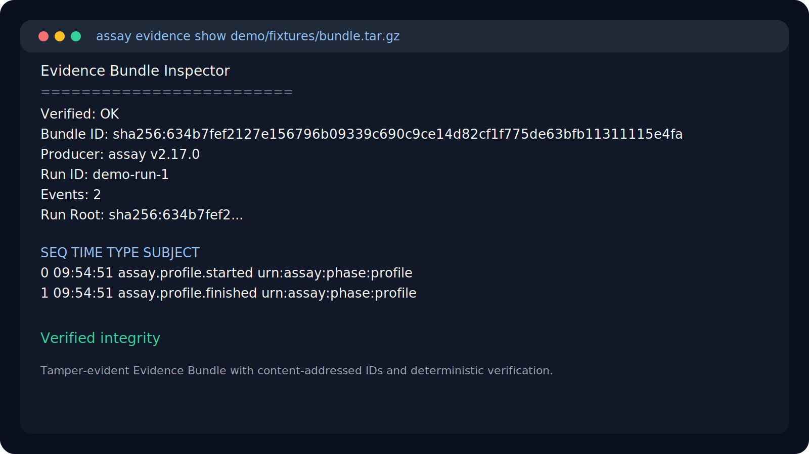

<p align="center">
  <h1 align="center">Assay</h1>
  <p align="center">
    <strong>Claim-first runtime governance and trust compilation for agent systems.</strong>
  </p>
  <p align="center">
    <a href="https://crates.io/crates/assay-cli"></a>
    <a href="https://github.com/Rul1an/assay/actions/workflows/ci.yml"></a>
    <a href="https://github.com/Rul1an/assay/blob/main/LICENSE"></a>
  </p>
  <p align="center">
    <a href="#see-it-work">See It Work</a> ·
    <a href="examples/mcp-quickstart/">Quick Start</a> ·
    <a href="docs/guides/github-action.md">CI Guide</a> ·
    <a href="https://github.com/Rul1an/assay/discussions">Discussions</a>
  </p>
</p>

---

Your MCP agent calls `read_file`, `exec`, `web_search` — but should it, and what can you honestly prove about that run afterward?

Assay sits between your agent and its tools. It intercepts every MCP tool call, checks it against your policy, and blocks what shouldn't happen. Every decision produces an evidence trail you can audit, diff, replay, and compile into bounded trust claims.

```
  Agent ──► Assay ──► MCP Server
              │
              ├─ ✅ ALLOW (policy match)
              ├─ ❌ DENY  (blocked, logged)
              └─ 📋 Evidence bundle
```

No hosted backend. No API keys. Deterministic — same input, same decision, every time.

> The average MCP server scores [34/100 on security](https://dev.to/elliotllliu/we-scanned-17-popular-mcp-servers-heres-what-we-found-321c). Assay gives you the policy gate and audit trail to fix that. Covers [7 of 10 OWASP MCP Top 10](docs/security/OWASP-MCP-TOP10-MAPPING.md) risks.

## See It Work

```bash
cargo install assay-cli

mkdir -p /tmp/assay-demo && echo "safe content" > /tmp/assay-demo/safe.txt

assay mcp wrap --policy examples/mcp-quickstart/policy.yaml \
  -- npx @modelcontextprotocol/server-filesystem /tmp/assay-demo
```

```
✅ ALLOW  read_file  path=/tmp/assay-demo/safe.txt  reason=policy_allow
✅ ALLOW  list_dir   path=/tmp/assay-demo/           reason=policy_allow
❌ DENY   read_file  path=/etc/passwd                reason=path_constraint_violation
❌ DENY   exec       cmd=ls                          reason=tool_denied
```

Then inspect the audit artifact Assay can hand to security or compliance:

```bash
assay evidence show demo/fixtures/bundle.tar.gz
```



The bundle is tamper-evident and cryptographically verifiable. If your run includes signed mandate events, the same bundle also carries the Ed25519-backed authorization trail for high-risk actions.

Repository builds on `main` also expose the first low-level trust-compiler artifact. If you want to try it before the next crates.io line ships, install from source or from the GitHub repo:

```bash
cargo install --git https://github.com/Rul1an/assay assay-cli
```

or from a local checkout:

```bash
cargo install --path crates/assay-cli
```

Then generate the trust basis:

```bash
assay trust-basis generate demo/fixtures/bundle.tar.gz > trust-basis.json
```

`trust-basis.json` is the canonical compiler output for the current Trust Compiler MVP. It emits a fixed, deterministic claim set such as:

- `bundle_verified`
- `signing_evidence_present`
- `provenance_backed_claims_present`
- `delegation_context_visible`
- `containment_degradation_observed`
- `applied_pack_findings_present`

This is intentionally an advanced artifact, not a Trust Card and not a trust score. The Trust Card surface comes later; `T1a` keeps claim classification in the compiler layer.

## Is This For Me?

**Yes, if you:**
- Build with Claude Desktop, Cursor, Windsurf, or any MCP client
- Ship agents that call tools and you need to control which ones
- Want a CI gate that catches tool-call regressions before production
- Need a deterministic audit trail and bounded trust claims, not sampled observability

**Not yet, if you:**
- Don't use MCP (Assay is MCP-native; other protocols are on the roadmap)
- Need a hosted dashboard (Assay is CLI-first and offline)
- Want a magic trust score or badge as the main output

## Add to Cursor in 30 Seconds

Assay ships a helper that finds your local Cursor MCP config path and prints a ready-to-paste entry:

```bash
assay mcp config-path cursor
```

It generates JSON like:

```json
{
  "filesystem-secure": {
    "command": "assay",
    "args": [
      "mcp",
      "wrap",
      "--policy",
      "/path/to/policy.yaml",
      "--",
      "npx",
      "-y",
      "@modelcontextprotocol/server-filesystem",
      "/Users/you"
    ]
  }
}
```

The same wrapped command works in other MCP clients:
- Cursor: paste the generated entry into `mcpServers`
- Windsurf: paste the same `mcpServers` entry into `~/.codeium/windsurf/mcp_config.json`
- Zed: paste the wrapped command into `context_servers` in your settings JSON

See [MCP Quick Start](docs/mcp/quickstart.md) for client-specific examples.

## Policy Is Simple

```yaml
version: "2.0"
name: "my-policy"

tools:
  allow: ["read_file", "list_dir"]
  deny: ["exec", "shell", "write_file"]

schemas:
  read_file:
    type: object
    additionalProperties: false
    properties:
      path:
        type: string
        pattern: "^/app/.*"
        minLength: 1
    required: ["path"]
```

Already have a legacy `constraints:` policy? Assay still reads it, warns once, and ships `assay policy migrate` to write the v2 JSON Schema form.

Or don't write one — generate it from what your agent actually does:

```bash
assay init --from-trace trace.jsonl
```

See [Policy Files](docs/reference/config/policies.md) for the full YAML schema.

## OpenTelemetry In, Canonical Evidence Out

Already tracing with Langfuse or an OTel-enabled agent stack? Keep that pipeline. Assay ingests OpenTelemetry JSONL, turns it into replayable traces, and gives you deterministic policy gates plus exportable evidence bundles.

```bash
assay trace ingest-otel \
  --input otel-export.jsonl \
  --db .eval/eval.db \
  --out-trace traces/otel.v2.jsonl
```

Then run `assay ci` on the converted trace, export an Evidence Bundle for audit handoff, or compile a low-level trust basis from a verified bundle. See [OpenTelemetry & Langfuse](docs/guides/otel-langfuse.md).

## Add to CI

```yaml
# .github/workflows/assay.yml
name: Assay Gate
on: [push, pull_request]
permissions:
  contents: read
  security-events: write
jobs:
  assay:
    runs-on: ubuntu-latest
    steps:
      - uses: actions/checkout@v4
      - uses: Rul1an/assay-action@v2
```

PRs that violate policy get blocked. SARIF results show up in the Security tab.

## Measured Latency

On the M1 Pro/macOS fragmented-IPI harness, Assay's protected tool-decision path measured:
- Main protection run: `0.771ms` p50 / `1.913ms` p95
- Fast-path scenario: `0.345ms` p50 / `1.145ms` p95

These are tool-decision timings, not end-to-end model latency.

## Beyond MCP: Protocol Adapters

Assay already ships adapters for emerging agent protocols:

| Protocol | Adapter | What it maps |
|----------|---------|-------------|
| **ACP** (OpenAI/Stripe) | `assay-adapter-acp` | Checkout events, payment intents, tool calls |
| **A2A** (Google) | `assay-adapter-a2a` | Agent capabilities, task delegation, artifacts |
| **UCP** (Google/Shopify) | `assay-adapter-ucp` | Discover/buy/post-purchase state transitions |

Each adapter translates protocol-specific events into Assay's canonical evidence format. Same policy engine, same evidence trail — regardless of which protocol your agent speaks.

The agent protocol landscape is fragmenting (ACP, A2A, UCP, AP2, x402). Assay's bet: **governance is protocol-agnostic.** The evidence and policy layer stays the same even as protocols come and go.

## Why Assay

| | |
|---|---|
| **Deterministic** | Same input, same decision, every time. Not probabilistic. |
| **MCP-native** | Built for MCP tool calls. Adapters for ACP, A2A, UCP. |
| **Evidence trail** | Every decision is auditable, diffable, replayable. |
| **Trust compiler** | Verified bundles can be compiled into bounded trust claims without collapsing into a single score. |
| **Offline-first** | No backend, no API keys. Runs on your machine. |
| **Measured** | `0.771ms` p50 / `1.913ms` p95 in the main M1 Pro/macOS tool-decision harness. |
| **Tested** | [3 security experiments](docs/architecture/SYNTHESIS-TRUST-CHAIN-TRIFECTA-2026q2.md), 12 attack vectors, 0 false positives. |

## Install

```bash
cargo install assay-cli
```

In CI: use the [GitHub Action](https://github.com/marketplace/actions/assay-ai-agent-security) directly.

Python SDK: `pip install assay-it`

## Learn More

- [MCP Quickstart](examples/mcp-quickstart/) — full walkthrough with a filesystem server
- [Policy Files](docs/reference/config/policies.md) — current YAML schema for `assay mcp wrap`
- [OpenTelemetry & Langfuse](docs/guides/otel-langfuse.md) — turn existing traces into replay and evidence
- [CI Guide](docs/guides/github-action.md) — GitHub Action setup
- [OWASP MCP Top 10 Mapping](docs/security/OWASP-MCP-TOP10-MAPPING.md) — how Assay addresses each risk
- [Evidence Store](docs/guides/evidence-store-aws-s3.md) — push bundles to S3, B2, or MinIO
- [Security Experiments](docs/architecture/SYNTHESIS-TRUST-CHAIN-TRIFECTA-2026q2.md) — 12 vectors, 0 false positives

## Contributing

```bash
cargo test --workspace
cargo clippy --workspace --all-targets -- -D warnings
```

See [CONTRIBUTING.md](CONTRIBUTING.md). Join the [discussion](https://github.com/Rul1an/assay/discussions).

## License

[MIT](LICENSE)
