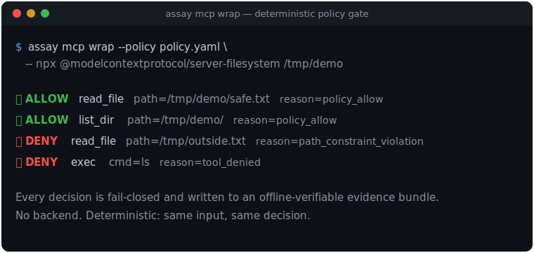
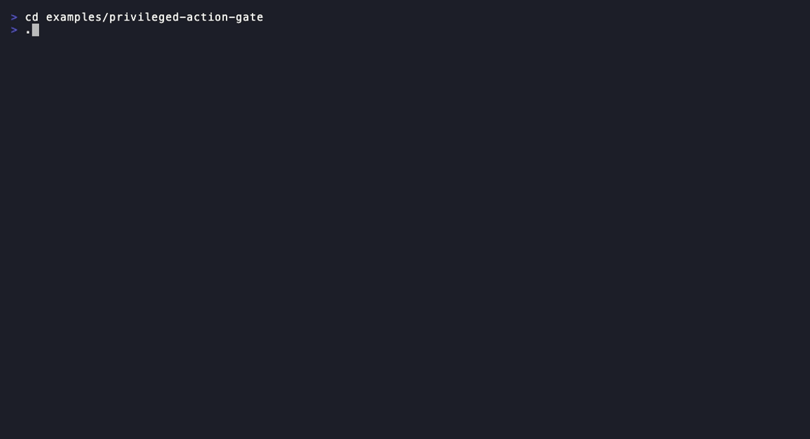

<p align="center">
  <h1 align="center">Assay</h1>
  <p align="center">
    <strong>Policy-as-code for MCP agents: enforce what a tool call can do, prove what it did, stay honest about what you can't.</strong><br />
    <span>A deterministic, fail-closed gate for MCP tool calls — with real kernel-level (eBPF/LSM) enforcement on Linux and offline-verifiable evidence. CI-native, no backend, bounded by design.</span>
  </p>
  <p align="center">
    <a href="https://crates.io/crates/assay-cli"></a>
    <a href="https://github.com/Rul1an/assay/actions/workflows/ci.yml"></a>
    <a href="https://github.com/Rul1an/assay/blob/main/LICENSE"></a>
  </p>
  <p align="center">
    <a href="#quickstart">Quickstart</a> ·
    <a href="#enforce-prove-stay-honest">How it works</a> ·
    <a href="#see-it-work">See it work</a> ·
    <a href="examples/mcp-quickstart/">MCP example</a> ·
    <a href="docs/security/OWASP-MCP-TOP10-MAPPING.md">OWASP MCP Top 10</a> ·
    <a href="https://github.com/Rul1an/assay/discussions">Discussions</a>
  </p>
</p>

---

Agents got real tool access through MCP — and tool poisoning, rug pulls, and confused-deputy OAuth came with it. Most tools scan a server or filter a prompt. Assay sits at the tool-call boundary and does three things, in order.

### Enforce, prove, stay honest

- **Enforce.** A deterministic, fail-closed gate decides every `tools/call` before it runs, with the precise reason for each allow or deny. On Linux it adds real kernel enforcement — an eBPF/LSM IPv4/TCP connect-egress block and a Landlock TCP-connect port allowlist, both opt-in and fail-closed. A policy it cannot express exactly is refused, never half-applied.
- **Prove.** Each decision and observed effect becomes an offline-verifiable, tamper-evident evidence bundle: the verdict, the pre-call establish journey, and declared-vs-observed conformance — all reviewable in CI, with no hosted backend.
- **Stay honest.** Every claim carries its basis (`verified`, `self_reported`, `inferred`, `absent`), and a gate refuses to let a claim exceed what was observed. A tool returning "success" is the provider's assertion, never proof. Assay ships no single safety score and never claims more than it can prove.

### Quickstart

```bash
cargo install assay-cli

mkdir -p /tmp/assay-demo && echo "safe content" > /tmp/assay-demo/safe.txt
assay mcp wrap --policy examples/mcp-quickstart/policy.yaml \
  -- npx @modelcontextprotocol/server-filesystem /tmp/assay-demo
```

```
✅ ALLOW  read_file  path=/tmp/assay-demo/safe.txt  reason=policy_allow
❌ DENY   read_file  path=/tmp/outside-demo.txt      reason=path_constraint_violation
❌ DENY   exec       cmd=ls                          reason=tool_denied
```



Wire it into Cursor, Claude Code, or Codex in one line with `assay mcp config-path <editor>`. Python SDK: `pip install assay-it`. CI: [GitHub Action](https://github.com/marketplace/actions/assay-ai-agent-security). No hosted backend, no API keys for core flows, deterministic by design. New to the threat model? The [OWASP MCP Top 10 mapping](docs/security/OWASP-MCP-TOP10-MAPPING.md) lays out, per risk, what Assay covers and what it deliberately does not.

## What ships

| Output | What it is |
|--------|------------|
| **Policy gate** | `assay mcp wrap` — deterministic allow/deny before tools run, with the reason. |
| **Evidence bundle** | Offline-verifiable, tamper-evident archive for audit and replay. |
| **Trust Basis / Trust Card** | Canonical `trust-basis.json` (bounded claim classification) plus review-friendly `trustcard.{json,md,html}`. |
| **External receipts** | Eval outcomes, runtime decisions, and model inventory as bounded receipts with JSON Schema contracts. |
| **Tool-decision surface** | Each privileged `tools/call` recorded as `assay.tool_decision_surface.v0` — sensitive ids hashed, raw arguments never stored. |
| **SARIF / CI** | GitHub Action, Security-tab integration, policy gates on PRs. |
| **Attestation** | Export a bundle as an in-toto / DSSE statement (v0), anchor-pluggable. |

```
  Agent ──► Assay ──► MCP Server
              ├─ ✅ ALLOW / ❌ DENY  (policy, with reason)
              ├─► 📋 Evidence bundle (offline-verifiable)
              └─► 📊 Trust Basis → Trust Card → SARIF / CI
```

New in **3.30.0:** an evidence event can carry an optional **soft `semantic_digest`** (with its `digest_profile`) beside the hard `content_hash` — a correlation/equivalence overlay for grouping records by canonical content across producers or points in time, computed via the [`assay-canonical`](crates/assay-canonical/) crate (RFC 8785 / JCS). It is never part of `content_hash`, never on the verify or admission path, and never substitutes integrity. [CHANGELOG.md](CHANGELOG.md) and release notes remain the authority for what is public; crates.io publication is separate from merge state.

## Is this for me?

**Yes** if you already have eval output, runtime decisions, inventory artifacts, or MCP tool-call tests, and you want a small reviewable CI artifact instead of a dashboard — bounded auditability, not a scalar trust badge.

**Not yet** if you need Assay to judge model correctness for you, want a hosted dashboard as the product, or want a compliance claim rather than a bounded evidence boundary. Assay is not a trust-score engine, a generic eval dashboard, or a hosted observability product — see [what it is and is not](docs/concepts/scope.md).

## See it work

An agent tries a privileged action — `github.add_deploy_key` — through the enforcing proxy, decided per call **before it forwards**, offline against a local mock (no real credentials):

```bash
cd examples/privileged-action-gate && ./run.sh
```



A deny is fail-closed caution, not a verdict on intent; an allow is the decision to forward, never proof the action happened. Declared-vs-observed conformance is recorded **beside** the verdict, never as a gate. Full walkthrough: [privileged-action-gate](examples/privileged-action-gate/).

## Pick your path

| You have | What you get | Start here |
|---|---|---|
| Promptfoo JSONL from CI evals | Eval outcome receipts + verified bundle + Trust Basis diff | [Promptfoo JSONL](docs/use-cases/evidence-receipts-from-promptfoo-jsonl.md) |
| OpenFeature `EvaluationDetails` | Decision receipt + verified bundle | [OpenFeature](docs/use-cases/openfeature-evaluationdetails-to-ci-review-artifact.md) |
| CycloneDX ML-BOM model component | Inventory receipt + verified bundle | [CycloneDX ML-BOM](docs/use-cases/cyclonedx-mlbom-model-to-inventory-receipt.md) |
| MCP tool calls | Allow/deny audit trail + observed-behavior evidence | [MCP Quick Start](examples/mcp-quickstart/) |
| A GitHub PR gate | Trust Basis diff, gate status, SARIF/JUnit-ready output | [CI Guide](docs/guides/github-action.md) |
| A Runner archive / coverage annotation | Coverage descriptors + claim-class cells + a claimed-vs-observed check | [Coverage-honesty walkthrough](examples/coverage-honesty-walkthrough/) |

The workflow stays small: import or record a bounded outcome, bundle and verify it, compile `trust-basis.json`, gate the Trust Basis diff. Assay doesn't make the upstream tool the source of truth; it makes the evidence boundary inspectable. For privileged tool actions, the MCP proxy records each `tools/call` as a structured [tool-decision surface](docs/reference/tool-decision-surface.md) — keeping the asserted-versus-verified line honest.

## Policy is simple

```yaml
version: "2.0"
name: "my-policy"
tools:
  allow: ["read_file", "list_dir"]
  deny: ["exec", "shell", "write_file"]
schemas:
  read_file:
    type: object
    properties:
      path: { type: string, pattern: "^/app/.*" }
    required: ["path"]
```

Generate one from observed behaviour with `assay init --from-trace trace.jsonl`, or migrate a legacy `constraints:` policy with `assay policy migrate`. See [Policy Files](docs/reference/config/policies.md).

## Why Assay

| | |
|---|---|
| **Canonical evidence** | Assay's evidence model is the stable contract; OpenTelemetry and protocol adapters (ACP / A2A / UCP) map into it. |
| **Deterministic** | Same input, same decision — not probabilistic. |
| **Bounded claims** | Explicit about **verified** vs **visible** vs **absent** — no score-first UX. |
| **Offline-first** | No backend required for core enforcement and bundle verification. |

## Learn more

- [MCP Quickstart](examples/mcp-quickstart/) · [Editor MCP recipe](docs/guides/editor-mcp-recipe.md) — policy-enforcing MCP in Cursor / Claude Code / Codex
- [Coding-agent governance](docs/guides/coding-agent-governance.md) · [OpenTelemetry & Langfuse](docs/guides/otel-langfuse.md) — observed runs → evidence
- [Evidence Receipts in Action](docs/notes/EVIDENCE-RECEIPTS-IN-ACTION.md) — Promptfoo / OpenFeature / CycloneDX receipt families
- [CI Guide](docs/guides/github-action.md) · [Evidence Store](docs/guides/evidence-store-aws-s3.md) (S3 / B2 / MinIO)
- [OWASP MCP Top 10 mapping](docs/security/OWASP-MCP-TOP10-MAPPING.md) · [Security experiments](docs/architecture/SYNTHESIS-TRUST-CHAIN-TRIFECTA-2026q2.md)
- Positioning: [ADR-033](docs/architecture/ADR-033-OTel-Trust-Compiler-Positioning.md) · [RFC-005](docs/architecture/RFC-005-trust-compiler-mvp-2026q2.md)

<details>
<summary>Evidence epistemology, latency, and the internal Runner</summary>

Trust claims use explicit epistemology, not a single safety score: `verified` (direct evidence or offline verification), `self_reported` (emitted without independent corroboration), `inferred` (bounded, documented rules), `absent` (no trustworthy evidence). Assay ships no aggregate trust score or `safe/unsafe` badge as the main output — see [ADR-033](docs/architecture/ADR-033-OTel-Trust-Compiler-Positioning.md).

Tool-decision path latency on an M1 Pro fragmented-IPI harness: main protection `0.771ms` p50 / `1.913ms` p95; fast-path `0.345ms` p50 / `1.145ms` p95. These are tool-decision timings, not end-to-end model latency.

[Assay-Runner](docs/reference/runner/index.md) is an internal measured-run subsystem behind the delegated Linux/eBPF acceptance path — `publish = false`, not a standalone product, no release commitment.

</details>

## Contributing

```bash
cargo test --workspace
cargo clippy --workspace --all-targets -- -D warnings
```

See [CONTRIBUTING.md](CONTRIBUTING.md) and [GitHub Discussions](https://github.com/Rul1an/assay/discussions).

## License

[MIT](LICENSE)
