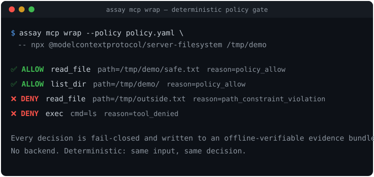
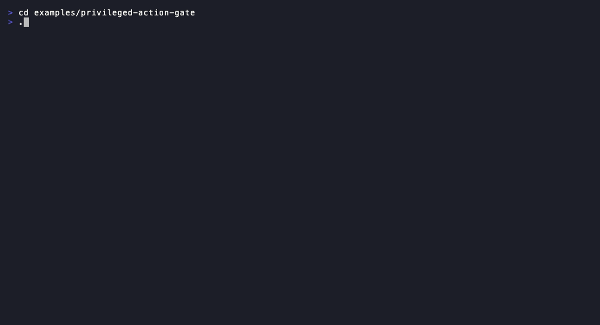

<p align="center">
  <h1 align="center">Assay</h1>
  <p align="center">
    <strong>The open, recomputable evidence profile for privileged MCP tool actions.</strong><br />
    <span>Assay records what a privileged tool call decided, what was observed, and what stays unproven, so a reviewer can replay the claim offline instead of trusting the agent's account of itself. Enforcement is deterministic and fail-closed, and the enforcing proxy is the reference producer rather than the contract itself. Kernel-level (eBPF/LSM) observation on Linux is an optional stronger vantage. CI-native, no backend, bounded by design.</span>
  </p>
  <p align="center">
    <a href="https://crates.io/crates/assay-cli"></a>
    <a href="https://github.com/Rul1an/assay/actions/workflows/ci.yml"></a>
    <a href="https://github.com/Rul1an/assay/blob/main/LICENSE"></a>
  </p>
  <p align="center">
    <a href="#quickstart">Quickstart</a> ·
    <a href="#enforce-prove-stay-honest">How it works</a> ·
    <a href="#see-it-work">See it work</a> ·
    <a href="examples/mcp-quickstart/">MCP example</a> ·
    <a href="docs/security/OWASP-MCP-TOP10-MAPPING.md">OWASP MCP Top 10</a> ·
    <a href="https://github.com/Rul1an/assay/discussions">Discussions</a>
  </p>
</p>

---

Agents got real tool access through MCP — and tool poisoning, rug pulls, and confused-deputy OAuth came with it. Most tools scan a server or filter a prompt. Assay sits at the tool-call boundary and does three things, in order.

**One golden path:** the [release-pinned agent journey](docs/guides/agent-golden-path.md) records the nine driven CLI/MCP steps and their exit/stdout contracts. Its protected-action fixture lives in [examples/privileged-action-gate/](examples/privileged-action-gate/).

### Enforce, prove, stay honest

- **Enforce.** A deterministic, fail-closed gate decides every `tools/call` before it runs, with the precise reason for each allow or deny. On Linux it adds real kernel enforcement — an eBPF/LSM IPv4/TCP connect-egress block and a Landlock TCP-connect port allowlist, both opt-in and fail-closed. A policy it cannot express exactly is refused, never half-applied.
- **Prove.** Each decision and observed effect becomes an offline-verifiable, tamper-evident evidence bundle: the verdict, the pre-call establish journey, and declared-vs-observed conformance — all reviewable in CI, with no hosted backend.
- **Stay honest.** Every claim carries its basis (`verified`, `self_reported`, `inferred`, `absent`), and a gate refuses to let a claim exceed what was observed. A tool returning "success" is the provider's assertion, never proof. Assay ships no single safety score and never claims more than it can prove.

### Quickstart

```bash
# Fast path: release installer for Linux and macOS.
curl -fsSL https://getassay.dev/install.sh | sh

# Confirm the command resolves; if setup fails, run `assay doctor`.
assay --version

# Source-build alternative (requires Rust):
cargo install assay-cli --version 5.5.2 --locked

python3 examples/mcp-quickstart/run.py
```

For v5.5.2, run the last command from a source checkout or an extracted published CLI archive.
The installer is binary-only and does not carry the bounded quickstart assets. The live
`getassay.dev` installer downloads over HTTPS but does not yet consume the published checksum or
provenance sidecars. The verified source installer will replace it through the separately measured
deployment tracked in `Rul1an/getassay-site#6`.

Captured runner output (the bundled local mock performs no external action):

```text
assay quickstart: PASS
mcp_requests=initialize,tools/list,tools/call
decision=allow tool=read_file
decision_artifact=.assay/quickstart/decisions.ndjson
non_claim=forwarded_to_local_mock_only
```



Released surfaces:

- Static project manifests are shipped for Claude Code and Cursor; Codex uses the equivalent TOML entry documented in the [editor MCP recipe](docs/guides/editor-mcp-recipe.md). Manifest presence is not host-discovery proof. `assay mcp config-path` supports Claude and Cursor only.
- Published v5.5.2 CLI archives cover Linux x86_64/arm64, macOS x86_64/arm64, and Windows x86_64. The Python wheels cover CPython 3.12 on macOS x86_64/arm64 and Linux x86_64; other interpreters and platforms are not claimed.
- Published `assay-mcp-server` archives cover Linux x86_64/arm64. MCPB and `server.json` package descriptors are also published; their presence is not host-discovery proof.
- CI: [GitHub Action](https://github.com/marketplace/actions/assay-ai-agent-security). Core flows need no hosted backend or API key. New to the threat model? The [OWASP MCP Top 10 mapping](docs/security/OWASP-MCP-TOP10-MAPPING.md) states, per risk, what Assay covers and deliberately does not.

## What ships

| Output | What it is |
|--------|------------|
| **Policy gate** | `assay mcp wrap` — deterministic allow/deny before tools run, with the reason. |
| **Evidence bundle** | Offline-verifiable, tamper-evident archive for audit and replay. |
| **Trust Basis / Trust Card** | Canonical `trust-basis.json` (bounded claim classification) plus review-friendly `trustcard.{json,md,html}`. |
| **External receipts** | Eval outcomes, runtime decisions, and model inventory as bounded receipts with JSON Schema contracts. |
| **Tool-decision surface** | Each privileged `tools/call` recorded as `assay.tool_decision_surface.v0` — sensitive ids hashed, raw arguments never stored. |
| **SARIF / CI** | GitHub Action, Security-tab integration, policy gates on PRs. |
| **Attestation** | Export a bundle as an in-toto / DSSE statement (v0), anchor-pluggable. |

```text
  Agent ──► Assay ──► MCP Server
              ├─ ✅ ALLOW / ❌ DENY  (policy, with reason)
              ├─► 📋 Evidence bundle (offline-verifiable)
              └─► 📊 Trust Basis → Trust Card → SARIF / CI
```

Current release: [`v5.5.2`](https://github.com/Rul1an/assay/releases/tag/v5.5.2). [CHANGELOG.md](CHANGELOG.md) and release notes remain the authority for released behavior; merged changes after the tag are `Unreleased`, and crates.io publication is separate from merge state.

## Is this for me?

**Yes** if you already have eval output, runtime decisions, inventory artifacts, or MCP tool-call tests, and you want a small reviewable CI artifact instead of a dashboard — bounded auditability, not a scalar trust badge.

**Not yet** if you need Assay to judge model correctness for you, want a hosted dashboard as the product, or want a compliance claim rather than a bounded evidence boundary. Assay is not a trust-score engine, a generic eval dashboard, or a hosted observability product — see [what it is and is not](docs/concepts/scope.md).

## See it work

An agent tries a privileged action — `github.add_deploy_key` — through the enforcing proxy, decided per call **before it forwards**, offline against a local mock (no real credentials):

```bash
cd examples/privileged-action-gate && ./run.sh
```



A deny is fail-closed caution, not a verdict on intent; an allow is the decision to forward, never proof the action happened. Declared-vs-observed conformance is recorded **beside** the verdict, never as a gate. Full walkthrough: [privileged-action-gate](examples/privileged-action-gate/).

## Pick your path

| You have | What you get | Start here |
|---|---|---|
| Promptfoo JSONL from CI evals | Eval outcome receipts + verified bundle + Trust Basis diff | [Promptfoo JSONL](docs/use-cases/evidence-receipts-from-promptfoo-jsonl.md) |
| OpenFeature `EvaluationDetails` | Decision receipt + verified bundle | [OpenFeature](docs/use-cases/openfeature-evaluationdetails-to-ci-review-artifact.md) |
| CycloneDX ML-BOM model component | Inventory receipt + verified bundle | [CycloneDX ML-BOM](docs/use-cases/cyclonedx-mlbom-model-to-inventory-receipt.md) |
| MCP tool calls | Allow/deny audit trail + observed-behavior evidence | [MCP Quick Start](examples/mcp-quickstart/) |
| A GitHub PR gate | Trust Basis diff, gate status, SARIF/JUnit-ready output | [CI Guide](docs/guides/github-action.md) |
| A Runner archive / coverage annotation | Coverage descriptors + claim-class cells + a claimed-vs-observed check | [Coverage-honesty walkthrough](examples/coverage-honesty-walkthrough/) |

The workflow stays small: import or record a bounded outcome, bundle and verify it, compile `trust-basis.json`, gate the Trust Basis diff. Assay doesn't make the upstream tool the source of truth; it makes the evidence boundary inspectable. For privileged tool actions, the MCP proxy records each `tools/call` as a structured [tool-decision surface](docs/reference/tool-decision-surface.md) — keeping the asserted-versus-verified line honest.

## Policy is simple

```yaml
version: "2.0"
name: "my-policy"
tools:
  allow: ["read_file", "list_dir"]
  deny: ["exec", "shell", "write_file"]
schemas:
  read_file:
    type: object
    properties:
      path: { type: string, pattern: "^/app/.*" }
    required: ["path"]
```

`assay init --from-trace trace.jsonl` generates the runtime-observation policy used by the trace-generation flow (`files`, `network`, and `processes`); it is not an MCP authorization policy. Migrate a legacy MCP `constraints:` policy with `assay policy migrate`. See [Policy Files](docs/reference/config/policies.md).

## Why Assay

| | |
|---|---|
| **Canonical evidence** | Assay's evidence model is the stable contract; OpenTelemetry and protocol adapters (ACP / A2A / UCP) map into it. |
| **Deterministic** | Same input, same decision — not probabilistic. |
| **Bounded claims** | Explicit about **verified** vs **visible** vs **absent** — no score-first UX. |
| **Offline-first** | No backend required for core enforcement and bundle verification. |
| **Checkable provenance** | Which piece of the source-class and coverage model shipped when, as commits you can `git log` rather than claims you have to take — [provenance](docs/PROVENANCE-SOURCE-CLASS.md), prior art credited first. |

## Learn more

- [MCP Quickstart](examples/mcp-quickstart/) · [Editor MCP recipe](docs/guides/editor-mcp-recipe.md) — policy-enforcing MCP in Cursor / Claude Code / Codex
- [MCP 2025/2026 protocol-era parity](https://docs.getassay.dev/mcp/protocol-era-parity/) — pinned `resultType` and interim-result compatibility corpus
- [Coding-agent governance](docs/guides/coding-agent-governance.md) · [OpenTelemetry & Langfuse](docs/guides/otel-langfuse.md) — observed runs → evidence
- [Evidence Receipts in Action](docs/notes/EVIDENCE-RECEIPTS-IN-ACTION.md) — Promptfoo / OpenFeature / CycloneDX receipt families
- [CI Guide](docs/guides/github-action.md) · [Evidence Store](docs/guides/evidence-store-aws-s3.md) (S3 / B2 / MinIO)
- [OWASP MCP Top 10 mapping](docs/security/OWASP-MCP-TOP10-MAPPING.md) · [Security experiments](docs/architecture/SYNTHESIS-TRUST-CHAIN-TRIFECTA-2026q2.md)
- Positioning: [ADR-033](docs/architecture/ADR-033-OTel-Trust-Compiler-Positioning.md) · [RFC-005](docs/architecture/RFC-005-trust-compiler-mvp-2026q2.md)

<details>
<summary>Evidence epistemology, latency, and the internal Runner</summary>

Trust claims use explicit epistemology, not a single safety score: `verified` (direct evidence or offline verification), `self_reported` (emitted without independent corroboration), `inferred` (bounded, documented rules), `absent` (no trustworthy evidence). Assay ships no aggregate trust score or `safe/unsafe` badge as the main output — see [ADR-033](docs/architecture/ADR-033-OTel-Trust-Compiler-Positioning.md).

Tool-decision path latency on an M1 Pro fragmented-IPI harness: main protection `0.771ms` p50 / `1.913ms` p95; fast-path `0.345ms` p50 / `1.145ms` p95. These are tool-decision timings, not end-to-end model latency.

[Assay-Runner](docs/reference/runner/index.md) is an internal measured-run subsystem behind the delegated Linux/eBPF acceptance path — `publish = false`, not a standalone product, no release commitment.

</details>

## Ecosystem

Repositories that compose with Assay's evidence layer:

- [assay-action](https://github.com/Rul1an/assay-action) — GitHub Action: verify bundles, PR summaries, SARIF ([Marketplace](https://github.com/marketplace/actions/assay-ai-agent-security)).
- [Assay-Harness](https://github.com/Rul1an/Assay-Harness) — recipe, gate, and report layer over canonical evidence artifacts.
- [observed-effect-v0](https://github.com/Rul1an/observed-effect-v0) — worked examples of the bounded observed-effect evidence record and its neutral carriers (in-toto, SCITT, MCP evidenceRef).
- [gateway-evidence-replay](https://github.com/Rul1an/gateway-evidence-replay) — deterministic offline replay verifier for gateway-path evidence bundles.
- [RGE-Bench](https://github.com/rge-bench/rge-bench) — a conformance kit for evidence reviewability, maintained separately under its own machine-checked neutrality guard. Reproduction there is **digest-scoped and does not carry forward**: the v1 71-vector digest `sha256:e769822bc6c9e31085da7b1a17b163b9747fe0d04314fbb8685d4e612087c7cb` and the current v2 digest `sha256:ba0e3795d75c788fa48313ab462493f22d78759851d1b3275d8117051bb22fd0` (95 vectors) each carry one reported **independent implementation** by a second author on a different stack. JM-Lab reported the v2 95/95 reproduction on 2026-08-24, from the contract text and author-supplied inputs without reading `expected`. See its [REPRODUCTIONS.md](https://github.com/rge-bench/rge-bench/blob/main/REPRODUCTIONS.md).

## Open profile: privileged-mcp-action/v0

[`privileged-mcp-action/v0`](docs/profiles/privileged-mcp-action/v0.md)
is a composition and verification contract over evidence records that already exist: what a
privileged MCP tool call decided, what was observed of its effect, and what stays unproven. It adds
no new envelope and no aggregate verdict.

It ships with a [14-vector conformance corpus](conformance/privileged-mcp-action-v0)
(5 accept, 9 reject) whose digest is a **candidate**: it is not called reproduced until a non-author
implementation derives the expected outcomes from the specification text alone.

**That reproduction is open, and the invitation is real:
[#1840](https://github.com/Rul1an/assay/issues/1840).** Any language, any stack. The invitation
names the exact commit the current digest describes. The
[clean-room protocol](conformance/privileged-mcp-action-v0/CONFORMANCE-PROTOCOL.md) provides an
opaque, attested inputs pack, a one-command scoring action, and an implementation-report template
without supplying verifier logic or expected outcomes. The
[corpus README](conformance/privileged-mcp-action-v0/README.md) states the authorship boundary and
the claim ceiling.

## Contributing

```bash
cargo test --workspace
cargo clippy --workspace --all-targets -- -D warnings
```

See [CONTRIBUTING.md](CONTRIBUTING.md) and [GitHub Discussions](https://github.com/Rul1an/assay/discussions).

## License

[MIT](LICENSE)
