# Architecture Diagrams

This document contains visual representations of the Assay architecture using Mermaid diagrams.

## System Overview

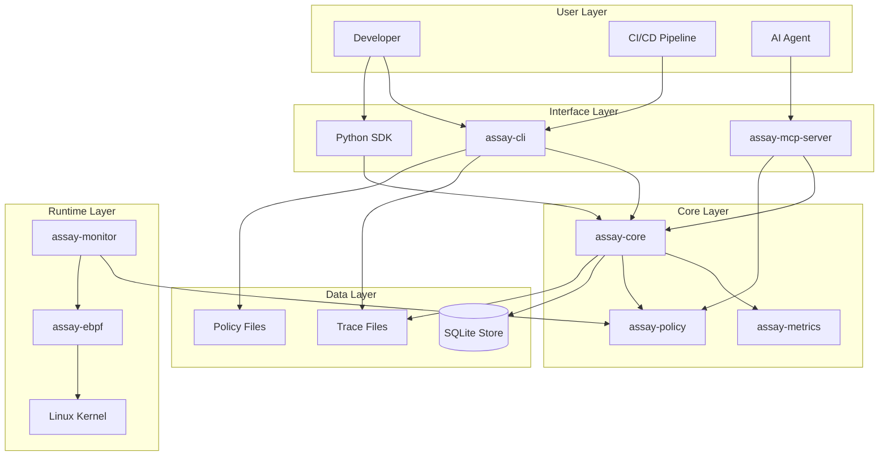

## Component Architecture

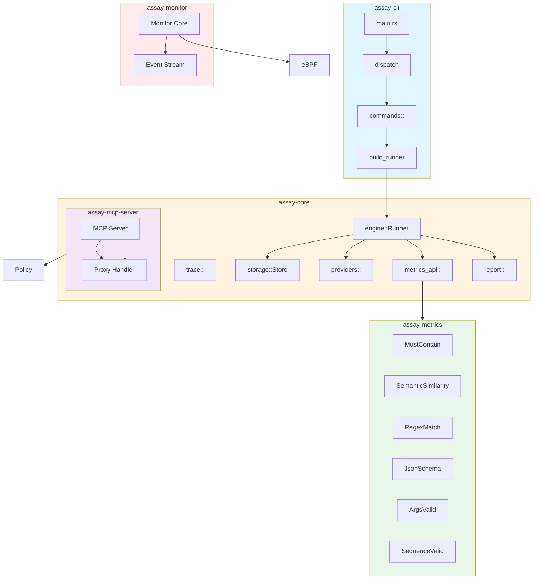

## Data Flow: Test Execution

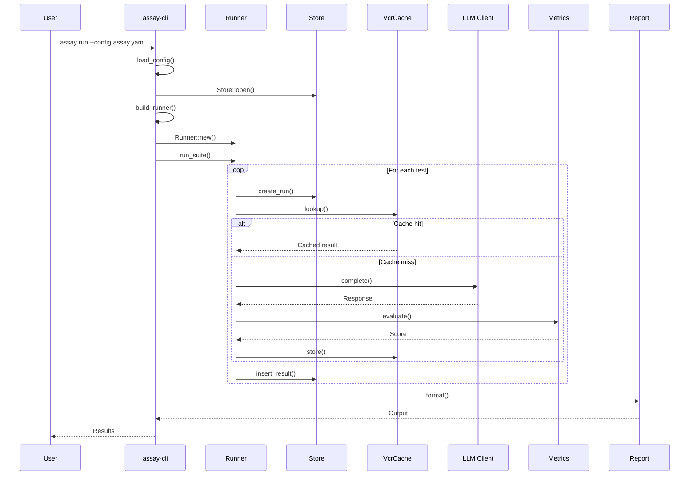

## Policy Enforcement Flow

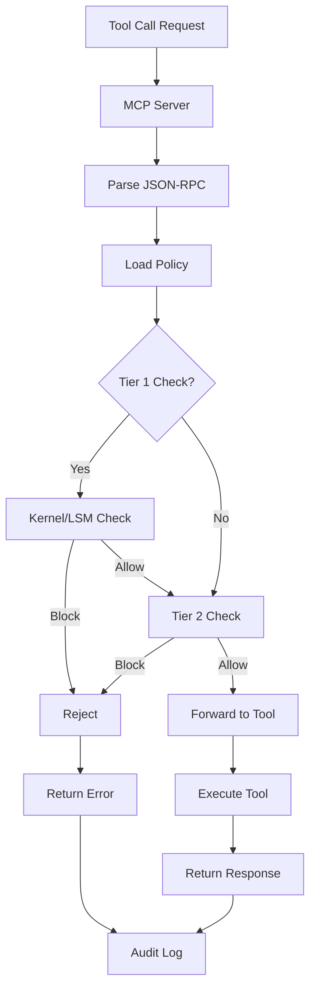

## Trace Lifecycle

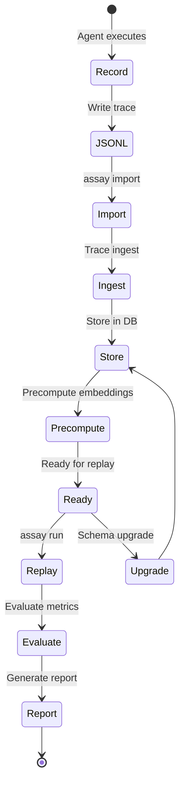

## Evidence Pipeline

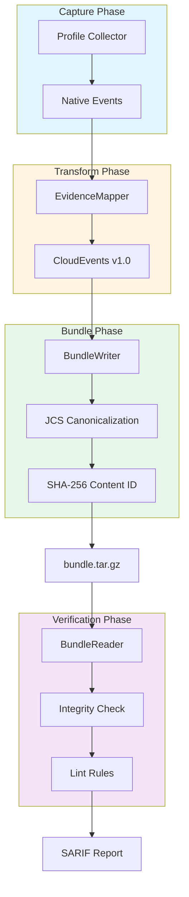

## MCP Integration Architecture

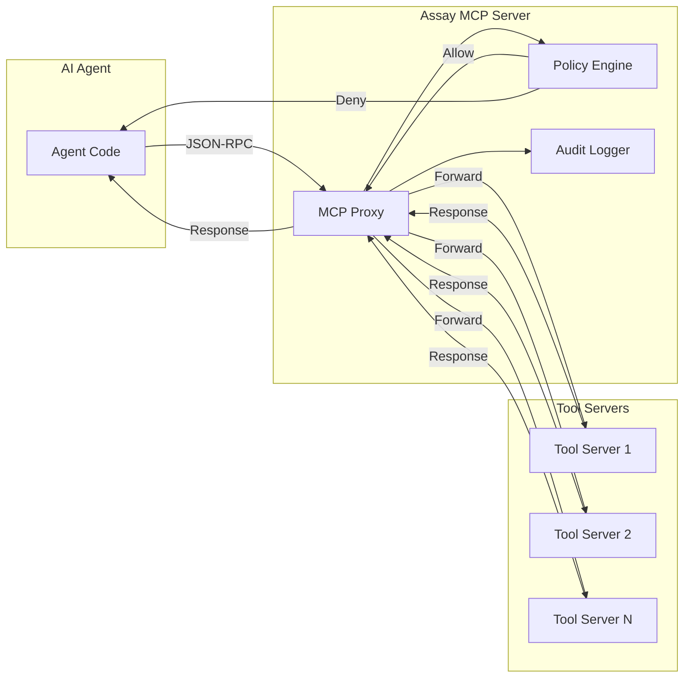

## Runtime Security Architecture

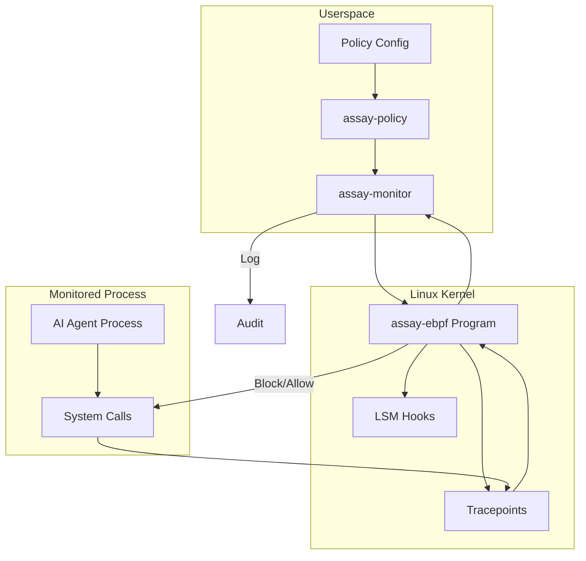

## Storage Schema

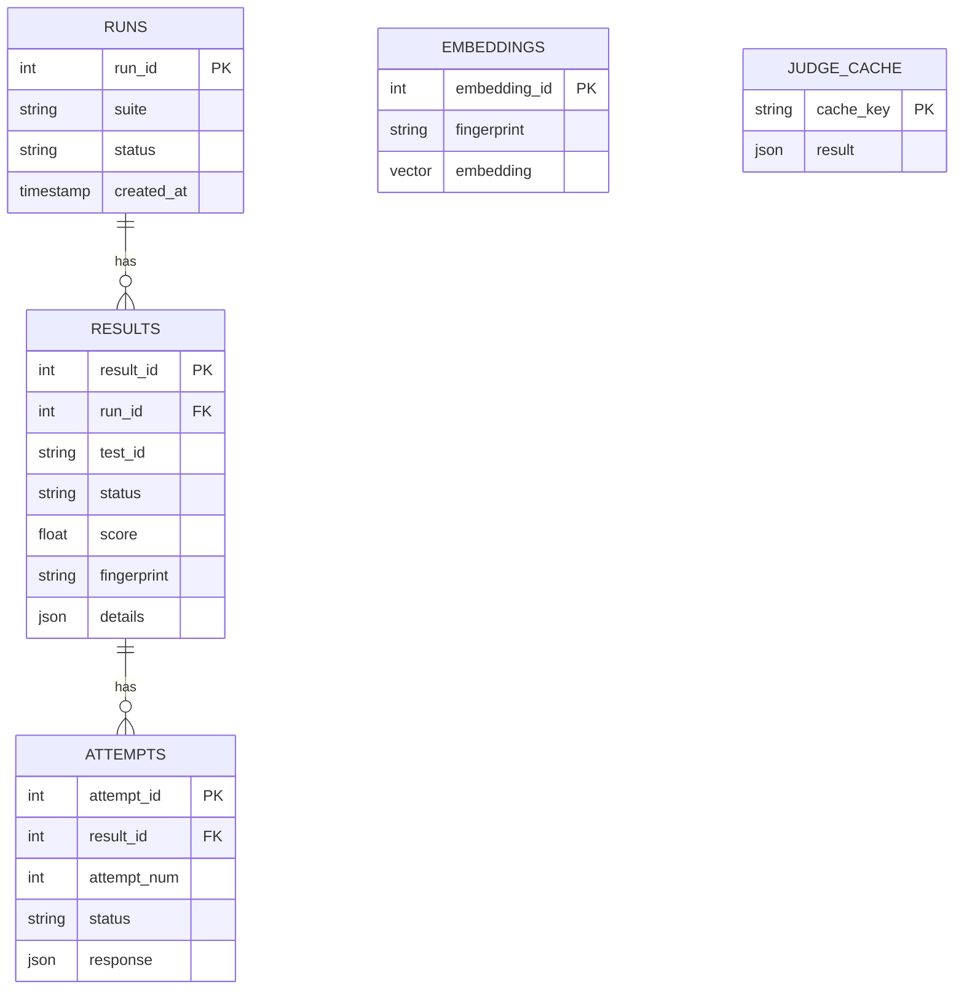

## Metrics Evaluation Flow

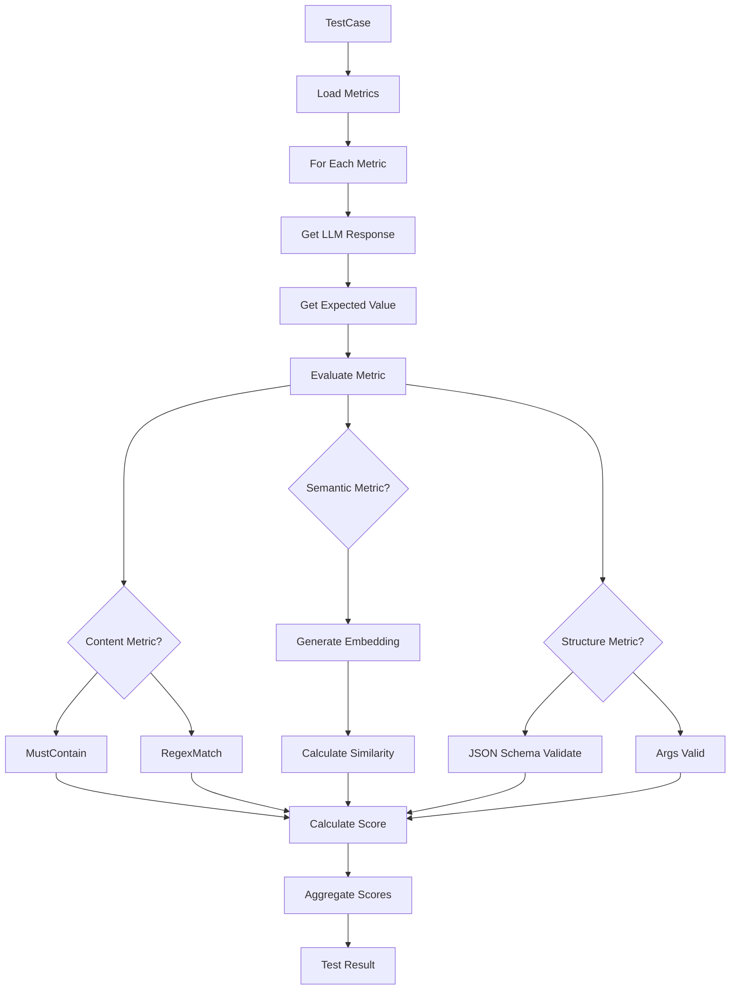

## CI/CD Integration Flow

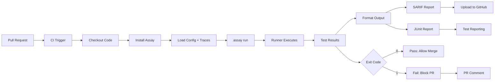

## Policy Compilation Flow

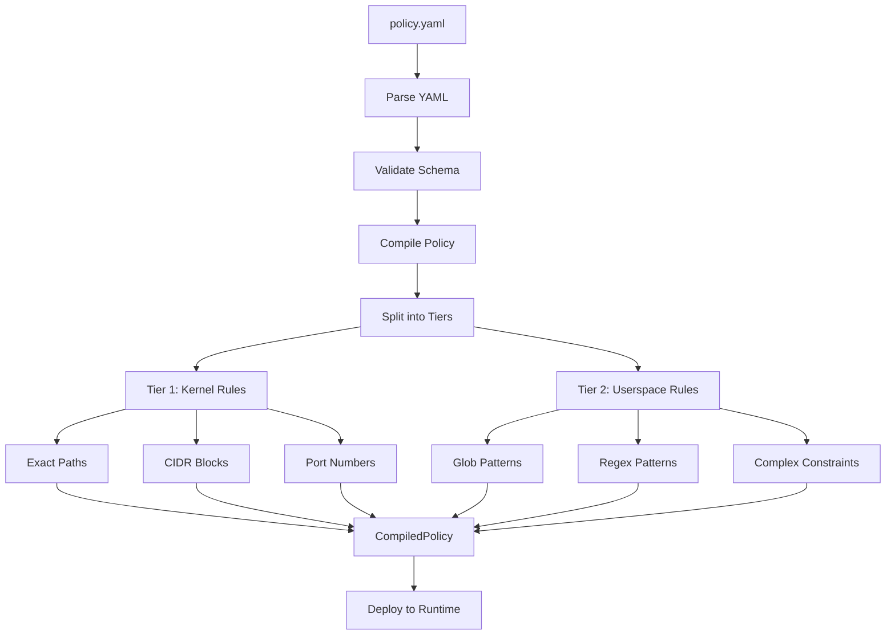

## Python SDK Architecture

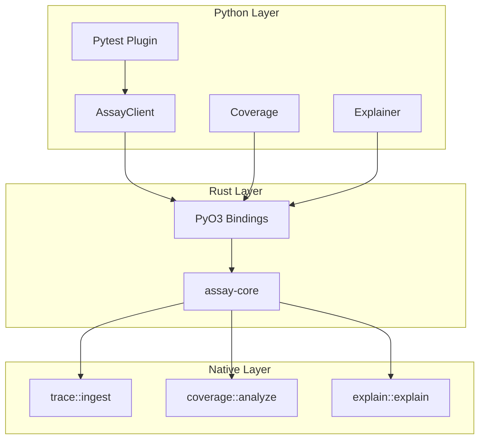

## Error Handling Flow

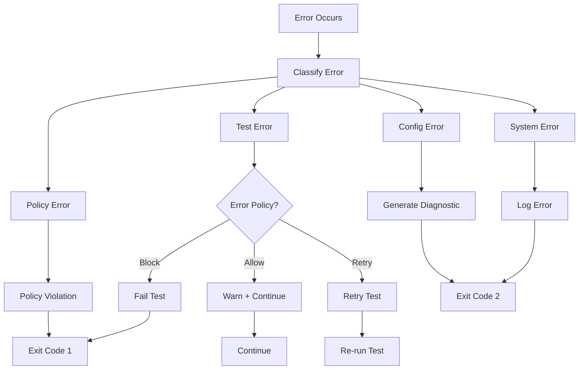

## Related Documentation

- [Codebase Overview](codebase-overview.md) - Detailed component descriptions
- [Interdependencies](interdependencies.md) - Dependency relationships
- [User Flows](user-flows.md) - User journey mappings
