# Architecture Diagrams

This document contains visual representations of the Assay architecture using Mermaid diagrams.

## System Overview

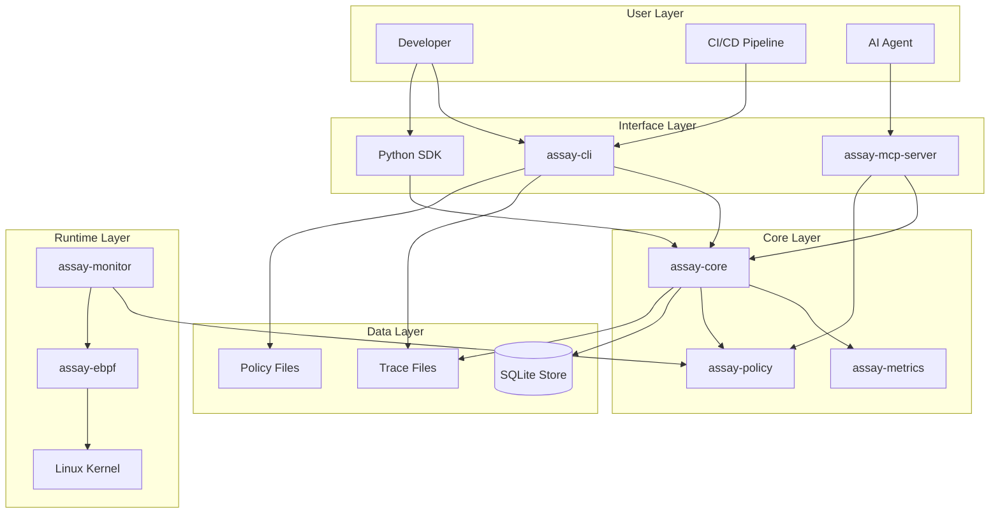
```mermaid
flowchart TB
    subgraph UserLayer[User Layer]
        Dev[Developer]
        CI[CI/CD Pipeline]
        Agent[AI Agent]
    end

    subgraph InterfaceLayer[Interface Layer]
        CLI[assay-cli]
        PySDK[Python SDK]
        MCPServer[assay-mcp-server]
    end

    subgraph CoreLayer[Core Layer]
        Core[assay-core]
        Metrics[assay-metrics]
        Policy[assay-policy]
    end

    subgraph RuntimeLayer[Runtime Layer]
        Monitor[assay-monitor]
        eBPF[assay-ebpf]
        Kernel[Linux Kernel]
    end

    subgraph DataLayer[Data Layer]
        Store[(SQLite Store)]
        Traces[Trace Files]
        Policies[Policy Files]
    end

    Dev --> CLI
    Dev --> PySDK
    CI --> CLI
    Agent --> MCPServer

    CLI --> Core
    PySDK --> Core
    MCPServer --> Core

    Core --> Metrics
    Core --> Policy
    Core --> Store

    MCPServer --> Policy
    Monitor --> Policy
    Monitor --> eBPF
    eBPF --> Kernel

    CLI --> Traces
    CLI --> Policies
    Core --> Traces
```

## Component Architecture

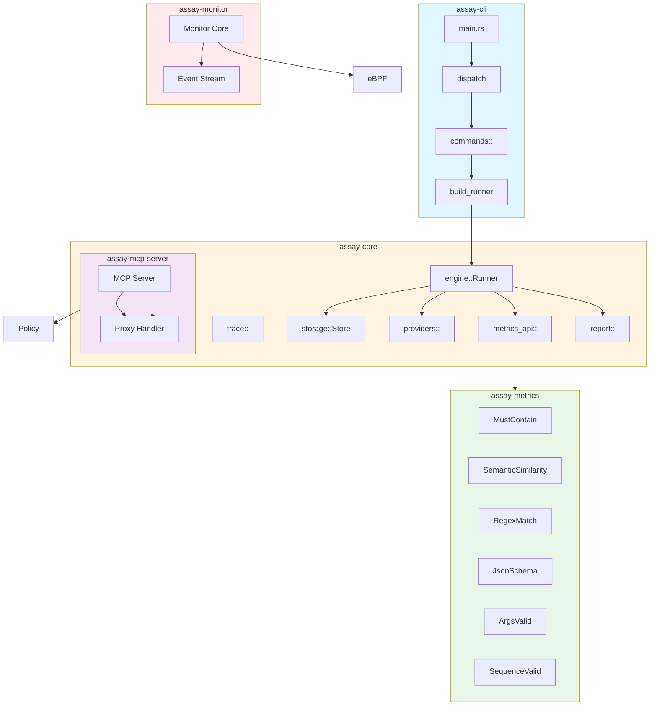
```mermaid
graph TB
    subgraph Core[assay-core]
        Engine[engine::Runner]
        Storage[storage::Store]
        MCP[mcp::]
        Trace[trace::]
        Report[report::]
        Providers[providers::]
        MetricsAPI[metrics_api::]
    end

    subgraph CLI[assay-cli]
        Main[main.rs]
        Dispatch[dispatch]
        Commands[commands::]
        BuildRunner[build_runner]
    end

    subgraph Metrics[assay-metrics]
        MustContain[MustContain]
        Semantic[SemanticSimilarity]
        Regex[RegexMatch]
        JsonSchema[JsonSchema]
        ArgsValid[ArgsValid]
        SequenceValid[SequenceValid]
    end

    subgraph MCP[assay-mcp-server]
        Server[MCP Server]
        Proxy[Proxy Handler]
    end

    subgraph Monitor[assay-monitor]
        MonitorCore[Monitor Core]
        EventStream[Event Stream]
    end

    Main --> Dispatch
    Dispatch --> Commands
    Commands --> BuildRunner
    BuildRunner --> Engine
    Engine --> Storage
    Engine --> Providers
    Engine --> MetricsAPI
    MetricsAPI --> Metrics
    Engine --> Report

    Server --> Proxy
    Proxy --> MCP
    MCP --> Policy

    MonitorCore --> EventStream
    MonitorCore --> eBPF

    style Core fill:#fff4e1
    style CLI fill:#e1f5ff
    style Metrics fill:#e8f5e9
    style MCP fill:#f3e5f5
    style Monitor fill:#ffebee
```

## Data Flow: Test Execution

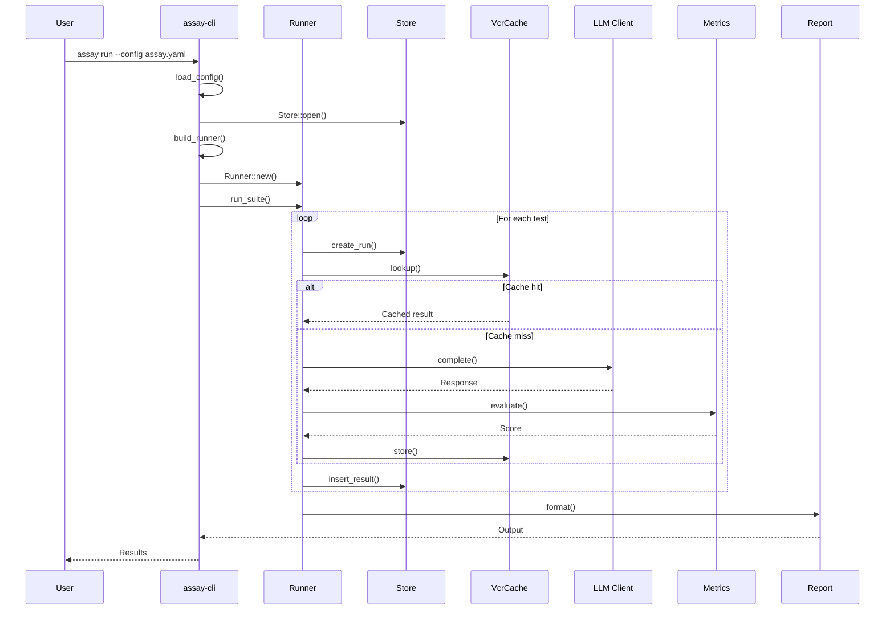
```mermaid
sequenceDiagram
    participant User
    participant CLI as assay-cli
    participant Runner as Runner
    participant Store as Store
    participant Cache as VcrCache
    participant LLM as LLM Client
    participant Metrics as Metrics
    participant Report as Report

    User->>CLI: assay run --config assay.yaml
    CLI->>CLI: load_config()
    CLI->>Store: Store::open()
    CLI->>CLI: build_runner()
    CLI->>Runner: Runner::new()
    CLI->>Runner: run_suite()

    loop For each test
        Runner->>Store: create_run()
        Runner->>Cache: lookup()
        alt Cache hit
            Cache-->>Runner: Cached result
        else Cache miss
            Runner->>LLM: complete()
            LLM-->>Runner: Response
            Runner->>Metrics: evaluate()
            Metrics-->>Runner: Score
            Runner->>Cache: store()
        end
        Runner->>Store: insert_result()
    end

    Runner->>Report: format()
    Report-->>CLI: Output
    CLI-->>User: Results
```

## Policy Enforcement Flow

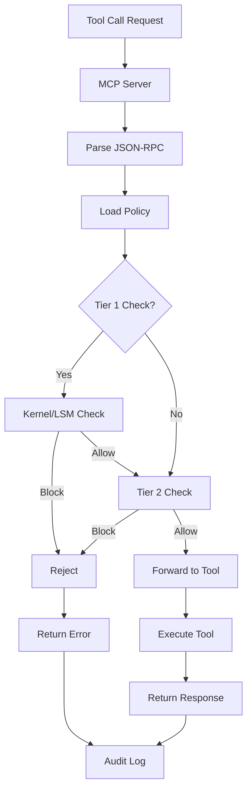
```mermaid
flowchart TD
    ToolCall[Tool Call Request] --> MCP[MCP Server]
    MCP --> Parse[Parse JSON-RPC]
    Parse --> Policy[Load Policy]
    Policy --> Tier1{Tier 1 Check?}
    Tier1 -->|Yes| Kernel[Kernel/LSM Check]
    Tier1 -->|No| Tier2[Tier 2 Check]
    Kernel -->|Block| Reject[Reject]
    Kernel -->|Allow| Tier2
    Tier2 -->|Block| Reject
    Tier2 -->|Allow| Forward[Forward to Tool]
    Forward --> Execute[Execute Tool]
    Execute --> Response[Return Response]
    Reject --> Error[Return Error]
    Response --> Audit[Audit Log]
    Error --> Audit
```

## Trace Lifecycle

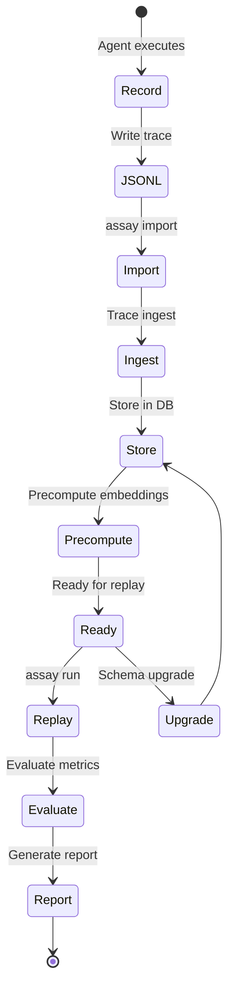
```mermaid
stateDiagram-v2
    [*] --> Record: Agent executes
    Record --> JSONL: Write trace
    JSONL --> Import: assay import
    Import --> Ingest: Trace ingest
    Ingest --> Store: Store in DB
    Store --> Precompute: Precompute embeddings
    Precompute --> Ready: Ready for replay
    Ready --> Replay: assay run
    Replay --> Evaluate: Evaluate metrics
    Evaluate --> Report: Generate report
    Report --> [*]

    Ready --> Upgrade: Schema upgrade
    Upgrade --> Store
```

## Evidence Pipeline

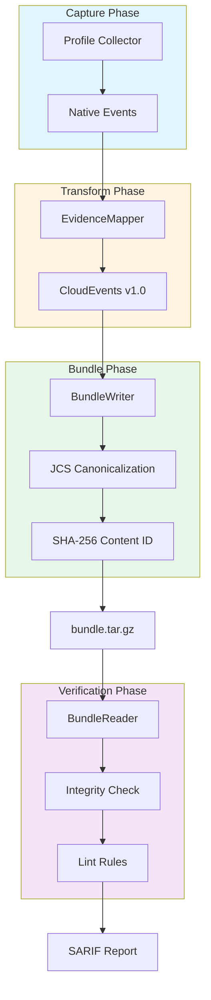
```mermaid
flowchart TD
    subgraph Capture[Capture Phase]
        Profile[Profile Collector]
        Events[Native Events]
    end

    subgraph Transform[Transform Phase]
        Mapper[EvidenceMapper]
        CloudEvents[CloudEvents v1.0]
    end

    subgraph Bundle[Bundle Phase]
        Writer[BundleWriter]
        JCS[JCS Canonicalization]
        Hash[SHA-256 Content ID]
    end

    subgraph Verify[Verification Phase]
        Reader[BundleReader]
        Integrity[Integrity Check]
        Lint[Lint Rules]
    end

    Profile --> Events
    Events --> Mapper
    Mapper --> CloudEvents
    CloudEvents --> Writer
    Writer --> JCS
    JCS --> Hash
    Hash --> TarGz[bundle.tar.gz]

    TarGz --> Reader
    Reader --> Integrity
    Integrity --> Lint
    Lint --> SARIF[SARIF Report]

    style Capture fill:#e1f5ff
    style Transform fill:#fff4e1
    style Bundle fill:#e8f5e9
    style Verify fill:#f3e5f5
```

## MCP Integration Architecture

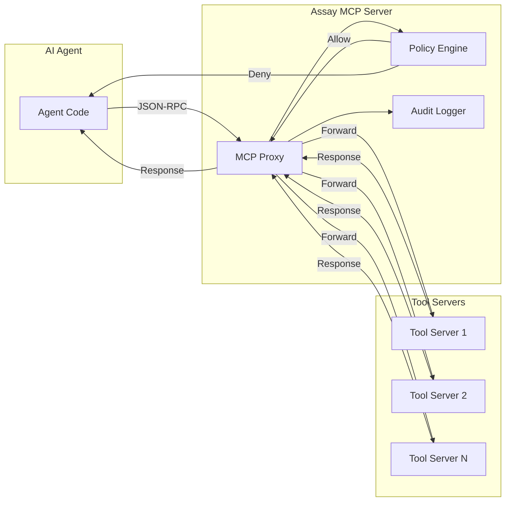
```mermaid
graph LR
    subgraph Agent[AI Agent]
        AgentCode[Agent Code]
    end

    subgraph Assay[Assay MCP Server]
        MCPProxy[MCP Proxy]
        PolicyEngine[Policy Engine]
        AuditLog[Audit Logger]
    end

    subgraph Tools[Tool Servers]
        Tool1[Tool Server 1]
        Tool2[Tool Server 2]
        ToolN[Tool Server N]
    end

    AgentCode -->|JSON-RPC| MCPProxy
    MCPProxy --> PolicyEngine
    PolicyEngine -->|Allow| MCPProxy
    PolicyEngine -->|Deny| AgentCode
    MCPProxy -->|Forward| Tool1
    MCPProxy -->|Forward| Tool2
    MCPProxy -->|Forward| ToolN
    Tool1 -->|Response| MCPProxy
    Tool2 -->|Response| MCPProxy
    ToolN -->|Response| MCPProxy
    MCPProxy -->|Response| AgentCode
    MCPProxy --> AuditLog
```

## Runtime Security Architecture

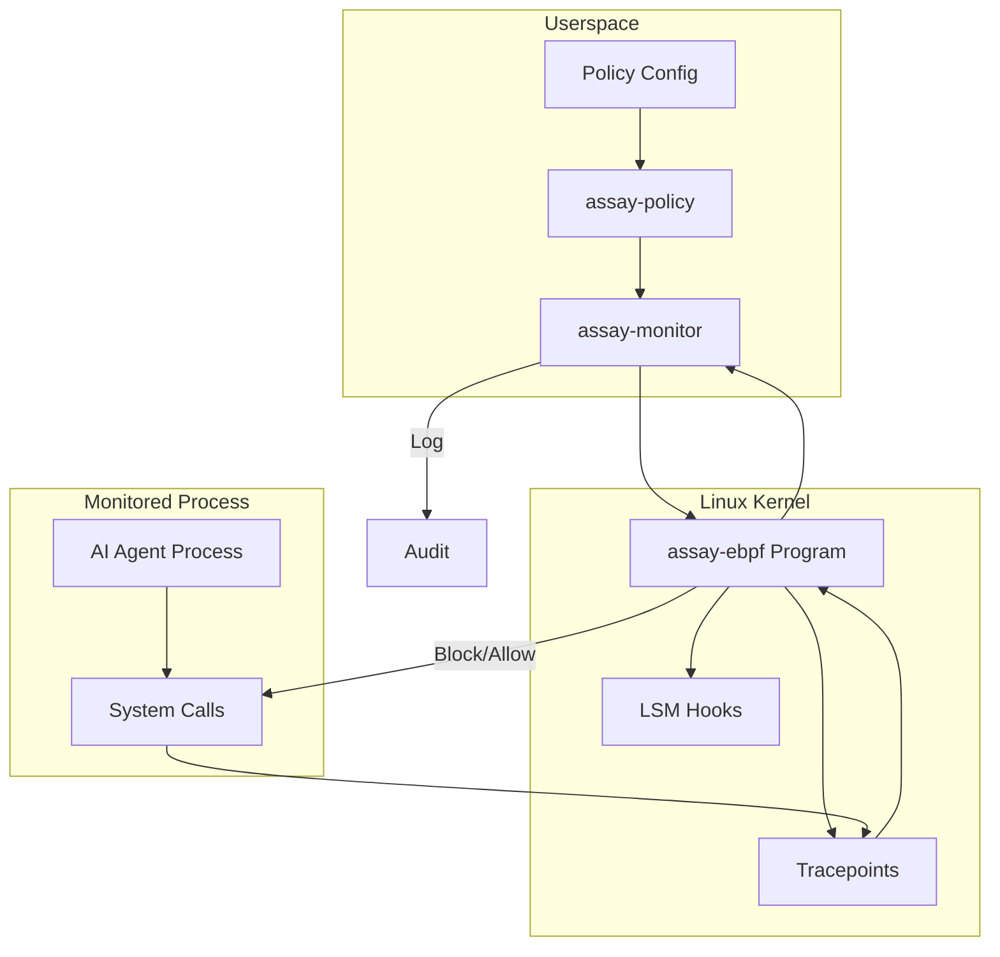
```mermaid
graph TB
    subgraph Userspace[Userspace]
        Monitor[assay-monitor]
        Policy[assay-policy]
        Config[Policy Config]
    end

    subgraph Kernel[Linux Kernel]
        eBPF[assay-ebpf Program]
        LSM[LSM Hooks]
        Tracepoints[Tracepoints]
    end

    subgraph Process[Monitored Process]
        Agent[AI Agent Process]
        Syscalls[System Calls]
    end

    Config --> Policy
    Policy --> Monitor
    Monitor --> eBPF
    eBPF --> LSM
    eBPF --> Tracepoints
    Agent --> Syscalls
    Syscalls --> Tracepoints
    Tracepoints --> eBPF
    eBPF -->|Block/Allow| Syscalls
    eBPF --> Monitor
    Monitor -->|Log| Audit
```

## Storage Schema

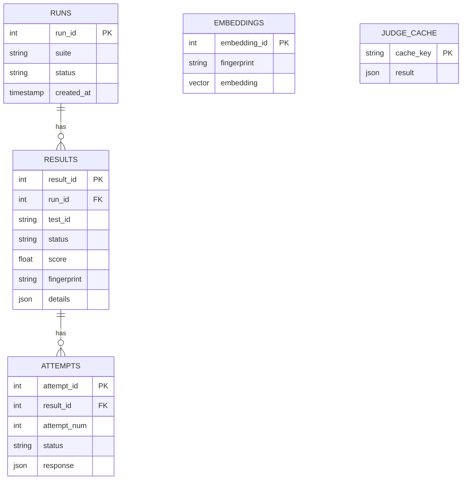
```mermaid
erDiagram
    RUNS ||--o{ RESULTS : has
    RUNS {
        int run_id PK
        string suite
        string status
        timestamp created_at
    }
    RESULTS ||--o{ ATTEMPTS : has
    RESULTS {
        int result_id PK
        int run_id FK
        string test_id
        string status
        float score
        string fingerprint
        json details
    }
    ATTEMPTS {
        int attempt_id PK
        int result_id FK
        int attempt_num
        string status
        json response
    }
    EMBEDDINGS {
        int embedding_id PK
        string fingerprint
        vector embedding
    }
    JUDGE_CACHE {
        string cache_key PK
        json result
    }
```

## Metrics Evaluation Flow

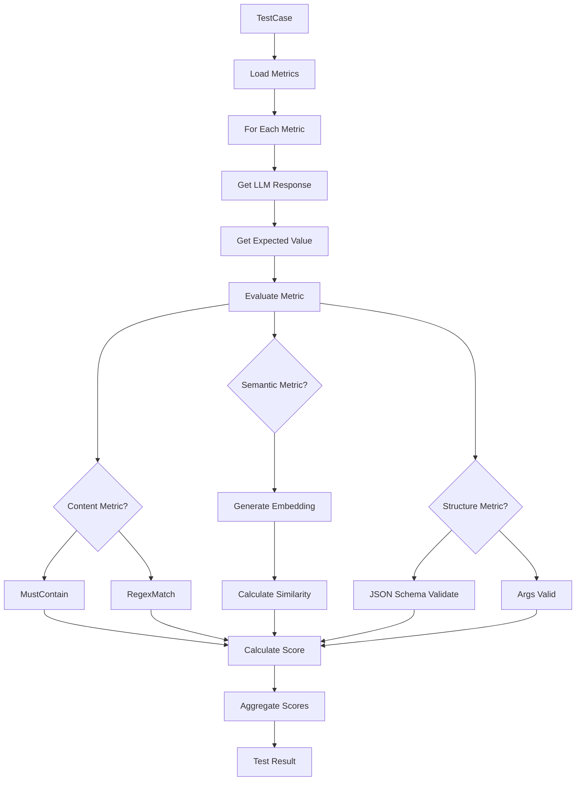
```mermaid
flowchart TD
    TestCase[TestCase] --> LoadMetrics[Load Metrics]
    LoadMetrics --> ForEach[For Each Metric]
    ForEach --> GetResponse[Get LLM Response]
    GetResponse --> GetExpected[Get Expected Value]
    GetExpected --> Evaluate[Evaluate Metric]
    Evaluate --> Content{Content Metric?}
    Evaluate --> Semantic{Semantic Metric?}
    Evaluate --> Structure{Structure Metric?}
    Content --> MustContain[MustContain]
    Content --> Regex[RegexMatch]
    Semantic --> Embed[Generate Embedding]
    Embed --> Similarity[Calculate Similarity]
    Structure --> JsonSchema[JSON Schema Validate]
    Structure --> ArgsValid[Args Valid]
    MustContain --> Score[Calculate Score]
    Regex --> Score
    Similarity --> Score
    JsonSchema --> Score
    ArgsValid --> Score
    Score --> Aggregate[Aggregate Scores]
    Aggregate --> Result[Test Result]
```

## CI/CD Integration Flow

### Using GitHub Action (Recommended)

```mermaid
flowchart LR
    PR[Pull Request] --> Trigger[CI Trigger]
    Trigger --> Checkout[Checkout Code]
    Checkout --> Tests[Run Tests]
    Tests --> Bundles[Evidence Bundles]
    Bundles --> Action["assay-action@v2"]
    Action --> Cache{Cache Hit?}
    Cache -->|Yes| CLI[Use Cached CLI]
    Cache -->|No| Download[Download CLI]
    Download --> CLI
    CLI --> Discover[Auto-Discover Bundles]
    Discover --> Verify[Verify Bundles]
    Verify --> Lint[Lint Bundles]
    Lint --> SARIF[Generate SARIF]
    SARIF --> Upload[Upload to Security Tab]
    Upload --> Summary[Job Summary]
    Summary --> Comment{Findings?}
    Comment -->|Yes| PRComment[PR Comment]
    Comment -->|No| Pass[Pass]
    PRComment --> ExitCode{Threshold?}
    Pass --> Merge[Allow Merge]
    ExitCode -->|Exceeded| Fail[Block PR]
    ExitCode -->|OK| Merge
```

### Using CLI Directly

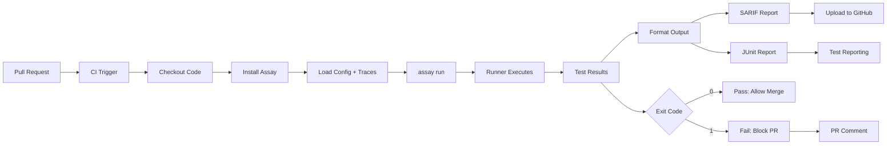
```mermaid
flowchart LR
    PR[Pull Request] --> Trigger[CI Trigger]
    Trigger --> Checkout[Checkout Code]
    Checkout --> Install[Install Assay]
    Install --> Load[Load Config + Traces]
    Load --> Run[assay run]
    Run --> Runner[Runner Executes]
    Runner --> Results[Test Results]
    Results --> Format[Format Output]
    Format --> SARIF[SARIF Report]
    Format --> JUnit[JUnit Report]
    SARIF --> Upload[Upload to GitHub]
    JUnit --> TestReport[Test Reporting]
    Results --> ExitCode{Exit Code}
    ExitCode -->|0| Pass[Pass: Allow Merge]
    ExitCode -->|1| Fail[Fail: Block PR]
    Fail --> Comment[PR Comment]
```

## Policy Compilation Flow

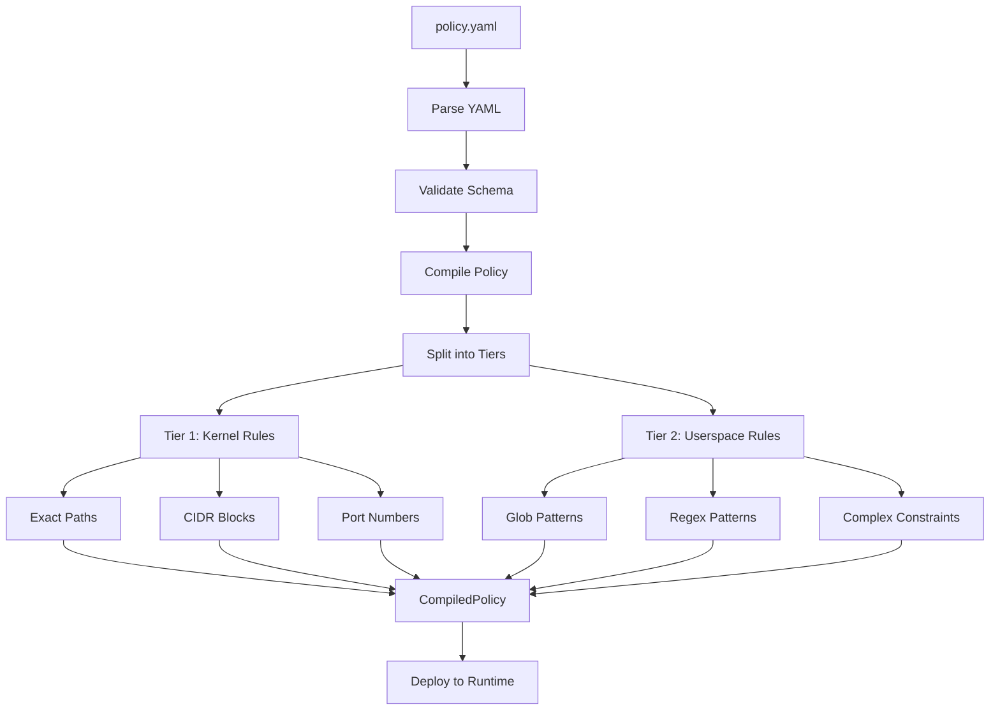
```mermaid
flowchart TD
    PolicyYAML[policy.yaml] --> Parse[Parse YAML]
    Parse --> Validate[Validate Schema]
    Validate --> Compile[Compile Policy]
    Compile --> Split[Split into Tiers]
    Split --> Tier1[Tier 1: Kernel Rules]
    Split --> Tier2[Tier 2: Userspace Rules]
    Tier1 --> Exact[Exact Paths]
    Tier1 --> CIDR[CIDR Blocks]
    Tier1 --> Ports[Port Numbers]
    Tier2 --> Glob[Glob Patterns]
    Tier2 --> Regex[Regex Patterns]
    Tier2 --> Complex[Complex Constraints]
    Exact --> Compiled[CompiledPolicy]
    CIDR --> Compiled
    Ports --> Compiled
    Glob --> Compiled
    Regex --> Compiled
    Complex --> Compiled
    Compiled --> Deploy[Deploy to Runtime]
```

## Python SDK Architecture

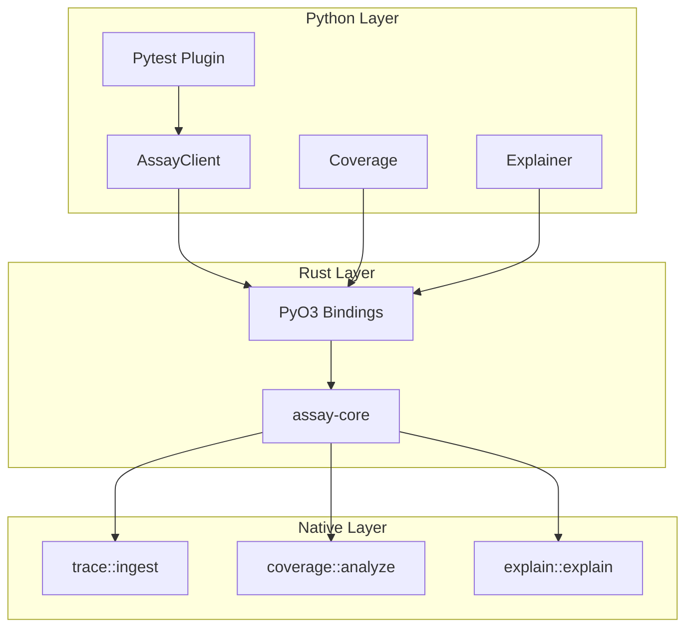
```mermaid
graph TB
    subgraph Python[Python Layer]
        Client[AssayClient]
        Coverage[Coverage]
        Explainer[Explainer]
        Pytest[Pytest Plugin]
    end

    subgraph Rust[Rust Layer]
        PyO3[PyO3 Bindings]
        Core[assay-core]
    end

    subgraph Native[Native Layer]
        TraceIngest[trace::ingest]
        CoverageAnalyze[coverage::analyze]
        Explain[explain::explain]
    end

    Client --> PyO3
    Coverage --> PyO3
    Explainer --> PyO3
    Pytest --> Client
    PyO3 --> Core
    Core --> TraceIngest
    Core --> CoverageAnalyze
    Core --> Explain
```

## Error Handling Flow

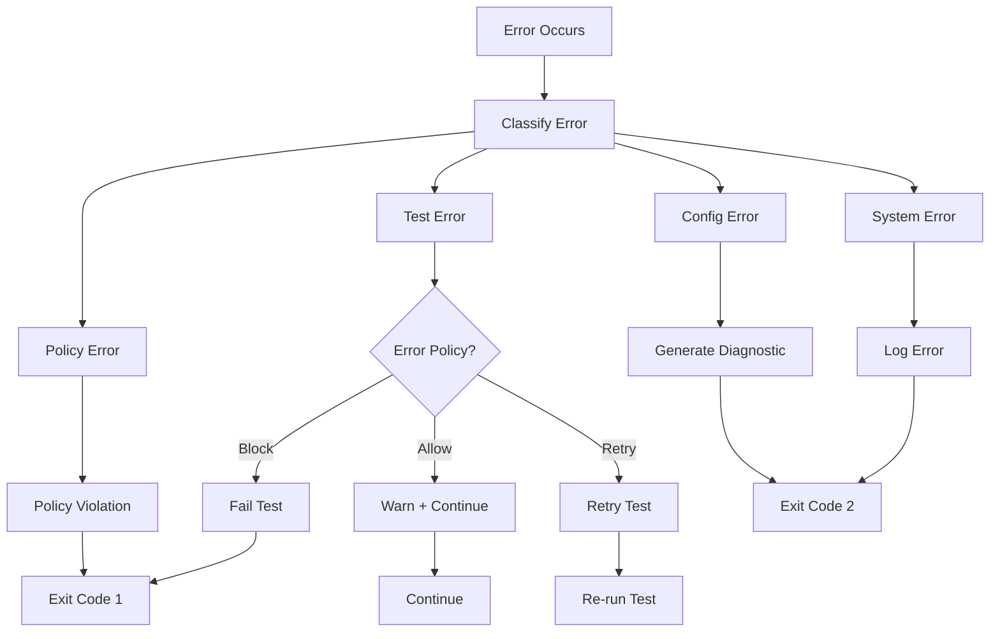
```mermaid
flowchart TD
    Error[Error Occurs] --> Classify[Classify Error]
    Classify --> ConfigError[Config Error]
    Classify --> TestError[Test Error]
    Classify --> PolicyError[Policy Error]
    Classify --> SystemError[System Error]

    ConfigError --> Diagnostic[Generate Diagnostic]
    TestError --> ErrorPolicy{Error Policy?}
    PolicyError --> Violation[Policy Violation]
    SystemError --> Log[Log Error]

    ErrorPolicy -->|Block| Fail[Fail Test]
    ErrorPolicy -->|Allow| Warn[Warn + Continue]
    ErrorPolicy -->|Retry| Retry[Retry Test]

    Diagnostic --> ExitCode2[Exit Code 2]
    Violation --> ExitCode1[Exit Code 1]
    Fail --> ExitCode1
    Warn --> Continue[Continue]
    Retry --> Test[Re-run Test]
    Log --> ExitCode2
```

## Mandate Runtime Flow

This diagram shows the mandate authorization flow when a tool call is processed:

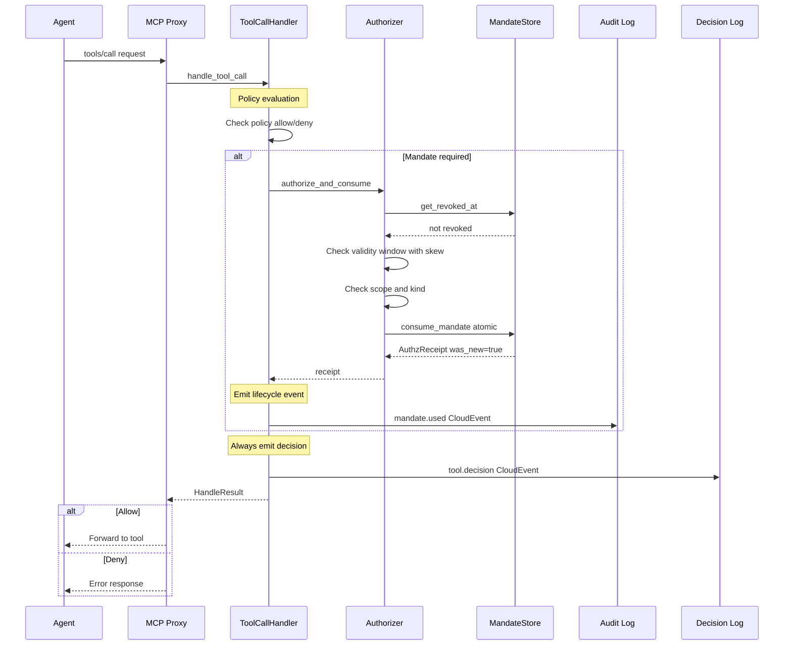
```mermaid
sequenceDiagram
    participant Agent
    participant Proxy as MCP Proxy
    participant Handler as ToolCallHandler
    participant Auth as Authorizer
    participant Store as MandateStore
    participant AuditLog as Audit Log
    participant DecisionLog as Decision Log

    Agent->>Proxy: tools/call request
    Proxy->>Handler: handle_tool_call

    Note over Handler: Policy evaluation
    Handler->>Handler: Check policy allow/deny

    alt Mandate required
        Handler->>Auth: authorize_and_consume
        Auth->>Store: get_revoked_at
        Store-->>Auth: not revoked
        Auth->>Auth: Check validity window with skew
        Auth->>Auth: Check scope and kind
        Auth->>Store: consume_mandate atomic
        Store-->>Auth: AuthzReceipt was_new=true
        Auth-->>Handler: receipt

        Note over Handler: Emit lifecycle event
        Handler->>AuditLog: mandate.used CloudEvent
    end

    Note over Handler: Always emit decision
    Handler->>DecisionLog: tool.decision CloudEvent
    Handler-->>Proxy: HandleResult

    alt Allow
        Proxy-->>Agent: Forward to tool
    else Deny
        Proxy-->>Agent: Error response
    end
```

### Key Invariants

| Invariant | Description |
|-----------|-------------|
| I1: Always Emit | Exactly 1 tool.decision per tool_call_id |
| I2: Consume Before Exec | mandate.used only after SQLite commit |
| I3: Fixed Source | event_source from config, not dynamic |
| I4: Idempotent | Same tool_call_id returns same receipt |

### Revocation Check (No Skew)

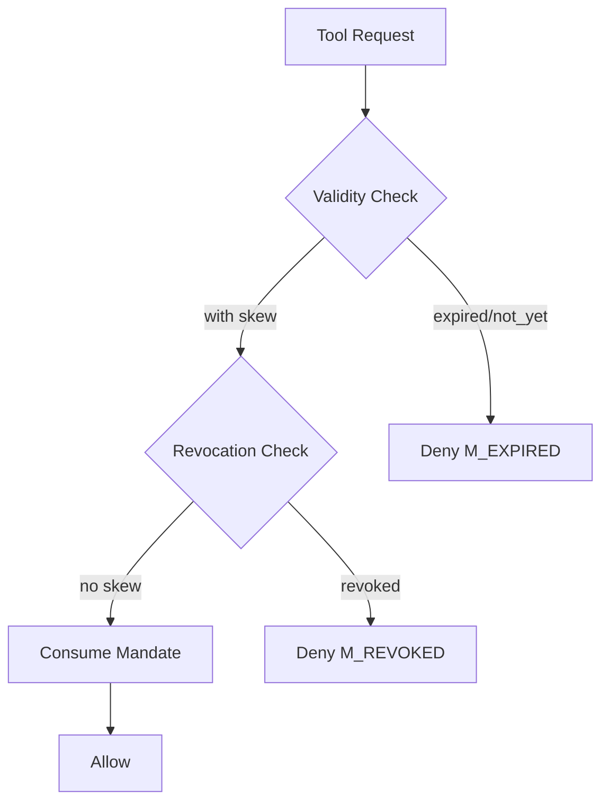
```mermaid
flowchart TD
    REQ[Tool Request] --> VAL{Validity Check}
    VAL -->|with skew| REV{Revocation Check}
    REV -->|no skew| CONSUME[Consume Mandate]

    VAL -->|expired/not_yet| DENY1[Deny M_EXPIRED]
    REV -->|revoked| DENY2[Deny M_REVOKED]
    CONSUME --> ALLOW[Allow]
```

## Pack Registry Architecture

### Pack Resolution Flow (Basic Path)

This diagram shows the basic flow when resolving, fetching, and verifying packs:

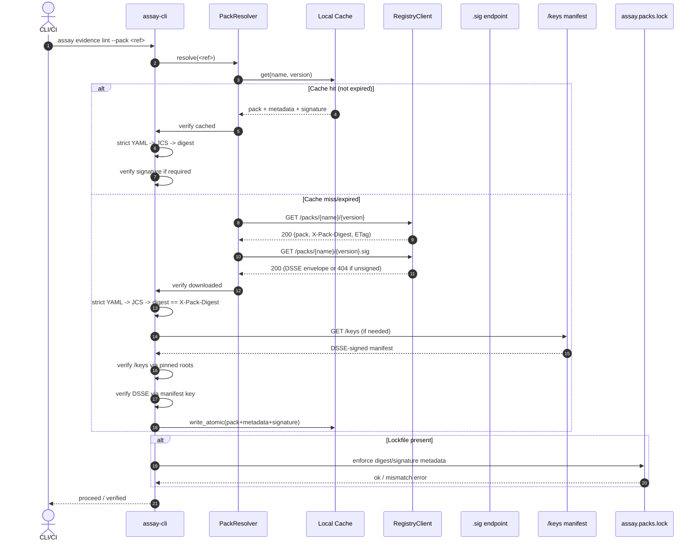
```mermaid
sequenceDiagram
  autonumber
  actor User as CLI/CI
  participant CLI as assay-cli
  participant RES as PackResolver
  participant CACHE as Local Cache
  participant REG as RegistryClient
  participant SIG as .sig endpoint
  participant KEYS as /keys manifest
  participant LOCK as assay.packs.lock

  User->>CLI: assay evidence lint --pack <ref>
  CLI->>RES: resolve(<ref>)

  RES->>CACHE: get(name, version)
  alt Cache hit (not expired)
    CACHE-->>RES: pack + metadata + signature
    RES->>CLI: verify cached
    CLI->>CLI: strict YAML -> JCS -> digest
    CLI->>CLI: verify signature if required
  else Cache miss/expired
    RES->>REG: GET /packs/{name}/{version}
    REG-->>RES: 200 (pack, X-Pack-Digest, ETag)
    RES->>REG: GET /packs/{name}/{version}.sig
    REG-->>RES: 200 (DSSE envelope or 404 if unsigned)
    RES->>CLI: verify downloaded
    CLI->>CLI: strict YAML -> JCS -> digest == X-Pack-Digest
    CLI->>KEYS: GET /keys (if needed)
    KEYS-->>CLI: DSSE-signed manifest
    CLI->>CLI: verify /keys via pinned roots
    CLI->>CLI: verify DSSE via manifest key
    CLI->>CACHE: write_atomic(pack+metadata+signature)
  end

  alt Lockfile present
    CLI->>LOCK: enforce digest/signature metadata
    LOCK-->>CLI: ok / mismatch error
  end

  CLI-->>User: proceed / verified
```

### Pack Resolution Flow (Auth Required)

This diagram shows the OIDC token exchange flow for authenticated pack fetching:

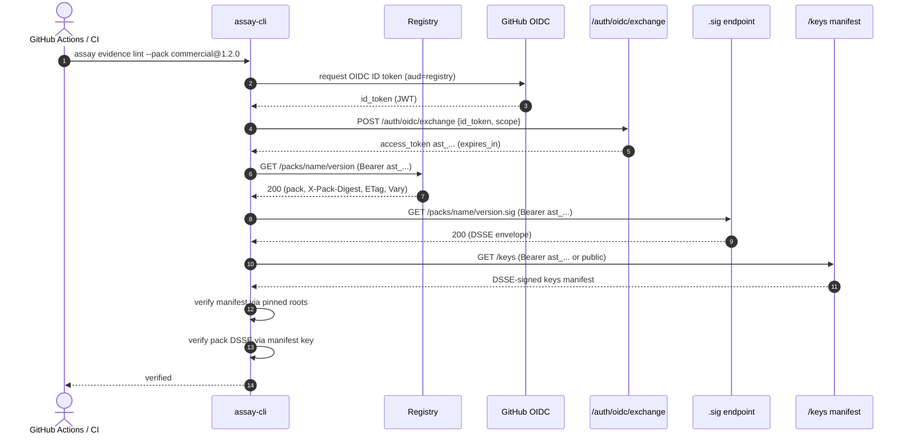
```mermaid
sequenceDiagram
  autonumber
  actor CI as GitHub Actions / CI
  participant CLI as assay-cli
  participant REG as Registry
  participant GH as GitHub OIDC
  participant EX as /auth/oidc/exchange
  participant SIG as .sig endpoint
  participant KEYS as /keys manifest

  CI->>CLI: assay evidence lint --pack commercial@1.2.0
  CLI->>GH: request OIDC ID token (aud=registry)
  GH-->>CLI: id_token (JWT)

  CLI->>EX: POST /auth/oidc/exchange {id_token, scope}
  EX-->>CLI: access_token ast_... (expires_in)

  CLI->>REG: GET /packs/name/version (Bearer ast_...)
  REG-->>CLI: 200 (pack, X-Pack-Digest, ETag, Vary)
  CLI->>SIG: GET /packs/name/version.sig (Bearer ast_...)
  SIG-->>CLI: 200 (DSSE envelope)

  CLI->>KEYS: GET /keys (Bearer ast_... or public)
  KEYS-->>CLI: DSSE-signed keys manifest
  CLI->>CLI: verify manifest via pinned roots
  CLI->>CLI: verify pack DSSE via manifest key
  CLI-->>CI: verified
```

### Pack Registry Trust Chain

This diagram shows how trust is established from pinned roots through the keys manifest to pack signatures:

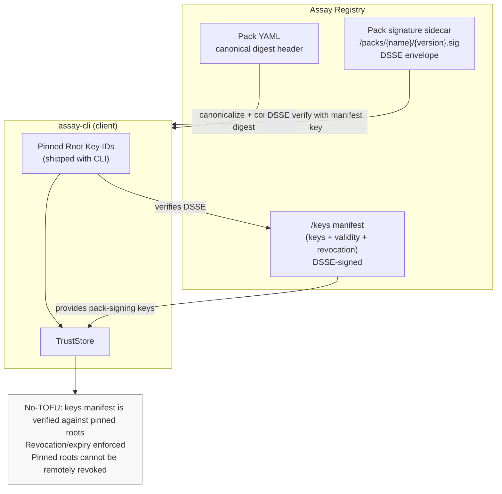
```mermaid
flowchart TB
  subgraph CLI["assay-cli (client)"]
    PR["Pinned Root Key IDs<br/>(shipped with CLI)"]
    TS["TrustStore"]
    PR --> TS
  end

  subgraph Registry["Assay Registry"]
    KM["/keys manifest<br/>(keys + validity + revocation)<br/>DSSE-signed"]
    PK["Pack YAML<br/>canonical digest header"]
    SG["Pack signature sidecar<br/>/packs/{name}/{version}.sig<br/>DSSE envelope"]
  end

  PR -->|verifies DSSE| KM
  KM -->|provides pack-signing keys| TS
  PK -->|canonicalize + compute digest| CLI
  SG -->|DSSE verify with manifest key| CLI

  note1["No-TOFU: keys manifest is verified against pinned roots<br/>Revocation/expiry enforced<br/>Pinned roots cannot be remotely revoked"]:::note
  TS --> note1

  classDef note fill:#f8f8f8,stroke:#999,color:#333
```

### Key Invariants

| Invariant | Description |
|-----------|-------------|
| **No-TOFU** | Keys manifest must be verified against pinned roots on first use |
| **Sidecar-First** | Client always fetches `.sig` sidecar instead of relying on headers |
| **Canonical Digest** | Pack integrity uses strict YAML → JCS → SHA-256, not raw bytes |
| **Cache Untrusted** | Digest (and signature if required) verified on every cache read |
| **Lockfile Hard Fail** | Digest mismatches with lockfile are always hard errors |

## Generated Diagrams

The following diagrams are automatically generated from the codebase by the
[docs-auto-update workflow](../../.github/workflows/docs-auto-update.yml).

### Crate Dependencies (Auto-Generated)

<!-- BEGIN:CRATE_DEPS -->
```mermaid
flowchart TB
    subgraph workspace["Assay Workspace"]
        direction TB
        assay_cli["assay-cli"]
        assay_common["assay-common"]
        assay_core["assay-core"]
        assay_ebpf["assay-ebpf"]
        assay_evidence["assay-evidence"]
        assay_it["assay-it"]
        assay_mcp_server["assay-mcp-server"]
        assay_metrics["assay-metrics"]
        assay_monitor["assay-monitor"]
        assay_policy["assay-policy"]
        assay_registry["assay-registry"]
        assay_sim["assay-sim"]
        assay_xtask["assay-xtask"]
    end

    assay_cli --> assay_common
    assay_cli --> assay_core
    assay_cli --> assay_evidence
    assay_cli --> assay_mcp_server
    assay_cli --> assay_metrics
    assay_cli --> assay_monitor
    assay_cli --> assay_policy
    assay_cli --> assay_sim
    assay_core --> assay_common
    assay_ebpf --> assay_common
    assay_it --> assay_core
    assay_mcp_server --> assay_common
    assay_mcp_server --> assay_core
    assay_mcp_server --> assay_metrics
    assay_metrics --> assay_common
    assay_metrics --> assay_core
    assay_monitor --> assay_common
    assay_monitor --> assay_policy
    assay_sim --> assay_core
    assay_sim --> assay_evidence

    %% Logical groupings for readability
    subgraph core["Core"]
        assay_core
        assay_metrics
        assay_policy
        assay_evidence
        assay_common
    end

    subgraph interface["Interface"]
        assay_cli
        assay_mcp_server
    end

    subgraph runtime["Runtime"]
        assay_monitor
        assay_ebpf
    end

    subgraph support["Support"]
        assay_sim
        assay_xtask
        assay_registry
    end

```
<!-- END:CRATE_DEPS -->

### Module Structure (Auto-Generated)

<!-- BEGIN:MODULE_MAP -->
```mermaid
flowchart TB
    subgraph assay_cli["assay-cli"]
        direction TB
        cli_main["main.rs"]
        cli_dispatch["dispatch"]
        cli_commands["commands/"]
        cli_args["args.rs"]
        cli_main --> cli_dispatch
        cli_dispatch --> cli_commands
        cli_dispatch --> cli_args
    end

    subgraph assay_core["assay-core"]
        direction TB
        core_lib["lib.rs"]
        core_engine["engine/"]
        core_storage["storage/"]
        core_trace["trace/"]
        core_mcp["mcp/"]
        core_report["report/"]
        core_providers["providers/"]
        core_lib --> core_engine
        core_lib --> core_storage
        core_lib --> core_trace
        core_lib --> core_mcp
        core_lib --> core_report
        core_lib --> core_providers
    end

    subgraph assay_metrics["assay-metrics"]
        direction TB
        metrics_lib["lib.rs"]
        metrics_must_contain["must_contain"]
        metrics_semantic["semantic"]
        metrics_regex["regex_match"]
        metrics_schema["json_schema"]
        metrics_args["args_valid"]
        metrics_sequence["sequence_valid"]
        metrics_lib --> metrics_must_contain
        metrics_lib --> metrics_semantic
        metrics_lib --> metrics_regex
        metrics_lib --> metrics_schema
        metrics_lib --> metrics_args
        metrics_lib --> metrics_sequence
    end

    subgraph assay_mcp_server["assay-mcp-server"]
        direction TB
        mcp_main["main.rs"]
        mcp_server["server"]
        mcp_proxy["proxy"]
        mcp_policy["policy"]
        mcp_main --> mcp_server
        mcp_server --> mcp_proxy
        mcp_proxy --> mcp_policy
    end

    subgraph assay_monitor["assay-monitor"]
        direction TB
        mon_lib["lib.rs"]
        mon_events["events"]
        mon_ebpf["ebpf_loader"]
        mon_lib --> mon_events
        mon_lib --> mon_ebpf
    end

    subgraph assay_evidence["assay-evidence"]
        direction TB
        ev_lib["lib.rs"]
        ev_bundle["bundle"]
        ev_events["cloud_events"]
        ev_jcs["jcs"]
        ev_lib --> ev_bundle
        ev_lib --> ev_events
        ev_lib --> ev_jcs
    end

    %% Cross-crate dependencies
    assay_cli --> assay_core
    assay_cli --> assay_metrics
    assay_cli --> assay_evidence
    assay_mcp_server --> assay_core
    assay_mcp_server --> assay_policy
    assay_monitor --> assay_ebpf
    core_engine --> metrics_lib
    core_mcp --> assay_policy

```
<!-- END:MODULE_MAP -->

## Related Documentation

- [Codebase Overview](codebase-overview.md) - Detailed component descriptions
- [Interdependencies](interdependencies.md) - Dependency relationships
- [User Flows](user-flows.md) - User journey mappings
- [SPEC-Mandate-v1](../architecture/SPEC-Mandate-v1.md) - Mandate specification
- [SPEC-Pack-Registry-v1](../architecture/SPEC-Pack-Registry-v1.md) - Pack Registry protocol specification
