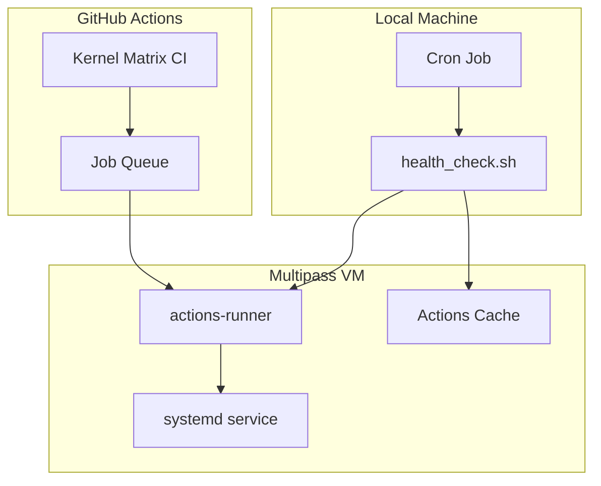
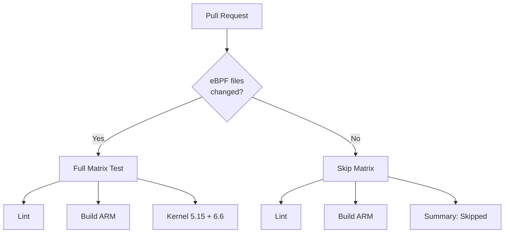

# CI Infrastructure

> **Purpose**: Documentation for CI/CD infrastructure, self-hosted runners, health checks, and optimization.
> **Version**: 2.15.0 (February 2026)

## Overview

Assay uses a hybrid CI infrastructure:
- **GitHub-hosted runners**: Standard CI jobs (build, test, lint)
- **Self-hosted runner**: eBPF/LSM kernel tests (requires privileged access)

## Self-Hosted Runner: `assay-bpf-runner`

### Architecture



### Location

| Component | Path |
|-----------|------|
| Health check script | `infra/bpf-runner/health_check.sh` |
| Setup script | `infra/bpf-runner/setup_local_multipass.sh` |
| Register script | `infra/bpf-runner/register_local.sh` |
| VM name | `assay-bpf-runner` |
| Runner directory | `/opt/actions-runner` |
| Runner user | `github-runner` |

### Health Check Features

The health check script (`health_check.sh`) provides self-healing capabilities:

| Feature | Trigger | Action |
|---------|---------|--------|
| **Stale Job Cleanup** | Jobs >4 hours in queue | Auto-cancel |
| **Superseded Run Cancel** | Multiple runs for same branch | Cancel older runs |
| **PR Priority** | Many PRs waiting, push runs queued | Cancel push runs |
| **Cache Corruption** | "Can't find action.yml" errors | Clear cache, rerun jobs |
| **Runner Offline** | Status != online with queued jobs | Full recovery |
| **Clock Drift** | Time difference >60s | NTP sync |

### Health Check Commands

```bash
# Full health check (runs all maintenance)
./health_check.sh

# Show status
./health_check.sh --status

# Manual recovery
./health_check.sh --recover

# Queue management
./health_check.sh --cancel-stale        # Cancel jobs >4h old
./health_check.sh --cancel-superseded   # Cancel duplicate runs
./health_check.sh --prioritize-prs      # Cancel push runs for PRs
./health_check.sh --optimize-queue      # All queue optimizations

# Cache management
./health_check.sh --clean-cache         # Remove stale entries
./health_check.sh --clear-cache         # Force clear all cache
./health_check.sh --heal-cache          # Detect + fix + rerun
```

### Environment Variables

| Variable | Default | Description |
|----------|---------|-------------|
| `STALE_JOB_HOURS` | 4 | Hours before job considered stale |
| `ACTIONS_CACHE_MAX_AGE_DAYS` | 7 | Days before cache entry is stale |
| `VM_NAME` | assay-bpf-runner | Multipass VM name |
| `RUNNER_NAME` | assay-bpf-runner | GitHub runner name |
| `RUNNER_DIR` | /opt/actions-runner | Runner installation path |

### Cron Setup

The health check runs every 5 minutes:

```bash
# Install cron job
./health_check.sh --install-cron
```

This adds:
```cron
*/5 * * * * /path/to/health_check.sh >> /tmp/assay-runner-health.log 2>&1
```

## CI Optimization: Kernel Matrix Skip

### Problem
Dependabot PRs that only update `Cargo.toml`/`Cargo.lock` (pure dependency bumps) don't need kernel matrix tests. These tests take 5-10 minutes each on the self-hosted runner.

### Solution
The `kernel-matrix.yml` workflow now:
1. Checks if eBPF-related files changed
2. Skips heavy self-hosted runner tests for pure dep bumps
3. Still runs lint and build jobs (on GitHub-hosted runners)



### Files Triggering Full Matrix

The following patterns trigger full kernel matrix tests:
- `crates/assay-ebpf/**`
- `crates/assay-monitor/**`
- `crates/assay-evidence/**`
- `scripts/ci/**`
- `.github/workflows/kernel-matrix.yml`

**NOT triggering full matrix:**
- `Cargo.toml` / `Cargo.lock` only changes
- Documentation changes
- Other crate changes

### Implementation

```yaml
# .github/workflows/kernel-matrix.yml
check-ebpf-changes:
  name: Check eBPF Changes
  runs-on: ubuntu-latest
  outputs:
    ebpf_changed: ${{ steps.check.outputs.ebpf_changed }}
  steps:
    - name: Check for eBPF-related changes
      id: check
      run: |
        EBPF_PATTERNS="crates/assay-ebpf|crates/assay-monitor|..."
        if git diff --name-only | grep -qE "$EBPF_PATTERNS"; then
          echo "ebpf_changed=true" >> "$GITHUB_OUTPUT"
        else
          echo "ebpf_changed=false" >> "$GITHUB_OUTPUT"
        fi

matrix-test:
  if: needs.check-ebpf-changes.outputs.ebpf_changed == 'true'
  # ... matrix test configuration
```

## Queue Management

### Automatic Cleanup

The health check performs these queue optimizations:

1. **Stale Jobs**: Jobs waiting >4 hours are cancelled (configurable)
2. **Superseded Runs**: When multiple runs exist for the same branch, older ones are cancelled
3. **PR Priority**: When >5 PR runs are waiting, push runs are cancelled

### Manual Queue Operations

```bash
# View queue status
./health_check.sh --status

# Cancel all stale jobs
./health_check.sh --cancel-stale

# Cancel superseded (duplicate) runs
./health_check.sh --cancel-superseded

# Prioritize PR runs
./health_check.sh --prioritize-prs

# All optimizations at once
./health_check.sh --optimize-queue
```

### Using GitHub CLI

```bash
# List queued runs
gh run list --repo Rul1an/assay --status queued

# Cancel specific run
gh run cancel <run_id> --repo Rul1an/assay

# Rerun failed jobs
gh run rerun <run_id> --repo Rul1an/assay --failed
```

## Cache Management

### Actions Cache Issues

The `_actions` cache can become corrupted, causing "Can't find action.yml" errors.

**Symptoms:**
```
Error: Can't find 'action.yml', 'action.yaml' or 'Dockerfile' under
'/opt/actions-runner/_work/_actions/actions/checkout/<SHA>'
```

**Auto-Heal Process:**
1. Health check detects failures with this error pattern
2. Clears the entire actions cache
3. Reruns affected jobs

**Manual Fix:**
```bash
# Force clear cache
./health_check.sh --clear-cache

# Or detect + fix + rerun
./health_check.sh --heal-cache
```

### Cache Locations

| Cache | Path | Cleanup |
|-------|------|---------|
| Actions cache | `/opt/actions-runner/_work/_actions/` | Auto (7 days) |
| Rust cache | In workspace | By workflow |
| Docker cache | System | `docker system prune` |

## Runner Recovery

### When Recovery Triggers

- Runner status is "offline" on GitHub
- Queued jobs are waiting
- Runner service is not active

### Recovery Steps

1. **Time Sync**: NTP synchronization (fixes token expiry from clock drift)
2. **Token Generation**: New registration token from GitHub API
3. **Config Cleanup**: Stop service, remove old config
4. **Reconfigure**: Register runner with new token
5. **Start Service**: Install and start systemd service
6. **Verification**: Check runner is online

### Manual Recovery

```bash
# Full recovery
./health_check.sh --recover

# Or step by step in VM:
multipass shell assay-bpf-runner
cd /opt/actions-runner
sudo ./svc.sh stop
sudo ./svc.sh uninstall
./config.sh remove
# Get new token from GitHub
./config.sh --url https://github.com/Rul1an/assay --token <TOKEN> --labels self-hosted,linux,x64,bpf-lsm,assay-bpf-runner --unattended --replace
sudo ./svc.sh install
sudo ./svc.sh start
```

## Workflows Overview

### `ci.yml` - Main CI
- Runs on: GitHub-hosted (ubuntu, macos, windows)
- Jobs: Build, Test, Clippy, Criterion benches
- Trigger: Push to main, PRs

### `kernel-matrix.yml` - Kernel Tests
- Runs on: Self-hosted (assay-bpf-runner)
- Jobs: Lint, Build ARM, Kernel 5.15/6.6 tests
- Trigger: PRs touching eBPF code, push to main
- **Optimization**: Skips matrix for pure dep bumps

### `perf_pr.yml` - Performance
- Runs on: GitHub-hosted
- Jobs: Criterion benchmarks with Bencher
- **Note**: `--err` flag removed (alerts are warnings, not failures)

### `assay-security.yml` - Security Validation
- Runs on: GitHub-hosted
- Jobs: Policy validation on the repo itself

## Monitoring

### Status Dashboard

```bash
# Quick status
./health_check.sh --status

# Output includes:
# - VM state (Running/Stopped)
# - GitHub runner status (online/offline)
# - Service status (active/inactive)
# - Queue stats (queued, in_progress, stale)
# - Cache health
```

### Logs

| Log | Location | Purpose |
|-----|----------|---------|
| Health check | `/tmp/assay-runner-health.log` | Cron job output |
| Runner | `/opt/actions-runner/_diag/` | Runner diagnostics |
| Service | `journalctl -u actions.runner.*` | Systemd logs |

### Alerts

The health check automatically:
- Recovers offline runners
- Clears corrupted caches
- Cancels stale jobs
- Reruns failed jobs due to cache issues

## Troubleshooting

### Runner Not Picking Up Jobs

1. Check status: `./health_check.sh --status`
2. Verify labels match workflow: `self-hosted,linux,x64,bpf-lsm,assay-bpf-runner`
3. Check runner is online in GitHub Settings > Actions > Runners
4. Run recovery: `./health_check.sh --recover`

### "Can't find action.yml" Errors

1. Clear cache: `./health_check.sh --clear-cache`
2. Rerun failed jobs: `./health_check.sh --heal-cache`

### Jobs Stuck in Queue

1. Check runner status: `./health_check.sh --status`
2. Cancel stale jobs: `./health_check.sh --cancel-stale`
3. Check if runner is busy: Only 1 job at a time on self-hosted

### Clock Drift Issues

Symptoms: "Token expired" errors despite recent token

Fix: Health check auto-syncs time, or manually:
```bash
multipass exec assay-bpf-runner -- sudo timedatectl set-ntp true
multipass exec assay-bpf-runner -- sudo systemctl restart systemd-timesyncd
```

## Related Documentation

- [Architecture Diagrams](architecture-diagrams.md) - CI/CD flow diagrams
- [User Flows](user-flows.md) - Flow 2: CI/CD Regression Gate
- [Quick Reference](quick-reference.md) - GitHub Action usage
