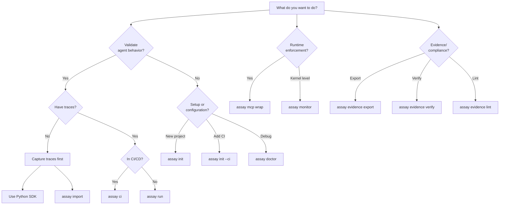
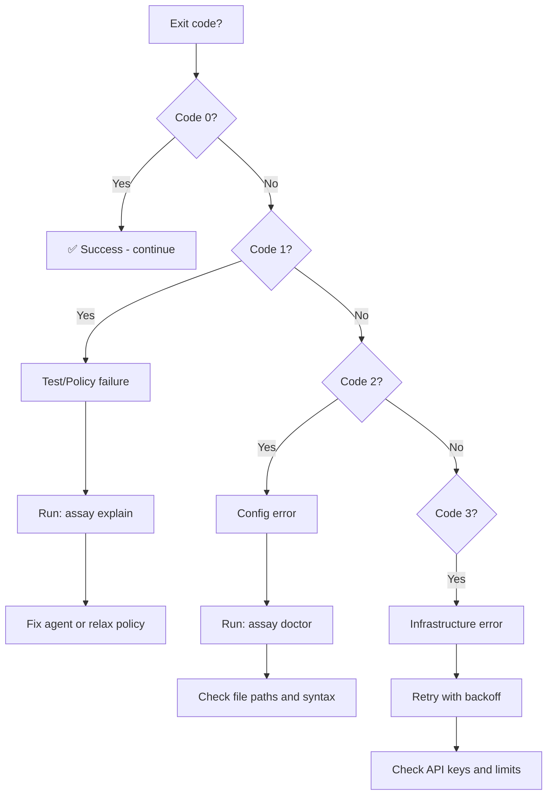
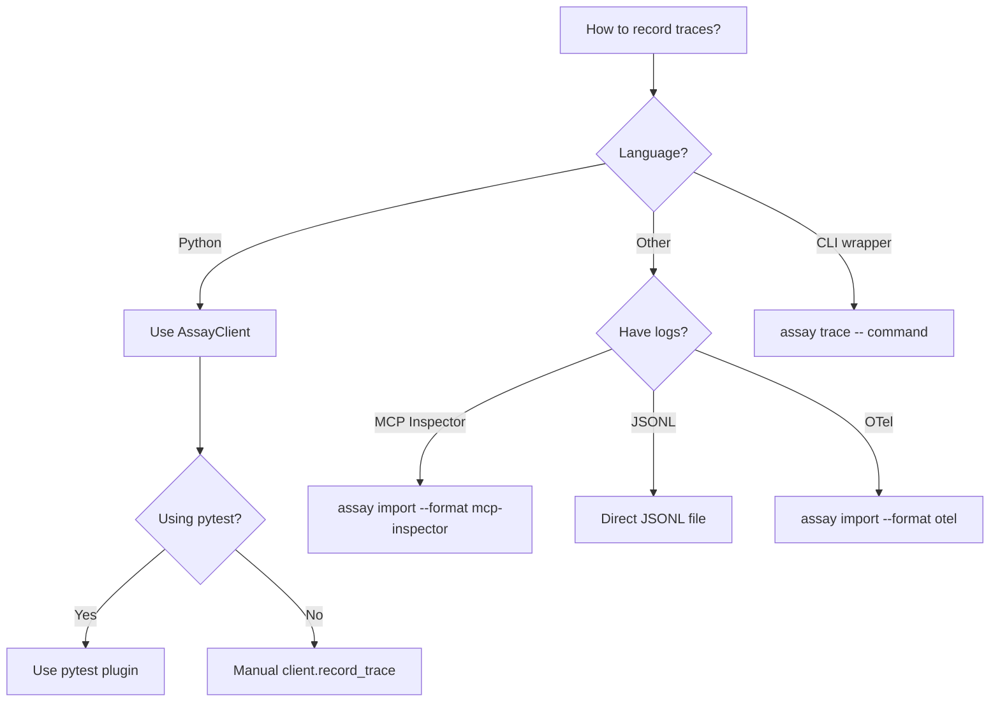
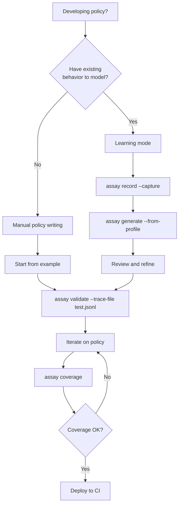
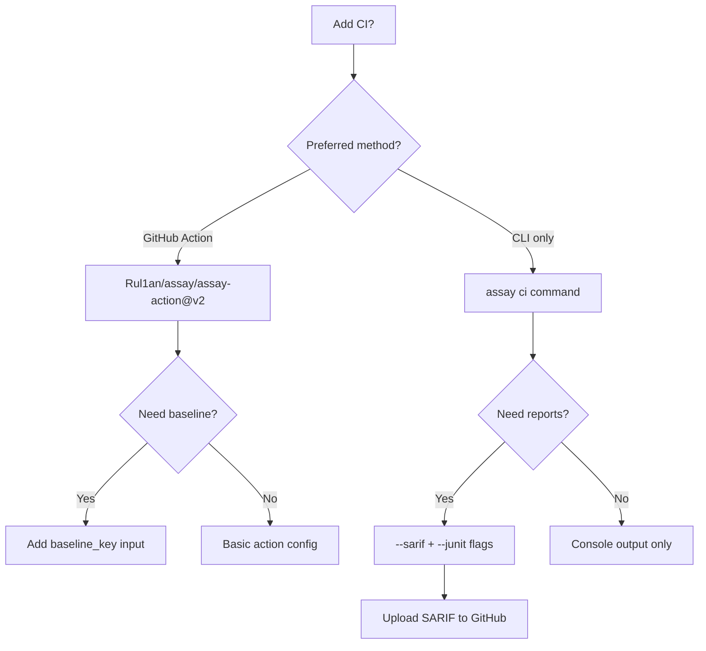
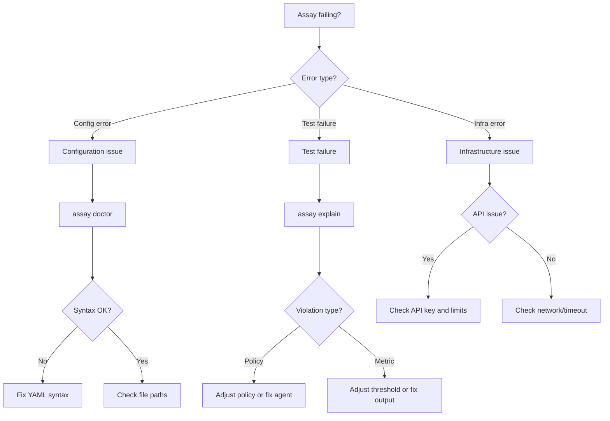
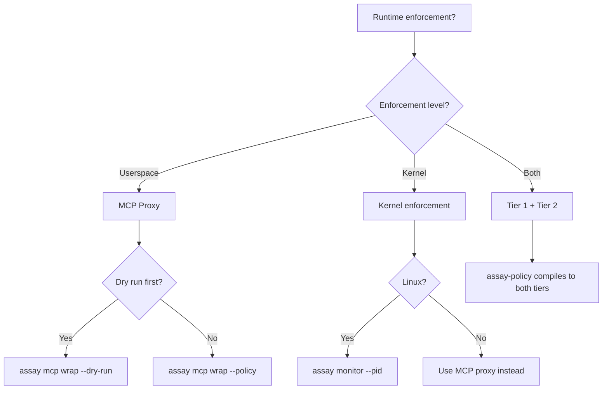

# Decision Trees

> **Purpose**: Help AI agents decide which command, approach, or pattern to use.
> **Version**: 2.12.0 (January 2026)

## Decision Tree 1: Which Command Should I Use?

## Decision Tree 2: Exit Code Handling

## Decision Tree 3: Trace Recording Method

## Decision Tree 4: Policy Development

## Decision Tree 5: CI Integration Method

## Decision Tree 6: Debugging Failures

## Decision Tree 7: Runtime Security

## Decision Table: Command Selection

| Scenario | Command | Key Options |
|----------|---------|-------------|
| New project setup | `assay init` | `--ci` for CI workflow |
| Validate traces | `assay validate` | `--trace-file`, `--format sarif` |
| Run test suite | `assay run` | `--config`, `--baseline` |
| CI gate (strict) | `assay ci` | `--trace-file`, `--sarif` |
| Debug setup | `assay doctor` | (no options needed) |
| Explain failures | `assay explain` | `--trace-file` |
| Generate policy | `assay generate` | `--from-profile` |
| Record behavior | `assay record` | `--capture` |
| Check coverage | `assay coverage` | `--min-coverage 80` |
| MCP enforcement | `assay mcp wrap` | `--policy`, `--dry-run` |
| Export evidence | `assay evidence export` | `--profile`, `--out` |
| Verify evidence | `assay evidence verify` | `<bundle.tar.gz>` |
| Lint evidence | `assay evidence lint` | `--format sarif` |
| Sign tool | `assay tool sign` | `--key`, `--out` |

## Decision Table: Output Format Selection

| Use Case | Format | Flag |
|----------|--------|------|
| Human reading | Console | (default) |
| CI parsing | JSON | `--format json` |
| Test reporting | JUnit | `--format junit` or `--junit <path>` |
| GitHub Security | SARIF | `--format sarif` or `--sarif <path>` |

## Decision Table: Error Recovery

| Error | Reason Code | Recovery Action |
|-------|-------------|-----------------|
| Trace file not found | `E_TRACE_NOT_FOUND` | Check path, use `assay import` |
| Config parse error | `E_CFG_PARSE` | Run `assay doctor --config <file>` |
| Judge unavailable | `E_JUDGE_UNAVAILABLE` | Check API key, retry later |
| Rate limited | `E_RATE_LIMIT` | Wait, reduce parallelism |
| Test failed | `E_TEST_FAILED` | Run `assay explain` |
| Policy violation | `E_POLICY_VIOLATION` | Review policy or fix agent |

## When to Use What: Quick Reference

### For Validation
- **Quick check**: `assay validate --trace-file traces.jsonl`
- **Full suite**: `assay run --config assay.yaml`
- **CI gate**: `assay ci --config assay.yaml --strict`

### For Policy Development
- **From scratch**: Write `policy.yaml` manually
- **From behavior**: `assay generate --from-profile profile.json`
- **Test coverage**: `assay coverage --trace-file traces.jsonl`

### For Debugging
- **Setup issues**: `assay doctor`
- **Test failures**: `assay explain --trace-file traces.jsonl`
- **Coverage gaps**: `assay coverage`

### For CI Integration
- **GitHub Action** (recommended): `Rul1an/assay/assay-action@v2`
- **CLI only**: `assay ci` with `--sarif` flag
- **Custom**: `assay run` with manual report handling

### For Runtime Security
- **Userspace**: `assay mcp wrap --policy policy.yaml`
- **Kernel (Linux)**: `assay monitor --policy policy.yaml --pid <pid>`
- **Sandbox**: `assay sandbox --policy policy.yaml -- command`

## Related Documentation

- [Quick Reference](quick-reference.md) - Command cheat sheet
- [Entry Points](entry-points.md) - Full command documentation
- [User Flows](user-flows.md) - Complete user journeys
