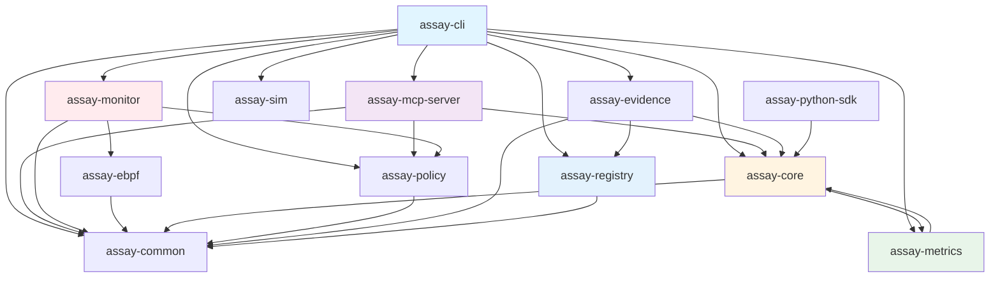
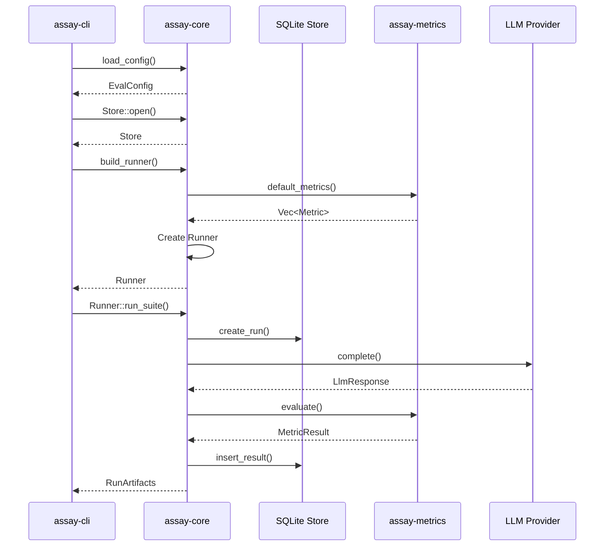
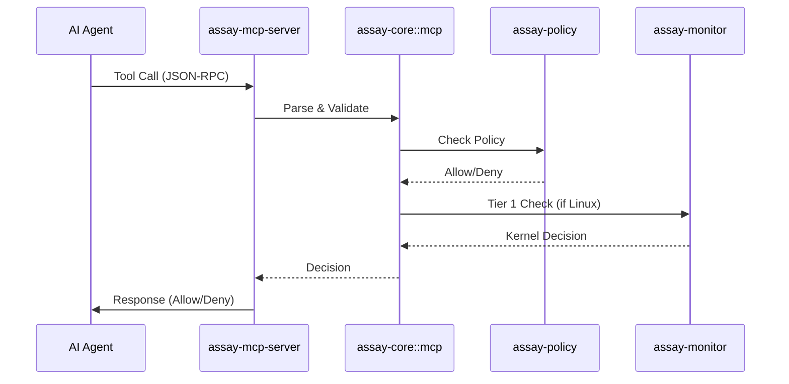
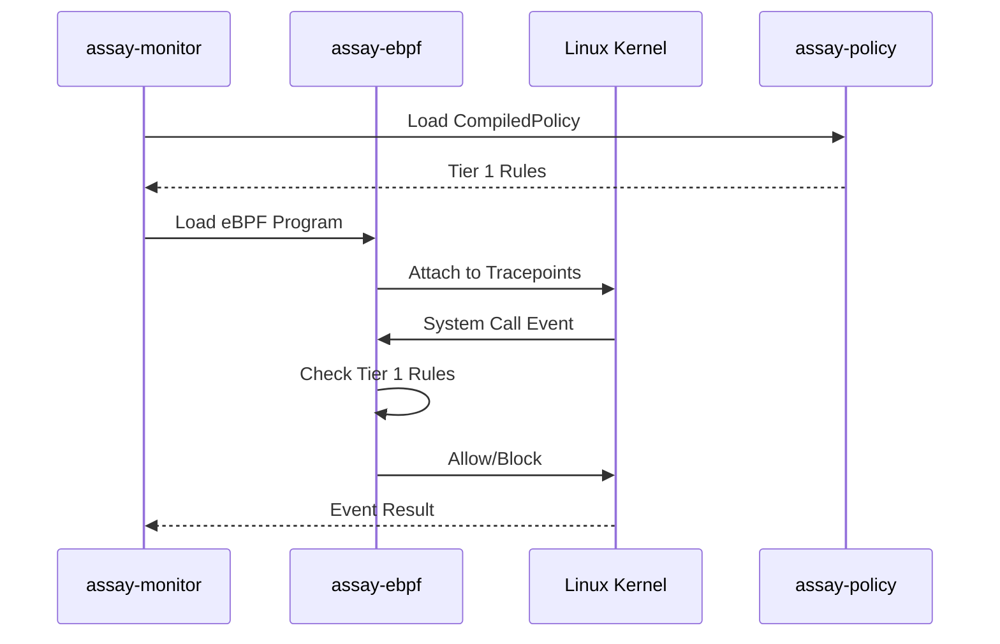

# Interdependencies

This document maps the dependencies and interfaces between all crates and components in the Assay codebase.

## Crate Dependency Graph



## Detailed Crate Dependencies

### `assay-cli` Dependencies

**Internal Crates:**
- `assay-core` (workspace) - Core evaluation engine
- `assay-monitor` (workspace) - Runtime monitoring
- `assay-common` (workspace, features: ["std"]) - Shared types
- `assay-policy` (workspace) - Policy compilation
- `assay-metrics` (workspace) - Standard metrics
- `assay-evidence` (workspace) - Evidence management
- `assay-mcp-server` (workspace) - MCP server
- `assay-sim` (workspace, optional) - Attack simulation

**External Dependencies:**
- `clap` - CLI argument parsing
- `tokio` - Async runtime
- `serde`, `serde_json`, `serde_yaml` - Serialization
- `anyhow` - Error handling
- `tracing` - Logging
- `dialoguer` - Interactive prompts
- `ratatui`, `crossterm` (optional) - TUI support

### `assay-core` Dependencies

**Internal Crates:**
- `assay-common` (workspace, features: ["std"]) - Shared types
- `assay-metrics` (workspace) - Metrics trait implementations

**External Dependencies:**
- `tokio` - Async runtime
- `rusqlite` - SQLite database
- `reqwest` - HTTP client (for LLM providers)
- `jsonschema` - JSON Schema validation
- `regex` - Regular expressions
- `serde`, `serde_json`, `serde_yaml` - Serialization
- `anyhow`, `thiserror` - Error handling
- `uuid`, `chrono` - ID generation and timestamps
- `sha2`, `md5` - Hashing
- `sysinfo`, `dirs` (optional) - Discovery features
- `nix` (optional) - Unix system calls

### `assay-metrics` Dependencies

**Internal Crates:**
- `assay-core` (workspace) - Metrics API traits

**External Dependencies:**
- `serde`, `serde_json` - Serialization
- `regex` - Pattern matching
- `jsonschema` - JSON Schema validation

### `assay-mcp-server` Dependencies

**Internal Crates:**
- `assay-core` (workspace) - MCP integration, policy engine
- `assay-policy` (workspace) - Policy compilation
- `assay-common` (workspace) - Shared types

**External Dependencies:**
- `tokio` - Async runtime
- `serde`, `serde_json` - Serialization
- `anyhow` - Error handling

### `assay-monitor` Dependencies

**Internal Crates:**
- `assay-policy` (workspace) - Policy compilation
- `assay-common` (workspace) - Shared types
- `assay-ebpf` (workspace) - eBPF programs

**External Dependencies:**
- `aya` - eBPF framework
- `tokio` - Async runtime
- `nix` - Unix system calls

### `assay-policy` Dependencies

**Internal Crates:**
- `assay-common` (workspace) - Shared types

**External Dependencies:**
- `serde`, `serde_json`, `serde_yaml` - Serialization

### `assay-evidence` Dependencies

**Internal Crates:**
- `assay-core` (workspace) - Profile types, event mapping
- `assay-common` (workspace) - Shared types
- `assay-registry` (workspace) - Pack fetching for lint rules

**External Dependencies:**
- `serde`, `serde_json` - Serialization
- `sha2` - SHA-256 for content-addressed IDs
- `tar`, `flate2` - Bundle compression
- `chrono` - Timestamps (RFC 3339)
- `uuid` - Event ID generation

**Key Types:**
- `EvidenceEvent` - CloudEvents v1.0 format
- `BundleWriter` / `BundleReader` - Tar.gz bundle I/O
- `Manifest` - Bundle metadata with content-addressed ID

### `assay-registry` Dependencies

**Internal Crates:**
- `assay-common` (workspace) - Shared types

**External Dependencies:**
- `reqwest` - HTTP client with retry logic
- `serde`, `serde_json`, `serde_yaml` - Serialization
- `serde_jcs` - JCS canonicalization (RFC 8785)
- `ed25519-dalek` - Ed25519 signatures
- `sha2` - SHA-256 digests
- `tokio` - Async runtime
- `thiserror`, `anyhow` - Error handling

**Key Types:**
- `RegistryClient` - HTTP client with auth/retry/rate-limiting
- `PackCache` - Local cache with TOCTOU protection
- `TrustStore` - Key manifest verification
- `Lockfile` - v2 lockfile for reproducible builds

**Key Features:**
- Strict YAML validation (no anchors/aliases/tags)
- JCS canonicalization for deterministic digests
- DSSE signature verification with sidecar endpoint
- No-TOFU trust model with pinned roots
- OIDC token exchange for CI environments

### `assay-common` Dependencies

**External Dependencies:**
- `serde`, `serde_json` - Serialization (no_std compatible)

## Key Interfaces

### Metrics API Interface

**Trait**: `assay-core::metrics_api::Metric`

```rust
pub trait Metric: Send + Sync {
    fn name(&self) -> &str;
    fn evaluate(&self, response: &str, expected: Option<&str>) -> MetricResult;
}
```

**Implementations**: All metrics in `assay-metrics` implement this trait.

**Usage**: `assay-core` uses `Vec<Arc<dyn Metric>>` to hold metrics, loaded from `assay-metrics::default_metrics()`.

### LLM Provider Interface

**Trait**: `assay-core::providers::llm::LlmClient`

```rust
pub trait LlmClient: Send + Sync {
    async fn complete(&self, prompt: &str) -> Result<LlmResponse>;
    fn provider_name(&self) -> &str;
}
```

**Implementations**:
- `OpenAIClient` - Real OpenAI API calls
- `FakeClient` - Mock client for testing
- `TraceClient` - Replay from trace files
- `StrictLlmClient` - Wrapper that enforces strict mode

### Embedder Interface

**Trait**: `assay-core::providers::embedder::Embedder`

```rust
pub trait Embedder: Send + Sync {
    async fn embed(&self, text: &str) -> Result<Vec<f32>>;
}
```

**Implementations**:
- `OpenAIEmbedder` - OpenAI embeddings API
- `FakeEmbedder` - Mock embedder for testing

### Storage Interface

**Struct**: `assay-core::storage::Store`

**Key Methods**:
- `create_run(cfg: &EvalConfig) -> Result<i64>`
- `insert_result_embedded(run_id: i64, result: &TestResultRow) -> Result<()>`
- `get_last_passing_by_fingerprint(fingerprint: &str) -> Result<Option<TestResultRow>>`
- `init_schema() -> Result<()>`

**Used by**: `assay-cli` via `build_runner()`, `Runner` for persistence

### Policy Engine Interface

**Module**: `assay-core::policy_engine`

**Key Types**:
- `Policy` - Parsed policy structure
- `PolicyEngine` - Policy evaluation engine

**Used by**:
- `assay-core::mcp` - Runtime policy checks
- `assay-cli` - Validation commands
- `assay-mcp-server` - Tool call validation

### MCP Integration Interface

**Module**: `assay-core::mcp`

**Key Components**:
- `McpProxy` - Proxy that intercepts MCP tool calls
- `McpPolicy` - Policy wrapper for MCP context
- `mapper_v2` - Maps MCP tool calls to policy checks

**Used by**: `assay-mcp-server` for runtime enforcement

## Data Flow Between Components

### CLI → Core Flow



### MCP Server Flow



### Monitor → Kernel Flow



## Shared Types (`assay-common`)

**Purpose**: Types shared between eBPF (kernel) and userspace (monitor)

**Key Types**:
- `MonitorEvent` - Event structure for kernel→userspace communication
- `InodeKey` - File identifier for tracking
- Event type constants

**Features**: `no_std` compatible for eBPF usage

## Circular Dependencies

**None**: The dependency graph is acyclic. All dependencies flow in one direction:
- CLI → Core → Metrics
- CLI → Registry → Common
- MCP Server → Core → Policy
- Monitor → Policy → Common
- Evidence → Registry → Common

## Feature Flags

### `assay-core` Features
- `discovery` - Auto-discovery of configs and MCP servers
- `kill-switch` - Process termination on violations
- `experimental` - Experimental features

### `assay-cli` Features
- `tui` - Terminal UI support (ratatui, crossterm)
- `sim` - Attack simulation (assay-sim)
- `experimental` - Experimental commands

## Platform-Specific Dependencies

### Linux-Only
- `assay-monitor` - Requires eBPF support
- `assay-ebpf` - Linux kernel eBPF
- `landlock` - Linux security module (in `assay-cli`)

### Unix-Only
- `nix` - Unix system calls (signal, process, fs)

### All Platforms
- `assay-core` - Core functionality works everywhere
- `assay-cli` - CLI works everywhere (some commands Linux-only)
- `assay-metrics` - Platform-independent

## Python SDK Integration

**Location**: `assay-python-sdk/`

**Rust Bindings**: Uses PyO3 to bind to `assay-core`

**Key Bindings**:
- `AssayClient` → Calls Rust `trace::ingest`
- `Coverage` → Calls Rust `coverage::analyze`
- `Explainer` → Calls Rust `explain::explain`

**Dependencies**:
- `pyo3` - Rust-Python bindings
- `assay-core` (workspace) - Core functionality

## GitHub Action Integration

**Repository**: https://github.com/Rul1an/assay/tree/main/assay-action

**Architecture**: Composite action (no Docker overhead)

**Key Dependencies**:
- Assay CLI binary (downloaded from releases)
- `actions/cache@v4` - Binary caching
- `actions/upload-artifact@v4` - Report artifacts
- `github/codeql-action/upload-sarif@v4` - SARIF upload

**Flow**:
```
GitHub Actions Runner
    ↓
Rul1an/assay/assay-action@v2
    ├─→ Cache check / Binary install
    ├─→ Evidence discovery (.assay/evidence/*.tar.gz)
    ├─→ assay evidence verify (per bundle)
    ├─→ assay evidence lint --format sarif (per bundle)
    ├─→ SARIF upload to GitHub Security
    ├─→ Job Summary
    └─→ Artifact upload
```

**Outputs consumed by callers**:
- `verified`: boolean
- `findings_error`: integer count
- `findings_warn`: integer count
- `reports_dir`: path to reports

## Build-Time vs Runtime Dependencies

### Build-Time Only
- `schemars` - JSON Schema generation
- `tempfile` - Temporary file creation (dev)

### Runtime
- All workspace crates are runtime dependencies
- External crates listed above are runtime dependencies

## Version Management

**Workspace Version**: All crates share version from `Cargo.toml` workspace:
```toml
[workspace.package]
version = "2.12.0"
```

**Patch Section**: Internal crates are patched to use local paths:
```toml
[patch.crates-io]
assay-core = { path = "crates/assay-core" }
assay-metrics = { path = "crates/assay-metrics" }
assay-registry = { path = "crates/assay-registry" }
```

## Related Documentation

- [Codebase Overview](codebase-overview.md) - High-level architecture
- [Architecture Diagrams](architecture-diagrams.md) - Visual dependency representations
- [Entry Points](entry-points.md) - How components are used
