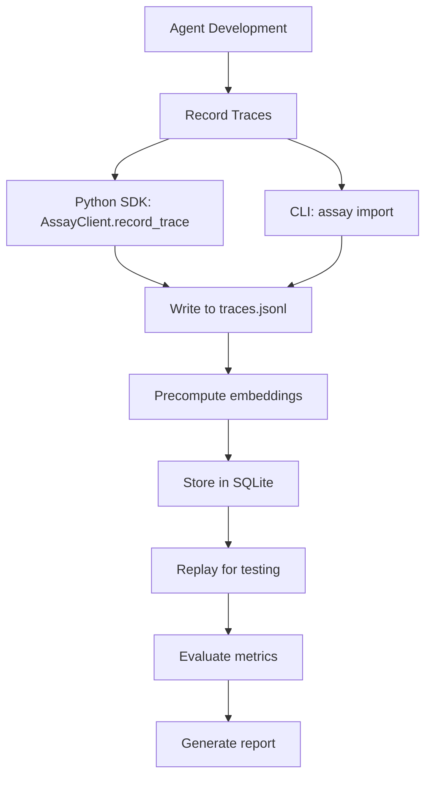
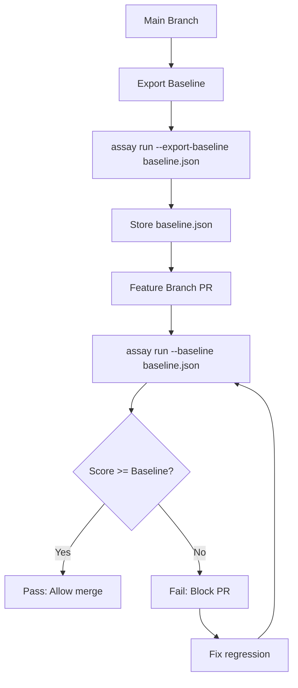
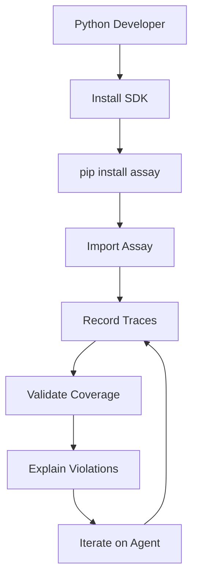
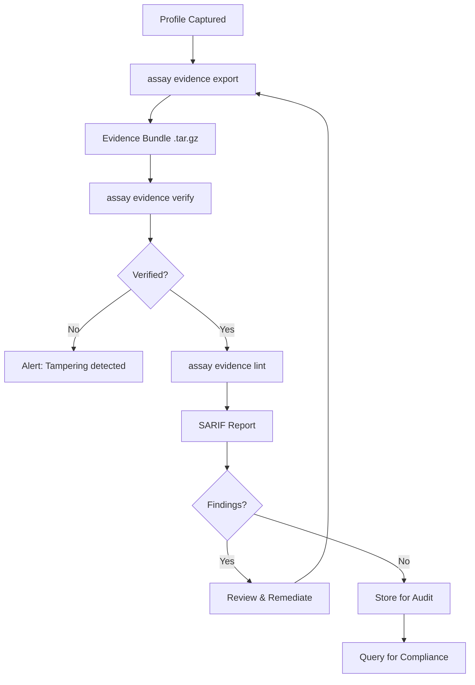

# User Flows

This document maps all user journeys through the Assay system, organized by user type and use case.

## User Types

1. **Agent Developer**: Builds AI agents and needs to validate their behavior
2. **Platform Engineer**: Integrates Assay into CI/CD pipelines
3. **Security Engineer**: Configures runtime security and policies
4. **Python Developer**: Uses the Python SDK for agent development

## Flow 1: Initial Setup & First Test (Agent Developer)

```mermaid
flowchart TD
    start[Developer starts] --> install[Install Assay CLI]
    install --> init[Run assay init]
    init --> detect[Auto-detect project type]
    detect --> gen[Generate assay.yaml + policy.yaml]
    gen --> capture[Capture traces]
    capture --> validate[Run assay validate]
    validate -->{Pass?}
    validate -->|Yes| success[Success: Agent validated]
    validate -->|No| fix[Fix agent or relax policy]
    fix --> validate
    success --> ci[Add to CI]
```

**Steps:**
1. **Install**: `pip install assay` or download binary
2. **Initialize**: `assay init` - auto-detects project, generates secure defaults
3. **Capture traces**: Use `AssayClient` or `assay import` to record tool calls
4. **Validate**: `assay validate --trace-file traces.jsonl`
5. **Iterate**: Fix agent or adjust policy until validation passes
6. **CI Integration**: Add `assay run` to CI pipeline

## Flow 2: CI/CD Regression Gate (Platform Engineer)

```mermaid
flowchart TD
    pr[Pull Request Created] --> trigger[CI Pipeline Triggered]
    trigger --> checkout[Checkout Code]
    checkout --> tests[Run Tests with Assay]
    tests --> action[Rul1an/assay/assay-action@v2]
    action --> verify[Verify Evidence Bundles]
    verify --> lint[Lint for Security Issues]
    lint --> sarif[Upload SARIF to Security Tab]
    sarif --> comment[PR Comment if Findings]
    comment -->{All Pass?}
    comment -->|Yes| merge[Allow Merge]
    comment -->|No| block[Block PR + Report]
    block --> fix[Developer fixes]
    fix --> pr
```

**Steps:**
1. **PR created**: Developer opens pull request
2. **CI triggered**: GitHub Actions runs
3. **Tests run**: Tests generate evidence bundles (`.assay/evidence/*.tar.gz`)
4. **Action verifies**: `Rul1an/assay/assay-action@v2` verifies and lints bundles
5. **Reporting**: SARIF uploaded to GitHub Security tab, PR comment if issues
6. **Gate decision**: Exit code 0 = pass, 1 = fail

**Configuration (Recommended):**
```yaml
# .github/workflows/assay.yml
name: AI Agent Security

on:
  push:
    branches: [main]
  pull_request:

permissions:
  contents: read
  security-events: write
  pull-requests: write

jobs:
  assay:
    runs-on: ubuntu-latest
    steps:
      - uses: actions/checkout@v4

      - name: Run tests with Assay
        run: |
          curl -fsSL https://getassay.dev/install.sh | sh
          assay run --policy policy.yaml -- pytest tests/

      - name: Verify AI agent behavior
        uses: Rul1an/assay/assay-action@v2
        with:
          fail_on: error
```

**Alternative (CLI-only):**
```yaml
- name: Run Assay
  run: assay run --config assay.yaml --format sarif --sarif assay-results.sarif
- name: Upload SARIF
  uses: github/codeql-action/upload-sarif@v4
  with:
    sarif_file: assay-results.sarif
```

## Flow 3: Trace Recording & Replay (Agent Developer)



**Recording Methods:**

1. **Python SDK**:
```python
from assay import AssayClient

client = AssayClient(trace_file="traces.jsonl")
client.record_trace({
    "tool": "filesystem_read",
    "args": {"path": "/tmp/file.txt"}
})
```

2. **CLI Import**:
```bash
assay import --format mcp-inspector session.json --init
```

3. **Pytest Plugin**:
```python
@pytest.mark.assay(trace_file="test_traces.jsonl")
def test_agent():
    # Test code automatically captures traces
    pass
```

**Replay Flow:**
```bash
assay run --config assay.yaml --trace-file traces.jsonl
```

## Flow 4: Policy Development & Learning Mode (Security Engineer)

```mermaid
flowchart TD
    start[Start Policy Development] --> profile[Capture Profile]
    profile --> record[assay record --capture]
    record --> generate[assay generate --from-profile]
    generate --> policy[Generated policy.yaml]
    policy --> review[Review & Refine]
    review --> test[Test with traces]
    test -->{Coverage OK?}
    test -->|No| refine[Refine policy]
    refine --> test
    test -->|Yes| deploy[Deploy to CI/Production]
```

**Learning Mode Commands:**

1. **Capture profile**: `assay record --capture --output profile.json`
2. **Generate policy**: `assay generate --from-profile profile.json --output policy.yaml`
3. **Review**: Edit generated policy to add custom constraints
4. **Test**: `assay validate --policy policy.yaml --trace-file traces.jsonl`
5. **Deploy**: Commit policy.yaml to repository

## Flow 5: Runtime Security (Security Engineer)

```mermaid
flowchart TD
    start[Production Deployment] --> mcp[Start MCP Server]
    mcp --> proxy[assay mcp-server --policy policies/]
    proxy --> agent[Agent connects]
    agent --> toolcall[Agent makes tool call]
    toolcall --> check[Policy check]
    check -->{Allowed?}
    check -->|Yes| execute[Execute tool]
    check -->|No| block[Block + Log]
    execute --> monitor[Monitor with eBPF]
    monitor --> kernel[Kernel enforcement]
    kernel --> audit[Audit log]
```

**Runtime Security Setup:**

1. **MCP Server**:
```bash
assay mcp-server --policy policies/ --port 3000
```

2. **Kernel Monitor** (Linux only):
```bash
sudo assay monitor --policy policy.yaml --pid <agent-pid>
```

3. **Agent Integration**: Agent connects to MCP server instead of direct tool execution

**Tier 1 (Kernel) vs Tier 2 (Userspace):**
- **Tier 1**: Exact paths, CIDRs, ports → enforced in kernel via eBPF/LSM
- **Tier 2**: Glob/regex patterns, complex constraints → enforced in userspace (MCP server)

## Flow 6: Baseline Regression Testing (Platform Engineer)



**Baseline Workflow:**

1. **On main branch**: Export baseline after successful run
```bash
assay run --config assay.yaml --export-baseline baseline.json
```

2. **On feature branch**: Compare against baseline
```bash
assay run --config assay.yaml --baseline baseline.json
```

3. **Gate**: If score drops below threshold (default 5%), PR is blocked

## Flow 7: Python SDK Usage (Python Developer)



**Python SDK Flow:**

1. **Installation**: `pip install assay`
2. **Recording**:
```python
from assay import AssayClient

client = AssayClient("traces.jsonl")
client.record_trace(tool_call)
```

3. **Validation**:
```python
from assay import Coverage

coverage = Coverage.analyze(traces, min_coverage=80.0)
if not coverage.passed:
    print(f"Coverage: {coverage.score}%")
```

4. **Explanation**:
```python
from assay import Explainer

explainer = Explainer("policy.yaml")
explanation = explainer.explain(trace)
print(explanation)
```

## Flow 8: MCP Integration (Agent Developer)

```mermaid
flowchart TD
    start[Agent with MCP] --> connect[Connect to MCP Server]
    connect --> list[List Tools]
    list --> call[Call Tool]
    call --> proxy[Assay MCP Proxy]
    proxy --> policy[Check Policy]
    policy -->{Allowed?}
    policy -->|Yes| forward[Forward to Real MCP Server]
    policy -->|No| reject[Reject + Return Error]
    forward --> execute[Execute Tool]
    execute --> response[Return Response]
    reject --> response
    response --> agent[Agent Receives Response]
```

**MCP Integration Steps:**

1. **Start MCP server**: `assay mcp-server --policy policies/`
2. **Agent connects**: Agent uses Assay MCP server as proxy
3. **Tool calls intercepted**: Assay validates against policy before forwarding
4. **Audit logging**: All tool calls logged for compliance

## Flow 9: Debugging & Diagnostics (All Users)

```mermaid
flowchart TD
    issue[Issue Detected] --> doctor[assay doctor]
    doctor --> analyze[Analyze Config + Traces]
    analyze --> report[Report Issues]
    report --> fix[Fix Issues]
    fix --> validate[assay validate]
    validate -->{Fixed?}
    validate -->|No| explain[assay explain]
    explain --> fix
    validate -->|Yes| done[Done]
```

**Debugging Commands:**

1. **Doctor**: `assay doctor` - Diagnoses common issues
2. **Explain**: `assay explain --trace-file trace.jsonl` - Explains violations
3. **Validate**: `assay validate --trace-file trace.jsonl` - Validates traces
4. **Coverage**: `assay coverage --trace-file trace.jsonl` - Shows coverage

## Flow 10: Migration & Upgrades (Platform Engineer)

```mermaid
flowchart TD
    old[Old Config Format] --> migrate[assay migrate]
    migrate --> preview[Preview Changes]
    preview --> apply[Apply Migration]
    apply --> backup[Backup Old Config]
    backup --> write[Write New Config]
    write --> validate[Validate New Config]
    validate --> test[Test with Traces]
    test -->{Works?}
    test -->|No| rollback[Rollback]
    test -->|Yes| commit[Commit Changes]
```

**Migration Flow:**

1. **Preview**: `assay migrate --config old.yaml --dry-run`
2. **Apply**: `assay migrate --config old.yaml`
3. **Validate**: `assay validate --config new.yaml`
4. **Test**: Run full test suite
5. **Commit**: If successful, commit new config

## Flow 11: Evidence & Compliance (Security/Compliance Engineer)



**Evidence Workflow Commands:**

1. **Export bundle**: `assay evidence export --profile profile.yaml --out bundle.tar.gz`
2. **Verify integrity**: `assay evidence verify bundle.tar.gz`
3. **Lint for issues**: `assay evidence lint bundle.tar.gz --format sarif`
4. **Compare runs**: `assay evidence diff baseline.tar.gz current.tar.gz`
5. **Interactive explore**: `assay evidence explore bundle.tar.gz` (requires TUI feature)

**Evidence Bundle Contents:**
- `manifest.json`: Bundle metadata, producer info, content-addressed ID
- `events.jsonl`: CloudEvents v1.0 format events
- Deterministic: Same profile → same bundle ID (JCS canonicalization)

## Decision Points

### When to Use Which Flow

| Use Case | Flow | Key Command/Action |
|----------|------|-------------|
| First-time setup | Flow 1 | `assay init` |
| CI integration | Flow 2 | `Rul1an/assay/assay-action@v2` |
| Recording traces | Flow 3 | `AssayClient` or `assay import` |
| Policy development | Flow 4 | `assay generate` |
| Production security | Flow 5 | `assay mcp-server` + `assay monitor` |
| Regression testing | Flow 6 | `assay run --baseline` |
| Python development | Flow 7 | Python SDK |
| MCP integration | Flow 8 | `assay mcp-server` |
| Debugging | Flow 9 | `assay doctor`, `assay explain` |
| Upgrading | Flow 10 | `assay migrate` |
| Evidence & Compliance | Flow 11 | `assay evidence export/verify/lint` |

## Error Handling Flows

### Validation Failure
```
Validation fails → Exit code 1 → CI blocks PR → Developer fixes → Re-run
```

### Policy Violation
```
Tool call → Policy check → Violation → Block (or warn) → Log → Agent receives error
```

### Cache Miss
```
Test run → Cache lookup → Miss → LLM call → Store result → Return
```

### Quarantine
```
Test fails → Quarantine check → Mark as flaky → Skip in future runs (optional)
```

## Related Documentation

- [Entry Points](entry-points.md) - All commands and APIs
- [Interdependencies](interdependencies.md) - How components interact
- [Architecture Diagrams](architecture-diagrams.md) - Visual flow representations
