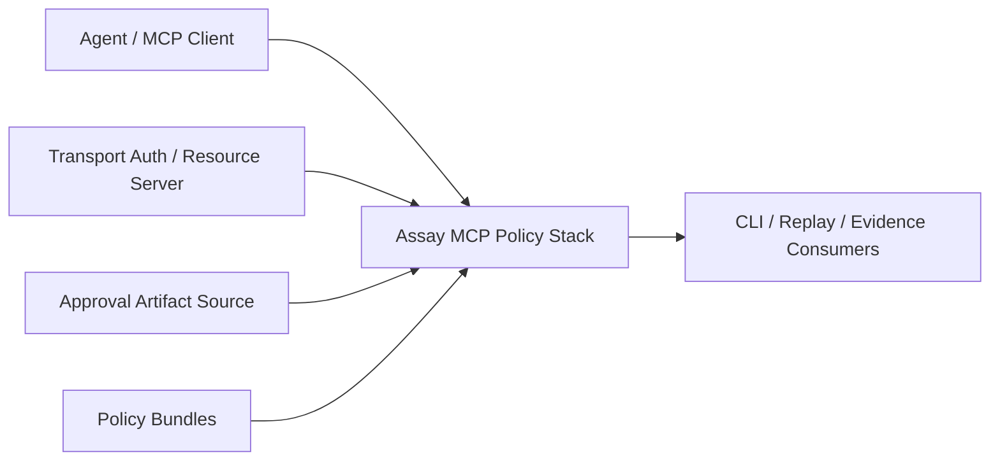
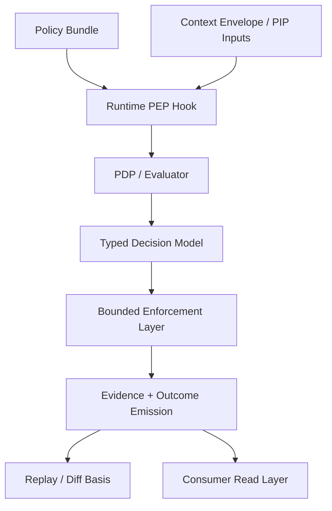

# ADR-032 Building Block View (2026 Q2)

> Status: Current-state building block view after Wave42
> Canonical ADR: [ADR-032](./ADR-032-MCP-Policy-Obligations-and-Evidence-v2.md)
> Companion docs: [Overview](./OVERVIEW-ADR-032-MCP-POLICY-STACK-2026q2.md), [Quality Scenarios](./QUALITY-SCENARIOS-ADR-032-MCP-POLICY-STACK-2026q2.md)

This page captures the stable building blocks of the ADR-032 implementation line.
It is the structural view of the current MCP policy/evidence stack on `main`.

## Scope

This building-block view covers the MCP governance line only.
It does not attempt to document every crate or every CLI path in the workspace.

## Level 1: System Context

### Context boundary

External to Assay:

- transport authentication
- token issuance
- approval UI / human workflow systems
- external incident systems

Owned by Assay:

- policy evaluation
- bounded runtime enforcement
- typed decision/evidence payloads
- replay/diff and consumer contracts

## Level 2: Container View

## Level 3: Building Blocks

### 1. Policy Bundle
Responsibility:
- hold typed rules, obligations, compatibility expectations, and evaluator inputs

Owns:
- decision contract inputs
- obligation declarations
- allow/deny semantics at policy level

Does not own:
- transport auth
- approval UX
- policy backend migration strategy

### 2. Runtime PEP Hook
Responsibility:
- intercept MCP runtime calls deterministically
- gather context and hand off to policy evaluation

Owns:
- pre-execution interception
- runtime call envelope
- handoff into evaluator and enforcement path

### 3. Context Envelope / PIP Inputs
Responsibility:
- carry policy-relevant context into evaluation and downstream evidence

Stable fields include:
- `lane`
- `principal`
- `auth_context_summary`
- `approval_state`
- other bounded runtime summaries

### 4. PDP / Evaluator
Responsibility:
- produce typed decisions from policy + context

Owns:
- rule matching
- decision typing
- bounded compatibility handling for legacy decision shapes

Does not own:
- token issuance
- transport negotiation
- broad control-plane semantics

### 5. Typed Decision Model
Responsibility:
- normalize runtime outcomes into a stable contract

Stable decision set:
- `allow`
- `allow_with_obligations`
- `deny`
- `deny_with_alert`

Compatibility path:
- legacy `AllowWithWarning` remains a bounded compatibility layer

### 6. Bounded Enforcement Layer
Responsibility:
- execute only the obligations and enforcement paths explicitly landed in the wave line

Current bounded executions:
- `log`
- `alert`
- `approval_required`
- `restrict_scope`
- `redact_args`

### 7. Fail-Closed Selector
Responsibility:
- choose deterministic deny/fallback behavior for fail-closed situations

Owns:
- fail-closed typing
- fail-closed reasons
- separation from policy-origin deny

### 8. Evidence + Outcome Emitter
Responsibility:
- emit decision events, obligation outcomes, normalized evidence, and additive compatibility fields

Owns:
- decision event payloads
- obligation fulfillment evidence
- deny/evidence convergence fields

### 9. Replay / Diff Basis
Responsibility:
- provide stable replay and comparison payloads across policy revisions and reader generations

Owns:
- replay diff basis
- deterministic diff buckets
- compatibility normalization

### 10. Consumer Read Layer
Responsibility:
- support deterministic downstream reads by CLI/reporting/replay consumers

Owns:
- read precedence
- compatibility markers
- context completeness metadata for payload consumers

## Responsibility Matrix

| Building block | Primary responsibility | Key bounded outputs |
|---|---|---|
| Policy bundle | policy contract | typed rules, obligations |
| Runtime PEP hook | interception | runtime call envelope |
| Context envelope | input completeness | lane/principal/auth/approval summaries |
| PDP / evaluator | decision | typed decision |
| Decision model | normalization | stable decision variants |
| Enforcement layer | bounded runtime action | approval/scope/redaction outcomes |
| Fail-closed selector | fallback semantics | typed fail-closed deny reason |
| Evidence emitter | audit contract | decision events, obligation outcomes |
| Replay / diff basis | comparison contract | deterministic replay basis |
| Consumer read layer | downstream robustness | compat fields, read precedence |

## Separation Rules

### Policy deny vs fail-closed deny vs enforcement deny
These must remain distinct in evidence and replay.
That distinction is now a structural property of the stack, not a best-effort convention.

### Runtime capability growth
Any new runtime capability must arrive as a new bounded wave.
It should attach to an existing block or add a clearly named new block.
It must not blur responsibilities between evaluator, enforcement, and evidence.

### Auth boundary
Auth context is consumed, not issued.
No building block here is allowed to become a hidden IdP or token broker.

## Maintainer Guidance

If a change does not clearly fit one building block, stop and re-evaluate the scope.
That is usually a sign the change belongs in a new bounded wave or needs an explicit architecture decision.
