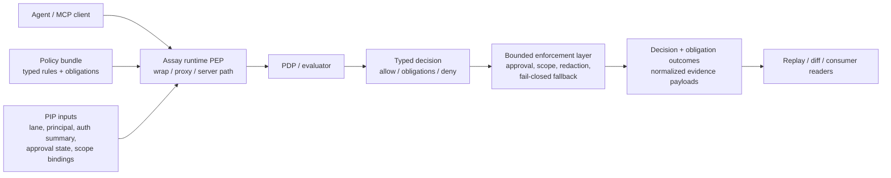
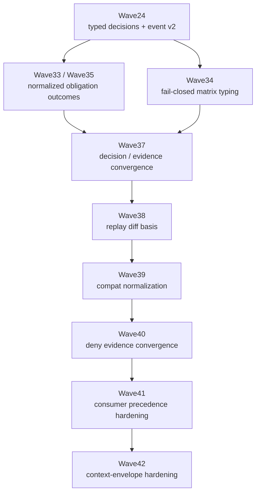
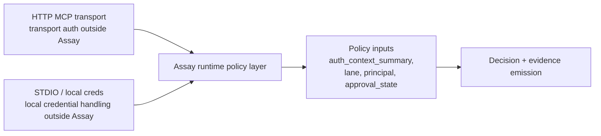

# ADR-032 Implementation Overview (2026 Q2)

> Status: Closed loop through Wave42 on `main`
> Updated: 2026-03-15
> Canonical ADR: [ADR-032](./ADR-032-MCP-Policy-Obligations-and-Evidence-v2.md)
> Historical execution log: [ADR-032 Execution Plan](./PLAN-ADR-032-MCP-POLICY-ENFORCEMENT-2026q2.md)
> Structural decomposition: [ADR-032 Building Block View](./BUILDING-BLOCKS-ADR-032-MCP-POLICY-STACK-2026q2.md)
> Quality attributes: [ADR-032 Quality Scenarios](./QUALITY-SCENARIOS-ADR-032-MCP-POLICY-STACK-2026q2.md)
> Architecture-as-code: [ADR-032 Structurizr Workspace](./STRUCTURIZR-ADR-032-WORKSPACE-2026q2.md)

This page is the maintainer-facing architecture overview for the ADR-032 line after Waves 24 through 42 landed on `main`.

It answers four practical questions:

1. What Assay is responsible for in MCP runtime governance.
2. What capabilities are stable on `main`.
3. How decision, enforcement, and evidence now fit together.
4. What remains intentionally out of scope.

## Product Boundary

Assay is now a runtime policy enforcement and evidence layer for MCP tool calls.

Assay is responsible for:

- typed policy decisions
- bounded obligation execution
- deterministic enforcement-time denials
- replay-safe decision and evidence payloads
- downstream consumer and context-envelope hardening

Assay is not responsible for:

- OAuth, IdP, or token issuance
- browser auth flows
- approval UI or case management
- external incident-management requirements
- broad control-plane orchestration

## Capability Groups on Main

| Group | Waves | Result on `main` |
|---|---|---|
| Decision contract foundation | Wave24 | Typed decisions and Decision Event v2 |
| Obligation execution expansion | Wave25-Wave32 | `log`, `alert`, `approval_required`, `restrict_scope`, `redact_args` landed in bounded slices |
| Normalization and fail-closed hardening | Wave33-Wave40 | normalized outcomes, fail-closed typing, replay/diff basis, deny convergence |
| Consumer and context hardening | Wave41-Wave42 | deterministic consumer precedence and context-envelope completeness metadata |

## Capability Matrix

| Capability | Status | Source waves |
|---|---|---|
| Typed decisions: `allow`, `allow_with_obligations`, `deny`, `deny_with_alert` | Stable | Wave24 |
| Decision Event v2 | Stable | Wave24 |
| `AllowWithWarning` compatibility path | Stable compatibility layer | Wave24-Wave25 |
| `log` obligation execution | Stable | Wave25 |
| `alert` obligation execution | Stable | Wave26 |
| Approval artifact/data shape | Stable | Wave27 |
| `approval_required` enforcement | Stable | Wave28 |
| `restrict_scope` contract/evidence shape | Stable | Wave29 |
| `restrict_scope` enforcement | Stable | Wave30 |
| `redact_args` contract/evidence shape | Stable | Wave31 |
| `redact_args` enforcement | Stable | Wave32, Wave36 |
| Normalized `obligation_outcomes` | Stable | Wave33, Wave35 |
| Fail-closed matrix typing | Stable | Wave34 |
| Decision/evidence convergence | Stable | Wave37 |
| Replay diff contract | Stable | Wave38 |
| Replay/evidence compatibility fields | Stable | Wave39 |
| Deny evidence convergence | Stable | Wave40 |
| Consumer read precedence | Stable | Wave41 |
| Context-envelope completeness metadata | Stable | Wave42 |

## Runtime Architecture

### Reading the runtime diagram

- The runtime path is the PEP wedge.
- Policy evaluation remains distinct from transport authentication.
- Enforcement happens only for bounded obligation and deny paths already frozen in the wave line.
- Evidence emission is a first-class output, not an afterthought.

## Decision and Evidence Convergence

### What this convergence line accomplished

- Decision payloads are no longer just execution byproducts; they are now durable replay and audit contracts.
- Deny paths are separated cleanly between policy, fail-closed, and enforcement origins.
- Consumers can read payloads deterministically without re-deriving runtime semantics.
- Context completeness is explicit instead of implied by ad hoc field checks.

## Auth and Transport Boundary

This boundary is deliberate:

- HTTP auth stays in the transport/resource-server layer.
- STDIO does not get forced into the same browser/OAuth model.
- Assay consumes auth context summaries; it does not issue or broker credentials.

## Wave Timeline Summary

| Wave | Theme | Result |
|---|---|---|
| Wave24 | Typed decisions | Decision contract broadened and versioned |
| Wave25-Wave26 | Low-risk obligations | `log` and `alert` became executable |
| Wave27-Wave28 | Approval path | approval artifact shape and bounded enforcement |
| Wave29-Wave30 | Scope path | `restrict_scope` contract and enforcement |
| Wave31-Wave32 | Redaction path | `redact_args` contract and enforcement |
| Wave33-Wave35 | Outcome normalization | `obligation_outcomes` and fulfillment semantics stabilized |
| Wave34 | Fail-closed typing | fallback modes and reasons became typed evidence |
| Wave36 | Redaction hardening | redaction enforcement aligned with normalized evidence |
| Wave37-Wave40 | Convergence | decision, replay, compat, and deny evidence stabilized |
| Wave41-Wave42 | Downstream hardening | consumer precedence and context-envelope completeness stabilized |

## What Is Intentionally Still Out of Scope

These items are still deliberate non-goals for the ADR-032 line:

- IdP / OAuth server features
- approval workflow UI
- external approval or incident systems as required runtime dependencies
- policy-engine replacement as part of routine wave delivery
- broad control-plane orchestration

## Guidance for Maintainers

If you are extending this line:

1. Keep runtime behavior changes bounded and explicit.
2. Prefer additive payload evolution over field replacement.
3. Update replay/consumer/context documentation whenever payload readers gain a new deterministic path.
4. Treat the overview page as the stable entry point and the execution plan as the historical rollout log.

## Further Reading

- [ADR-032](./ADR-032-MCP-Policy-Obligations-and-Evidence-v2.md)
- [ADR-032 Building Block View](./BUILDING-BLOCKS-ADR-032-MCP-POLICY-STACK-2026q2.md)
- [ADR-032 Quality Scenarios](./QUALITY-SCENARIOS-ADR-032-MCP-POLICY-STACK-2026q2.md)
- [ADR-032 Structurizr Workspace](./STRUCTURIZR-ADR-032-WORKSPACE-2026q2.md)
- [ADR-032 Execution Plan](./PLAN-ADR-032-MCP-POLICY-ENFORCEMENT-2026q2.md)
- [Data Flow](./data-flow.md)
- [Runtime enforcement](./runtime.md)
