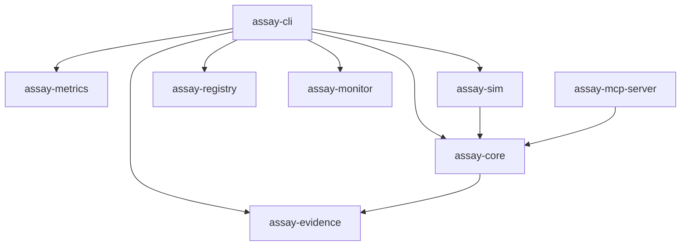

# Crate Structure

Assay is organized as a Cargo workspace with the following crates:

| Crate | Purpose | Key Modules |
|-------|---------|-------------|
| `assay-cli` | CLI binary and command implementations | `commands/`, `args.rs`, `templates.rs` |
| `assay-core` | Core engine: runner, storage, errors, doctor, explain | `engine/`, `storage/`, `errors/`, `report/` |
| `assay-evidence` | Evidence bundles, verification, linting, packs | `lint/`, `verify.rs`, `packs/` |
| `assay-metrics` | Metric evaluators (args_valid, sequence_valid, tool_blocklist) | Per-metric modules |
| `assay-sim` | Attack simulation and chaos testing | `attacks/`, `report.rs` |
| `assay-registry` | Pack registry client and verification | `client.rs`, `verify.rs` |
| `assay-monitor` | eBPF/LSM runtime monitor | `lib.rs` |
| `assay-mcp-server` | MCP protocol server for runtime enforcement | `lib.rs` |
| `assay-xtask` | Build/dev task automation | `main.rs` |

## Dependency Graph

## Generate Module (Post-RFC-003 Decomposition)

The `generate` command was decomposed in RFC-003 (G1–G6, merged Feb 2026) from a single 1166-line file into focused modules:

| Module | Responsibility |
|--------|---------------|
| `generate/mod.rs` | Orchestration and `run()` entry point |
| `generate/args.rs` | `GenerateArgs` and validation |
| `generate/model.rs` | `Policy`, `Meta`, `Section`, `Entry` DTOs |
| `generate/ingest.rs` | `read_events`, `aggregate`, `Stats` |
| `generate/profile.rs` | Profile classification and generation |
| `generate/diff.rs` | Policy diffing and reporting |

See [RFC-003](./RFC-003-generate-decomposition-q1-2026.md) for the decomposition plan and evidence.

## Further Reading

- [AIcontext Code Map](../AIcontext/code-map.md) — detailed file-level mapping
- [AIcontext Interdependencies](../AIcontext/interdependencies.md) — crate interface contracts
