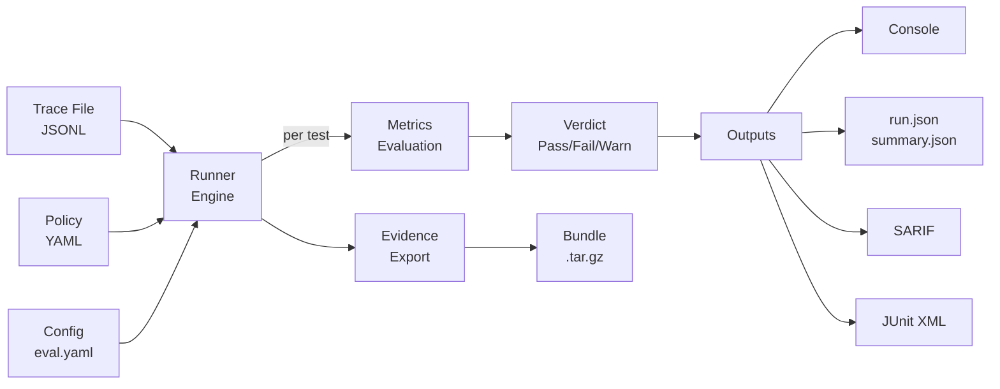

# Data Flow

This page describes the primary data flows through the Assay system.

## Core Pipeline: Trace → Gate → Evidence

## Trace Ingestion

1. **Read**: `read_events()` parses JSONL trace file line-by-line
2. **Aggregate**: `aggregate()` groups tool calls by name with statistics
3. **Evaluate**: Each test applies its metric evaluator to the aggregated data
4. **Gate**: Exit code determined by pass/fail counts and `--strict` mode

## Evidence Pipeline

1. **Collect**: `ProfileCollector` gathers events during a run (OTel Collector pattern)
2. **Map**: `EvidenceMapper` transforms to `EvidenceEvent` (CloudEvents v1.0 envelope)
3. **Export**: `assay evidence export` creates content-addressed, JCS-canonicalized bundle
4. **Verify**: `assay evidence verify` checks integrity offline (SHA-256 manifests)
5. **Lint**: `assay evidence lint` scans for compliance findings (SARIF output)

## Generate / Profile Pipeline

1. **Ingest**: Parse trace events via `ingest::read_events()`
2. **Aggregate**: Count tool calls, compute statistics via `ingest::aggregate()`
3. **Classify**: Wilson lower-bound scoring via `profile::classify_entry()`
4. **Output**: Generate `policy.yaml` with allow/review/deny sections

## Further Reading

- [Crate Structure](./crates.md) — workspace organization
- [AIcontext Architecture Diagrams](../AIcontext/architecture-diagrams.md) — visual diagrams
- [ADR-008: Evidence Streaming](./ADR-008-Evidence-Streaming.md) — streaming design
