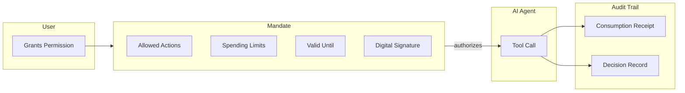
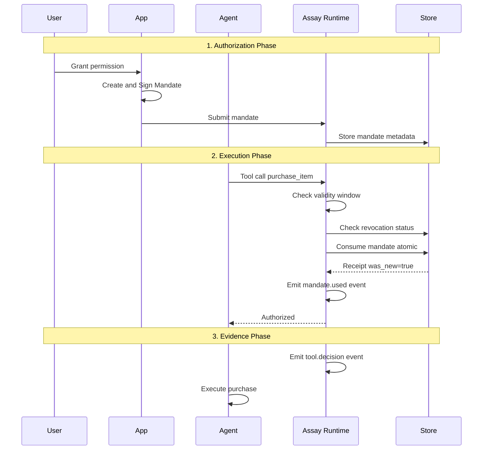
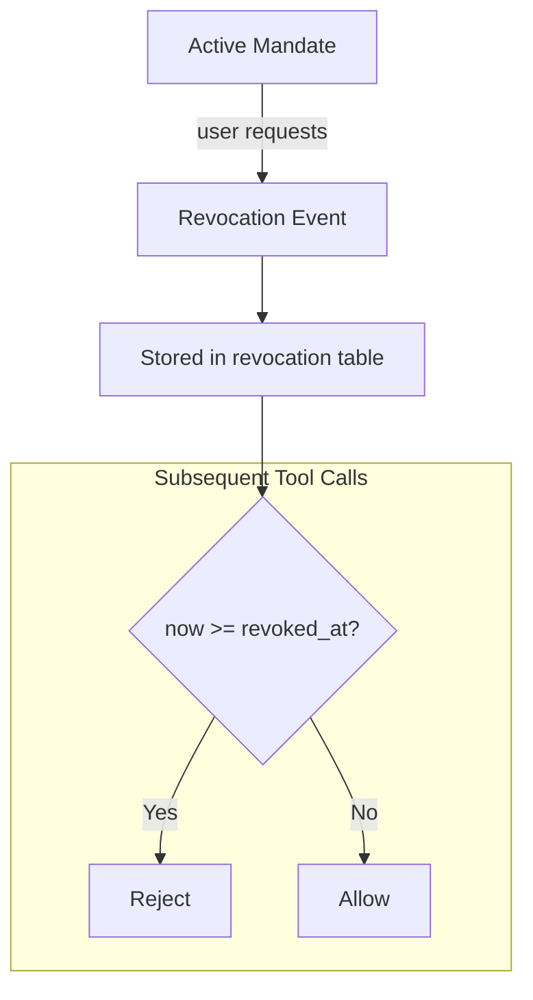
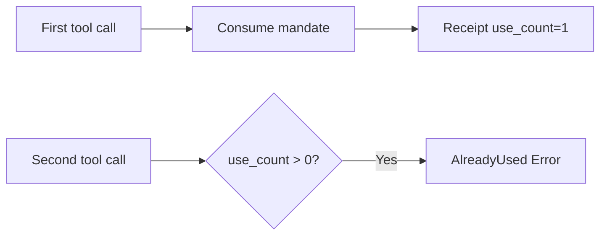
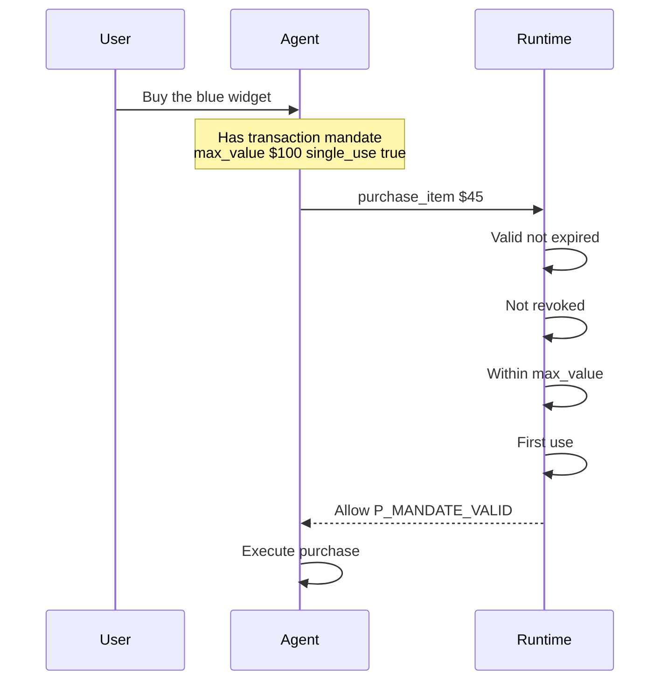
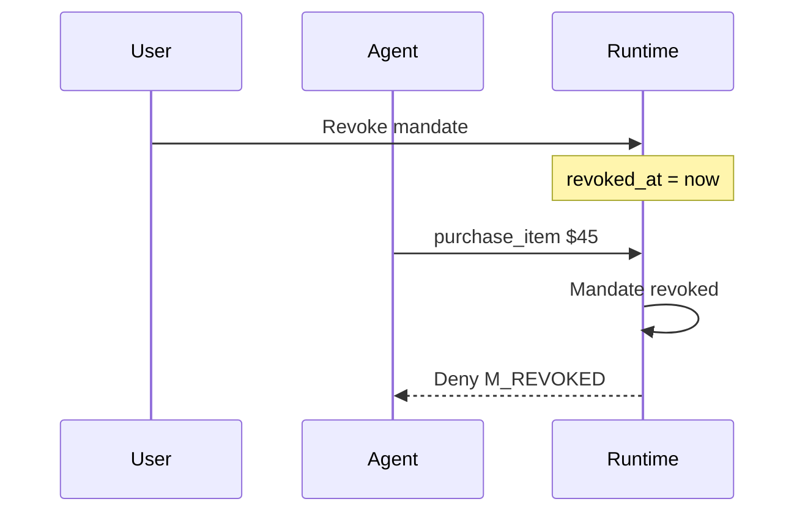
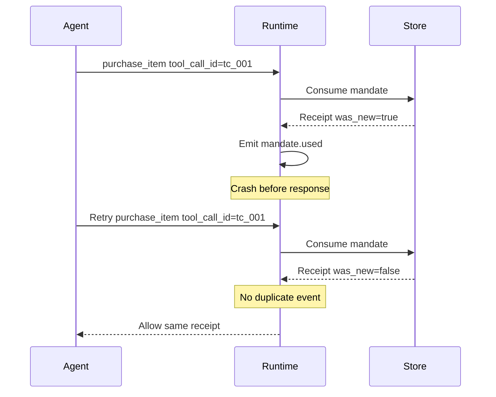

# Mandates: User Authorization for AI Agents

> **Audience:** Product managers, compliance officers, security teams, and developers new to Assay.

## What is a Mandate?

A **mandate** is cryptographic proof that a user authorized an AI agent to perform specific actions. Think of it as a digital "permission slip" that:

- **Proves authorization**: Links agent actions to explicit user consent
- **Limits scope**: Restricts what the agent can do (tools, amounts, time)
- **Enables audit**: Creates tamper-proof evidence for compliance



## Why Mandates Matter

### The Problem Without Mandates

When AI agents act autonomously, critical questions arise:

| Question | Without Mandates | With Mandates |
|----------|-----------------|---------------|
| Did the user approve this purchase? | Unknown | Cryptographic proof |
| What was the spending limit? | Implicit | Explicit in mandate |
| When did authorization expire? | Never defined | `expires_at` timestamp |
| Was the mandate revoked? | No mechanism | Revocation tracking |

### Regulatory Context

**EU AI Act (Articles 12 and 14):**

- Article 12: Automatic logging for post-market monitoring
- Article 14: Human oversight mechanisms
- **Mandates enable both**: Traceable authorization + audit trail

## Mandate Types

### 1. Intent Mandate (Standing Authority)

For ongoing, low-risk operations like browsing and discovery.

```yaml
# Example: "Let my agent search for products"
mandate_kind: intent
scope:
  tools: ["search_*", "list_*", "get_*"]
  operation_class: read
validity:
  expires_at: "2026-02-28T23:59:59Z"  # Valid for 1 month
```

**Use cases:**

- Product search and comparison
- Price monitoring
- Information gathering

### 2. Transaction Mandate (Final Authorization)

For specific, high-value actions requiring explicit consent.

```yaml
# Example: "Buy this specific item for up to $100"
mandate_kind: transaction
scope:
  tools: ["purchase_item"]
  operation_class: commit
  max_value:
    amount: "100.00"
    currency: "USD"
  transaction_ref: "sha256:cart_hash_abc123"
constraints:
  single_use: true
validity:
  expires_at: "2026-01-28T11:00:00Z"  # Valid for 1 hour
```

**Use cases:**

- Purchases and payments
- Account modifications
- Irreversible actions

## The Mandate Lifecycle



## Key Concepts

### Validity Windows

Mandates have explicit time boundaries:

| Field | Meaning |
|-------|---------|
| `not_before` | Earliest allowed use |
| `expires_at` | Latest allowed use |
| `issued_at` | When mandate was created |

**Clock tolerance:** The runtime allows 30 seconds of clock drift for `not_before` and `expires_at`.

### Revocation

Users can cancel mandates before they expire:



**Important:** Revocation has **no clock tolerance** - it takes effect immediately at `revoked_at`.

### Single-Use Protection

For high-value transactions, mandates can be limited to one use:



**Idempotency:** If a tool call retries with the same `tool_call_id`, the same receipt is returned (no double-charging).

## Integration with Assay CLI

### Enabling Mandate Logging

```bash
assay mcp wrap \
  --policy assay.yaml \
  --audit-log audit.ndjson \
  --decision-log decisions.ndjson \
  --event-source "assay://myorg/myapp" \
  -- npx @modelcontextprotocol/server-filesystem
```

| Flag | Purpose |
|------|---------|
| `--audit-log` | Lifecycle events (mandate.used, mandate.revoked) |
| `--decision-log` | Tool decisions (allow/deny with reason codes) |
| `--event-source` | CloudEvents source URI (required for logging) |

### Policy Configuration

```yaml
# assay.yaml
mandate_trust:
  # Which tools require mandates
  commit_tools:
    - "purchase_*"
    - "transfer_*"
    - "payment_*"

  # Expected audience for mandates
  expected_audience: "myorg/myapp"

  # Trusted mandate issuers
  trusted_issuers:
    - "auth.myorg.com"

  # Clock tolerance for validity checks
  clock_skew_tolerance_seconds: 30
```

## Evidence Output

### mandate.used Event

Emitted when a mandate is consumed (first use only):

```json
{
  "specversion": "1.0",
  "type": "assay.mandate.used.v1",
  "id": "sha256:use_id_deterministic",
  "source": "assay://myorg/myapp",
  "time": "2026-01-28T10:05:00Z",
  "data": {
    "mandate_id": "sha256:abc123...",
    "use_id": "sha256:deterministic_hash",
    "tool_call_id": "tc_456",
    "use_count": 1
  }
}
```

**Note:** The event `id` equals `use_id`, enabling deduplication on retries.

### tool.decision Event

Every tool call produces a decision event:

```json
{
  "type": "assay.tool.decision",
  "data": {
    "tool": "purchase_item",
    "decision": "allow",
    "reason_code": "P_MANDATE_VALID",
    "tool_call_id": "tc_456",
    "mandate_id": "sha256:abc123...",
    "use_id": "sha256:...",
    "use_count": 1
  }
}
```

## Common Scenarios

### Scenario 1: Successful Purchase



### Scenario 2: Revoked Mandate



### Scenario 3: Retry After Crash



## Glossary

| Term | Definition |
|------|------------|
| **Mandate** | Cryptographically-signed user authorization |
| **Intent** | Standing authority for low-risk operations |
| **Transaction** | One-time authorization for specific action |
| **use_id** | Deterministic identifier for consumption receipt |
| **tool_call_id** | Unique identifier for a tool invocation |
| **Revocation** | Cancellation of mandate before expiry |
| **CloudEvents** | Standard event format for audit logs |

## Further Reading

- [SPEC-Mandate-v1](../architecture/SPEC-Mandate-v1.md) - Technical specification
- [ADR-017: Mandate Evidence](../architecture/ADR-017-Mandate-Evidence.md) - Architecture decision record
- [MCP Quickstart](../mcp/quickstart.md) - Getting started with MCP proxy
