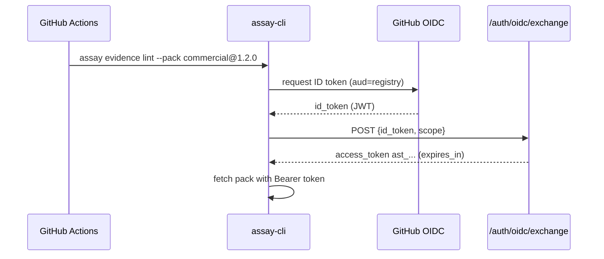

# Pack Registry

Assay supports compliance packs from multiple sources: local files, bundled packs, remote registries, and BYOS (Bring Your Own Storage). The Pack Registry protocol ensures secure, reproducible, and verifiable pack fetching.

## Resolution Order

The **normative** pack resolution order is defined in [SPEC-Pack-Engine-v1](../architecture/SPEC-Pack-Engine-v1.md#pack-resolution-normative). Summary:

1. **Path** — Existing filesystem path: if **file**, load as YAML; if **directory**, load `<dir>/pack.yaml` only. Override built-ins by using an explicit path.
2. **Built-in** — By name (e.g. `eu-ai-act-baseline`). Built-in wins over a pack with the same name in the config directory.
3. **Local pack directory** — Config dir (`~/.config/assay/packs` on Unix, `%APPDATA%\assay\packs` on Windows). Look for `{name}.yaml` or `{name}/pack.yaml`; reference must be a valid pack name (see SPEC).
4. **Registry** — `name@version` or pinned `name@version#sha256:...`
5. **BYOS** — `s3://`, `gs://`, `az://` (Bring Your Own Storage)
6. **NotFound** — Error with suggestion (e.g. "Did you mean …?" or "Available built-in packs: …").

This order is **fail-closed**: if a pack cannot be resolved or verified, the CLI errors immediately.

## Canonical Digest (Deterministic IDs)

To ensure reproducible verification across environments, pack integrity is checked using a canonical digest:

1. **Parse YAML** using a strict subset:
   - Reject anchors (`&`), aliases (`*`), tags (`!!`)
   - Reject multi-document (`---`)
   - Reject floats (use strings for decimals)
   - Reject duplicate keys
   - Enforce integer range: ±2^53 (IEEE 754 safe integer)
2. **Convert to JSON** value
3. **Canonicalize with JCS** (RFC 8785)
4. **Hash with SHA-256** → `sha256:{hex}`

This makes digests independent of YAML formatting, whitespace, and key ordering.

```bash
# Example: two YAMLs with different formatting produce the same digest
echo "a: 1\nb: 2" > pack1.yaml
echo "b:  2\na: 1" > pack2.yaml

# Both produce: sha256:abc123...
```

## Signatures (Authenticity)

Integrity alone is not enough for commercial packs—authenticity is required.

### DSSE + Ed25519

- Packs are signed using **Ed25519 + DSSE** (Dead Simple Signing Envelope)
- Signature is computed over the **canonical JCS bytes**, not the raw YAML
- PAE (Pre-Authentication Encoding) per DSSE specification

### Sidecar Endpoint

To avoid HTTP header size limits (8-16KB), signatures are fetched from a sidecar endpoint:

```
GET /packs/{name}/{version}.sig
```

The client uses a **sidecar-first policy** for signed packs. The `X-Pack-Signature` header is only used as fallback.

## Trust Model: No-TOFU

Assay uses a **no-TOFU** (Trust On First Use) trust chain:

```
┌─────────────────────────────────────────────────────────────┐
│                    assay-cli (client)                       │
│  ┌─────────────────────────────────────────────────────┐   │
│  │  Pinned Root Key IDs (compiled into binary)          │   │
│  │  └── TrustStore                                      │   │
│  └─────────────────────────────────────────────────────┘   │
└─────────────────────────────────────────────────────────────┘
                            │
                            │ verifies DSSE signature
                            ▼
┌─────────────────────────────────────────────────────────────┐
│                    Assay Registry                           │
│  ┌─────────────────────────────────────────────────────┐   │
│  │  GET /keys (keys manifest, DSSE-signed)              │   │
│  │  - pack-signing keys                                 │   │
│  │  - validity windows                                  │   │
│  │  - revocation list                                   │   │
│  └─────────────────────────────────────────────────────┘   │
└─────────────────────────────────────────────────────────────┘
                            │
                            │ provides pack-signing keys
                            ▼
┌─────────────────────────────────────────────────────────────┐
│  Pack Verification                                          │
│  1. Fetch pack YAML                                        │
│  2. Compute canonical digest                               │
│  3. Fetch signature sidecar (.sig)                         │
│  4. Verify DSSE with manifest key                          │
└─────────────────────────────────────────────────────────────┘
```

### Key Properties

| Property | Description |
|----------|-------------|
| **Pinned roots** | Root key IDs are compiled into the CLI binary |
| **Manifest verification** | Keys manifest must be signed by a pinned root |
| **Revocation enforced** | Revoked/expired keys are rejected |
| **Brick-proof** | Pinned roots cannot be remotely revoked |

## Caching

Packs and metadata are cached locally for performance. The cache is treated as **untrusted**:

### Cache Location

```
~/.assay/cache/packs/{name}/{version}/
├── pack.yaml          # Pack content
├── metadata.json      # ETag, expires_at, digest
└── signature.json     # DSSE envelope (if signed)
```

### TOCTOU Protection

On every cache read:

1. Recompute the canonical digest
2. Verify signature (when required)
3. On mismatch: **evict + refetch**

### Atomic Writes

Writes use temp file + rename to avoid partial/corrupt cache entries.

## Lockfile (Reproducible CI)

For CI and enterprise pipelines, `assay.packs.lock` (v2) pins:

```yaml
version: 2
packs:
  - name: eu-ai-act-baseline
    version: "1.2.0"
    digest: "sha256:abc123..."
    source: registry
    registry_url: "https://registry.getassay.dev"
    etag: "\"abc123\""
    signature:
      algorithm: Ed25519
      key_id: "key-prod-2026-01"
```

### Lockfile Behavior

| Scenario | Behavior |
|----------|----------|
| Lockfile exists, digest matches | Proceed |
| Lockfile exists, digest mismatch | **Hard error** |
| No lockfile | Fetch and verify, optionally create lockfile |

## Authentication

### Static Token

```bash
export ASSAY_REGISTRY_TOKEN=ast_abc123...
assay evidence lint --pack commercial@1.2.0 bundle.tar.gz
```

### OIDC Token Exchange (CI)

For CI environments (GitHub Actions, GitLab CI), Assay supports OIDC token exchange:



## Protocol Details

### HTTP Headers

| Header | Direction | Description |
|--------|-----------|-------------|
| `X-Pack-Digest` | Response | Canonical SHA-256 digest |
| `ETag` | Response | Resource version for caching |
| `Cache-Control` | Response | max-age for cache expiry |
| `If-None-Match` | Request | Conditional GET for 304 |
| `Authorization` | Request | Bearer token for auth |

### Status Codes

| Code | Meaning |
|------|---------|
| 200 | Success |
| 304 | Not Modified (use cache) |
| 401 | Authentication required |
| 403 | Access denied |
| 404 | Pack not found |
| 410 | **Revoked** (hard error) |
| 429 | Rate limited (retry with Retry-After) |

## DoS Protection

Strict YAML validation includes DoS limits:

| Limit | Value |
|-------|-------|
| Max depth | 50 |
| Max keys | 10,000 |
| Max string length | 1 MB |
| Max input size | 10 MB |

## Related Documentation

- [SPEC-Pack-Registry-v1](../architecture/SPEC-Pack-Registry-v1.md) - Full protocol specification
- [SPEC-Pack-Engine-v1](../architecture/SPEC-Pack-Engine-v1.md) - Pack execution engine
- [ADR-016](../architecture/ADR-016-Pack-Taxonomy.md) - Pack taxonomy and open core model
