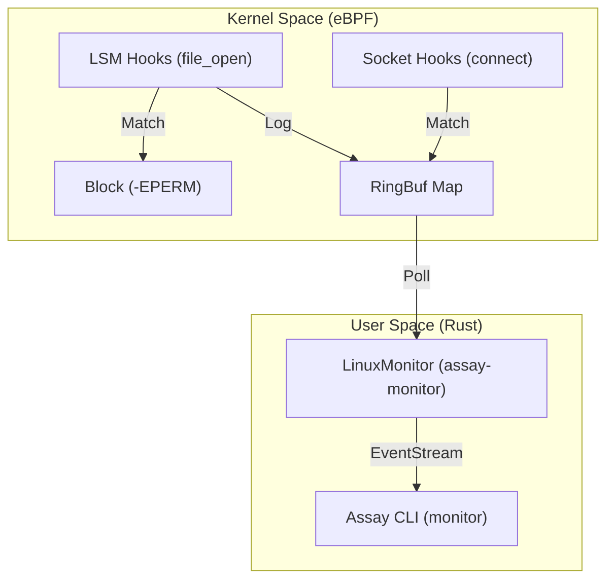

# Runtime Monitor Reference

**Status**: Production Ready (Linux / BPF LSM)

Assay's Runtime Monitor provides kernel-level enforcement for MCP security policies. Unlike traditional tracepoints which are detect-only and vulnerable to TOCTOU (Time-of-Check Time-of-Use) attacks, Assay uses **BPF LSM** to block unauthorized operations *before* they occur.

## 1. Architecture

The monitor bridges kernel space and user space using a producer-consumer model over a high-performance BPF Ring Buffer.



### Key Components

- **`assay-ebpf`**: Native BPF programs. Implements prefix/exact path matching and CIDR-based network blocking.
- **`assay-monitor`**: Orchestrates BPF lifecycle. Implements **RAII Link Persistence** to ensure programs remain attached.
- **`assay-xtask`**: Unified build automation. Supports building eBPF via a dedicated Docker toolchain.

## 2. Technical Capabilities

### LSM File Prevention
Assay hooks the `file_open` LSM gate. It allows or denies access based on:
- **SOTA Inode Resolution**: Resolves paths to `(dev, ino)` pairs securely using `open(O_PATH | O_NOFOLLOW)` to prevent TOCTOU/symlink attacks.
- **Exact Path Matches**: High-performance hash-based lookup for files like `/var/lib/private-demo/credentials.txt`.
- **Cgroup Scoping**: Automatically monitors only the processes within the target MCP sandbox.

### Network Egress Control
Uses the Cgroup `connect4` hook to enforce IPv4/TCP `connect()` rules:
- **Port Blocklists**: Block SSH, Telnet, or internal databases.
- **IPv4 CIDR deny rules**: Block matching destination ranges.
- **IPv4 CIDR allow exceptions**: Exempt more-specific ranges from a broader deny; an allow CIDR
  alone does not restrict unmatched traffic.

IPv6 CIDR policies are refused before any rule map is changed; they are not silently reduced to
their IPv4 subset. `connect6_hook` is compiled into the release ELF and presently unattached
(`Unsupported`); it is IPv6 **enforcement**, not the connect observer.
`sys_enter_connect` is always attached and handles `AF_INET6`. That tracepoint can **observe**
`AF_INET6` connect syscalls; it is not IPv6 enforcement. IPv6 CIDR enforcement, UDP/QUIC,
DNS resolution, already-open sockets, raw sockets, and
proxy/tunnel identity remain outside the enforcement claim tracked in issue #1576.

### Measured `IORING_OP_CONNECT` (one host)

On one measured host — `assay-bpf-runner`, Ubuntu 24.04, kernel `6.8.0-137-generic`, aarch64,
Assay checkout [`886ebce908401cb0a49502e7c7515f85fc9ceebd`](https://github.com/Rul1an/assay/commit/886ebce908401cb0a49502e7c7515f85fc9ceebd)
— raw `io_uring_setup` / `io_uring_enter` with `IORING_OP_CONNECT` to `127.0.0.1:9101`:

- produced **no** `sys_enter_connect` event (the syscall tracepoint was blind to that opcode on
  this kernel);
- was **observed** by attached cgroup `connect4` when IPv4/TCP network enforcement was requested
  and `:9101` was allowed (`cqe_res=0`; the listener accepted; `observed_peers` contained
  `127.0.0.1:9101`; socket counters incremented);
- was **blocked** by that same connect4 path when `:9101` was denied (`cqe_res=-EPERM`; the
  listener accepted nothing; `blocked_port=1`; enforcement `blocked_count=1`).

Syscall `connect` to `:9102` remained visible to `sys_enter_connect` in the audit-only cell, and
was blocked by connect4 when `:9102` was denied. UDP connect then `sendmsg` to `:9103` produced
peer evidence from the **connect-time** connect4 hook only; that row is not send-probe evidence.

This cell does not claim that every io_uring connect is blocked, that other kernels or
architectures match, or that io_uring `SEND` / `SENDMSG` is observed. Ring-buffer drops were `0`
in every discriminator cell; shutdown was the monitor's internal `--duration`.

Two producers must not be collapsed when reading this result:

- CLI `assay monitor` `observation_health.network_protocol_coverage` is **attach-derived** from
  cgroup `connect4` (network-policy path): `connect_only` if that probe attached, otherwise
  `absent`. On this host, that is the surface that saw `IORING_OP_CONNECT`.
- Runner archives (`assay runner-spike --kernel-capture` /
  `assay-runner-core` `network_protocol_coverage_for`) are **count-derived**:
  `connect_emitted > 0` yields `connect_only` from always-attached `sys_enter_connect`, with
  **no** connect4 / network-policy requirement. On this host that tracepoint did not see
  `IORING_OP_CONNECT`.

### `observed_peers` is diagnostic

`--observed-peers` writes `assay.monitor.observed_peers.v0`. Peers are distinct destinations
decoded from cgroup connect events (`EVENT_CONNECT_OBSERVED` / `EVENT_CONNECT_BLOCKED`), not from
the `sys_enter_connect` tracepoint. The set is **diagnostic and not exhaustive**: connect-time
only, empty when connect4 is not attached, and not a complete peer inventory. It does not prove
UDP/QUIC identity, already-open sockets, or every destination the process reached.

The `run_id` shared by `--observed-peers` and `--observation-health` currently hashes
attachment / drop / policy posture, not invocation identity. Distinct invocations with the same
posture can share an id. That pairing defect is tracked as
[#2342](https://github.com/Rul1an/assay/issues/2342) and is **not** fixed here; it remains
ordered separately.

## 3. Developer Workflow

### Environment Setup
eBPF development requires a specific toolchain (LLVM, nightly Rust, bpf-linker). The delegated runner path uses native `bpf-linker` builds so cold Docker image builds stay out of the proof hot path:

```bash
# 1. Install the native eBPF toolchain
rustup toolchain install nightly-2026-01-01 --profile minimal
rustup component add rust-src --toolchain nightly-2026-01-01
rustup run nightly-2026-01-01 cargo install bpf-linker --version 0.10.3 --locked

# 2. Compile eBPF bytecode
cargo xtask build-ebpf --release --no-docker
```

Docker remains available as a fallback for machines that cannot host the native toolchain: `cargo xtask build-image && cargo xtask build-ebpf --docker`.

### Verification
Local verification is best done via **Lima VM** on macOS or directly on **Linux**:

```bash
# Full E2E verification (LSM block check)
./scripts/verify_lsm_docker.sh
```

## 4. Production Deployment

The monitor requires `CAP_BPF` and `CAP_PERFMON` (or `sudo`).

```bash
# Run monitor with a specific policy
sudo assay monitor --ebpf ./target/assay-ebpf.o --policy policy.yaml
```

### Operator Output

Blocked-file denials are rendered as structured fields so operators can correlate the kernel event with the exact deny rule:

```text
[PID 4242] 🛡️ BLOCKED FILE: dev=2050 ino=918273 cgroup=4026532987 rule_id=7
```

At the end of a run, `assay monitor` also prints a summary of emitted and dropped ring-buffer events for the tracepoint, LSM, and socket paths. If any drop counter is non-zero, the CLI prints a `Ring buffer pressure detected` warning so an operator can distinguish "no events" from "events were dropped under load".

> [!IMPORTANT]
> Ensure your kernel is booted with `lsm=...,bpf` in the command line parameters to enable BPF LSM support.

## 5. Probe inventory and non-claims

The release eBPF object compiles **11** programs (`PROBE_PROGRAMS` in `assay-monitor`).
`EXPECTED_PROBES` lists the **7** always-attempted attach surfaces
(`sys_enter_openat`, `sys_enter_openat2`, `sys_exit_openat`, `sys_exit_openat2`,
`sys_enter_connect`, `sys_enter_fork`, `lsm:file_open`). The other four are mode-aware:

| ELF program | Surface | Present inventory |
|---|---|---|
| `connect4_hook` | `cgroup_sock_addr:connect4` | Requested only with a network policy; otherwise `not_requested` |
| `connect6_hook` | `cgroup_sock_addr:connect6` | Compiled-but-unattached **enforcement** (`Unsupported` / `AttachSpec::None`) |
| `assay_monitor_sendto` | `sys_enter_sendto` | Compiled-but-unattached (`Unsupported` / `AttachSpec::None`) |
| `assay_monitor_sendmsg` | `sys_enter_sendmsg` | Compiled-but-unattached (`Unsupported` / `AttachSpec::None`) |

Mode-aware outcomes are distinct: `not_requested` ≠ `unavailable` ≠ `failed` ≠ `unsupported` ≠
`attached` ([#2339](https://github.com/Rul1an/assay/pull/2339)). The CONFIG-ABI gate
([#2340](https://github.com/Rul1an/assay/pull/2340)) and exact compiled program-set gate
([#2341](https://github.com/Rul1an/assay/pull/2341)) prove object/loader agreement. They do **not**
prove runtime attach success, event completeness, or enforcement.

Non-claims for this page:

- one measured kernel and architecture (`6.8.0-137-generic` / aarch64); no kernel-version generality;
- no SQPOLL submitter attribution;
- no io_uring `SEND` / `SENDMSG` result;
- no IPv6 **enforcement** (`connect6_hook` remains unattached; `sys_enter_connect` observing
  `AF_INET6` is not an enforcement claim);
- no UDP/QUIC/DNS/already-open-socket/raw-socket/proxy-tunnel identity claim;
- `observed_peers` is diagnostic, not an exhaustive peer set;
- program-set and CONFIG-ABI gates ≠ attach completeness;
- no "complete egress" or exhaustive visibility claim;
- monitor artifact `run_id` pairing remains [#2342](https://github.com/Rul1an/assay/issues/2342).
