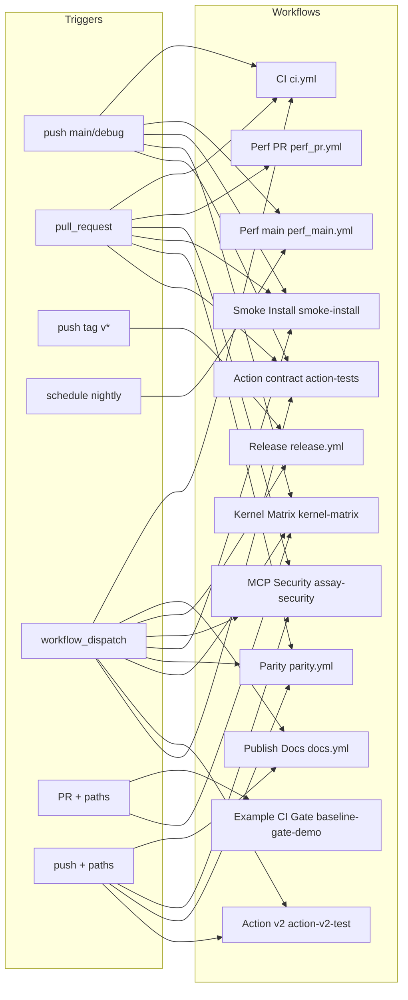
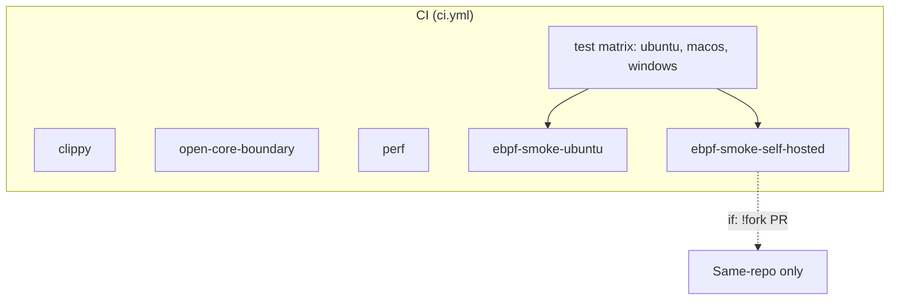
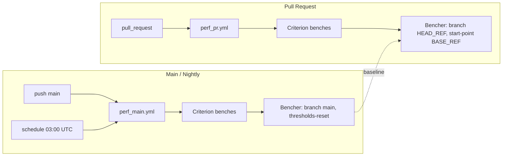
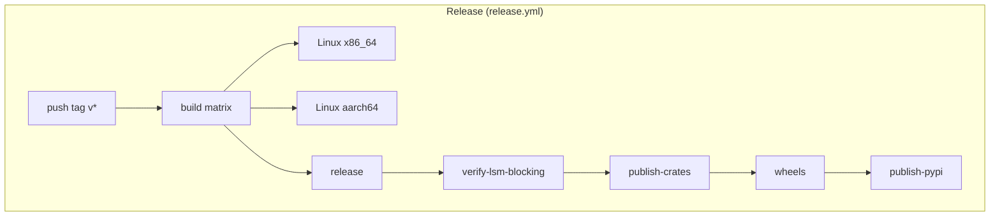

# GitHub Actions Workflows — Overzicht en assessment

Dit document geeft een uitgebreid overzicht van alle GitHub Actions-workflows in dit repository, met beschrijvingen en diagrammen voor assessment.

**Laatst bijgewerkt:** januari 2026.

---

## 1. Overzichtstabel

| Workflow | Bestand | Triggers | Jobs | Doel |
|----------|---------|----------|------|------|
| **CI** | `ci.yml` | push (main, debug/**), pull_request (paths-ignore docs), workflow_dispatch | clippy, open-core-boundary, perf, test, ebpf-smoke-ubuntu, ebpf-smoke-self-hosted | Kern-CI: lint, boundary check, Criterion benches, tests (matrix ubuntu/macos/windows), eBPF smoke (Ubuntu + self-hosted). |
| **Example CI Gate** | `baseline-gate-demo.yml` | pull_request (paths: examples/baseline-gate/**, workflow) | gate | Demo: baseline-gate PR — cache .eval/.assay, build release, replay traces, baseline check; cache-hit in summary. |
| **Perf (main baseline)** | `perf_main.yml` | push (main), schedule (nightly 03:00 UTC) | benches | Bencher: Criterion-baseline op main + nightly; benchmarks `sw/50x400b`, `sw/12xlarge` (store_write_heavy) en `sr/wc` (suite_run_worstcase); stdin/pipe-modus; thresholds (t_test, upper_boundary 0.99). |
| **Perf (PR compare)** | `perf_pr.yml` | pull_request (opened, reopened, edited, synchronize) | benches | Bencher: PR vergelijken met main (start-point, clone-thresholds); zelfde threshold-flags als main; soft (geen --err); alleen same-repo. |
| **Publish Docs** | `docs.yml` | push (main, paths: docs/**, mkdocs.yml), workflow_dispatch | deploy | MkDocs → GitHub Pages. |
| **Release** | `release.yml` | push (tags v*), workflow_dispatch (version input) | build, release, verify-lsm-blocking, publish-crates, wheels, publish-pypi | Cross-platform binaries (Linux x86/aarch64; macOS/Windows uitgecommentarieerd), LSM verify, crates.io + Python wheels + PyPI. |
| **MCP Security** | `assay-security.yml` | push/pull_request (paths: assay.yaml, policy.yaml, examples/**, **/*.mcp.json), workflow_dispatch | security-check | Validate demo config → SARIF → GitHub Security tab; gate op text output. |
| **Smoke Install** | `smoke-install.yml` | pull_request, push (main), workflow_dispatch | assay | E2E: install from source, migrate --check, assay ci (contract pass.yaml), JUnit artifact + test reporter. |
| **Parity Tests** | `parity.yml` | push (main, paths: assay-core, assay-metrics, assay-mcp-server), pull_request, workflow_dispatch | parity, integration-parity | Batch vs streaming parity (assay run vs MCP server); latency benchmark; release blocker. |
| **Kernel Matrix CI** | `kernel-matrix.yml` | pull_request (paths: eBPF/CLI/evidence/sim/monitor/scripts/Cargo.*), push (main, debug/**) | lint, build-artifacts, matrix-test | Pre-commit lint, build eBPF+CLI op Ubuntu ARM, matrix-test op self-hosted (kernels 5.15, 6.6). |
| **Action v2 Test** | `action-v2-test.yml` | workflow_dispatch, push (main, paths: assay-action/**, workflow) | test-no-bundles, test-with-bundle | Test assay-action: zonder bundles (soft exit), met bundle (outputs verified/findings). |
| **assay-action-contract-tests** | `action-tests.yml` | workflow_dispatch, push (main), pull_request | pack_lint_baseline, fork_pr_sarif_skip, oidc_provider_detection, attestation_conditional, coverage_calculation, smoke_monorepo_workdir, export_baseline_artifact | Contract tests voor GitHub Action: pack lint (eu-ai-act-baseline), fork/SARIF-skip, OIDC/store-URL, attestation logic, coverage, monorepo workdir, baseline artifact. |

**Branch protection (main):** Required status checks voor merge zijn **CI**, **Smoke Install (E2E)**, **assay-action-contract-tests** en **MCP Security (Assay)**. Zie [Branch protection setup](BRANCH-PROTECTION-SETUP.md).

---

## 2. Diagram: Triggers → Workflows

Welke events starten welke workflows (hoog niveau).

---

## 3. Diagram: CI-workflow (jobs en dependencies)

Detail van `ci.yml`: jobs en volgorde.

- **Parallel (geen needs):** clippy, open-core-boundary, perf, test — draaien gelijktijdig.
- **test** heeft matrix: `ubuntu-latest`, `macos-latest`, `windows-latest`; Linux test volledige workspace (excl. assay-ebpf, assay-it); niet-Linux excl. ook assay-monitor, assay-cli.
- **ebpf-smoke-ubuntu** en **ebpf-smoke-self-hosted** hebben `needs: [test]`; self-hosted draait alleen als geen fork-PR.

---

## 4. Diagram: Perf-pipeline (main vs PR)

Hoe performance-baseline en PR-vergelijking samenhangen.

- **perf_main.yml:** bouwt baseline op main (en nightly); Bencher slaat resultaten op met `--thresholds-reset`. Benchmarks: `sw/50x400b`, `sw/12xlarge`, `sr/wc`. Twee reports per run (één per `bencher run`-aanroep met `--ci-id`).
- **perf_pr.yml:** draait dezelfde Criterion-benches op de PR-branch en vergelijkt met main via `--start-point`, `--start-point-clone-thresholds`, `--start-point-reset`; zelfde threshold-flags als main; geen `--err` (soft; later hard fail mogelijk via aparte gate met `--err` + label).
- **Stdin/pipe-modus:** `cargo bench … 2>&1 | grep -v "Gnuplot not found" | bencher run --adapter rust_criterion …` — robuuster dan exec-modus.
- **Korte IDs:** Criterion group names `sw` (store_write_heavy) en `sr` (suite_run_worstcase) zodat `id time: [...]` op één regel blijft voor Bencher's rust_criterion-adapter.

---

## 5. Diagram: Release-pipeline

Stappen van `release.yml` (vereenvoudigd).

- **build:** matrix met o.a. Linux x86_64 en aarch64 (cross-compile); macOS/Windows zijn in het bestand uitgecommentarieerd.
- **release:** upload artifacts, create GitHub release.
- **verify-lsm-blocking:** LSM/security-verificatie.
- **publish-crates**, **wheels**, **publish-pypi:** publicatie naar crates.io, Python wheels, PyPI.

---

## 6. Beschrijving per workflow (voor assessment)

### 6.1 CI (`ci.yml`)

| Aspect | Beschrijving |
|--------|---------------|
| **Doel** | Elke push/PR (behalve doc-only) linten, testen en Criterion-benches + eBPF smoke uitvoeren. |
| **Triggers** | `push` naar main of `debug/**`; `pull_request` (paths-ignore: docs, *.md, .gitignore); `workflow_dispatch`. |
| **Jobs** | **clippy:** `cargo clippy --workspace --all-targets -- -D warnings`. **open-core-boundary:** script check open core boundary. **perf:** `cargo bench` (assay-core, assay-cli) met `--quick`, upload Criterion-artifact, log cache-hit. **test:** matrix ubuntu/macos/windows; sccache + mold (Linux); cargo test (exclusies per OS). **ebpf-smoke-ubuntu:** needs test; LSM verify in Docker (soft skip). **ebpf-smoke-self-hosted:** needs test; alleen non-fork PR; self-hosted runner; LSM strict. |
| **Afhankelijkheden** | Alleen test → ebpf-smoke-*; overige jobs parallel. |
| **Cache** | Swatinem/rust-cache; perf-job logt cache-hit in job summary. |
| **Assessment** | Duidelijke scheiding lint/test/perf/eBPF; paths-ignore voorkomt CI op doc-only wijzigingen; eBPF op twee runners (Ubuntu + self-hosted) voor betere dekking. |

---

### 6.2 Example CI Gate (`baseline-gate-demo.yml`)

| Aspect | Beschrijving |
|--------|---------------|
| **Doel** | PR’s die baseline-gate-voorbeeld raken, gate’en tegen een baseline (replay + baseline check). |
| **Triggers** | `pull_request` met paths: `examples/baseline-gate/**` of het workflowbestand zelf. |
| **Jobs** | **gate:** checkout; cache `.eval` en `.assay` (key op eval + traces); build release; in `examples/baseline-gate`: `assay run --replay-strict`, dan `assay baseline check --baseline baseline.json`; log cache-hit in summary. |
| **Assessment** | Paths beperken tot relevante wijzigingen; cache + cache-hit bewijs zoals in PERFORMANCE-ASSESSMENT; offline/replay zonder netwerk. |

---

### 6.3 Perf main / Perf PR (`perf_main.yml`, `perf_pr.yml`)

| Aspect | Beschrijving |
|--------|---------------|
| **Doel** | Main: Criterion-baseline vastleggen (Bencher). PR: vergelijken met main (soft; later hard fail mogelijk). |
| **Triggers** | Main: push naar main, schedule (nightly). PR: pull_request (alleen same-repo voor perf_pr). |
| **Jobs** | Beide: één job **benches** met rust-cache, deps, Bencher action, twee `bencher run`-stappen (store_write_heavy, suite_run_worstcase). Main: `--branch main`, `--thresholds-reset`. PR: `--branch HEAD_REF`, `--start-point BASE_REF`, clone-thresholds, reset; geen `--err`. |
| **Secrets** | BENCHER_PROJECT, BENCHER_API_TOKEN (moeten in repo staan). |
| **Assessment** | Conventie main = baseline, PR = compare; Bencher voor continuous benchmarking; perf_pr veilig voor forks (job draait niet op fork-PR). |

---

### 6.4 Publish Docs (`docs.yml`)

| Aspect | Beschrijving |
|--------|---------------|
| **Doel** | Docs bij push naar main (alleen bij doc-wijzigingen) of handmatig naar GitHub Pages deployen. |
| **Triggers** | push naar main (paths: docs/**, mkdocs.yml, workflow); workflow_dispatch. |
| **Jobs** | **deploy:** checkout, Python, pip install mkdocs-material e.d., `mkdocs gh-deploy --force`. |
| **Assessment** | Paths voorkomen builds bij alleen code-wijzigingen; contents: write voor gh-deploy. |

---

### 6.5 Release (`release.yml`)

| Aspect | Beschrijving |
|--------|---------------|
| **Doel** | Bij tag v* (of handmatig met version) cross-platform binaries bouwen, release aanmaken, LSM verifiëren, crates.io + wheels + PyPI publiceren. |
| **Triggers** | push tags `v*`; workflow_dispatch met version input. |
| **Jobs** | **build:** matrix (Linux x86_64, aarch64; rest uitgecommentarieerd). **release:** upload artifacts, create release. **verify-lsm-blocking:** LSM-check. **publish-crates**, **wheels**, **publish-pypi:** publicatie. |
| **Assessment** | Duidelijke release-pipeline; LSM-verify vóór publish; matrix uitbreidbaar voor macOS/Windows. |

---

### 6.6 MCP Security (`assay-security.yml`)

| Aspect | Beschrijving |
|--------|---------------|
| **Doel** | Config/policy/examples valideren en SARIF naar Security tab sturen; gate op validate. |
| **Triggers** | push/pull_request (paths: assay.yaml, policy.yaml, examples/**, **/*.mcp.json); workflow_dispatch. |
| **Jobs** | **security-check:** install via getassay.dev; `assay validate` SARIF (continue-on-error) → upload SARIF; daarna validate (gate). |
| **Assessment** | SARIF altijd uploaden (ook bij fout) voor zichtbaarheid in Security tab; paths beperken tot relevante bestanden. |

---

### 6.7 Smoke Install (`smoke-install.yml`)

| Aspect | Beschrijving |
|--------|---------------|
| **Doel** | E2E: build from source, migrate --check, assay ci met contract-config; JUnit-artifact en test reporter. |
| **Triggers** | pull_request, push main, workflow_dispatch. |
| **Jobs** | **assay:** checkout, Rust, cargo install assay-cli, migrate --check, assay ci (pass.yaml), upload JUnit, dorny/test-reporter. |
| **Assessment** | Eenvoudige smoke voor install + contract; JUnit + reporter voor UI-feedback. |

---

### 6.8 Parity (`parity.yml`)

| Aspect | Beschrijving |
|--------|---------------|
| **Doel** | Batch vs streaming (assay run vs MCP server) resultaat-parity; latency benchmark; release blocker. |
| **Triggers** | push main (paths: assay-core, assay-metrics, assay-mcp-server); pull_request; workflow_dispatch. |
| **Jobs** | **parity:** cargo test parity + latency_check. **integration-parity:** optioneel tegen binaries. |
| **Assessment** | Paths beperken tot relevante crates; expliciete “release blocker”-communicatie in logs. |

---

### 6.9 Kernel Matrix (`kernel-matrix.yml`)

| Aspect | Beschrijving |
|--------|---------------|
| **Doel** | Pre-commit lint, eBPF+CLI build op Ubuntu ARM, daarna matrix-test op self-hosted runners (kernels 5.15, 6.6). |
| **Triggers** | pull_request (paths: eBPF/CLI/evidence/sim/monitor/scripts/Cargo.*/workflow); push main/debug/**; workflow_dispatch. |
| **Jobs** | **lint:** pre-commit all files. **build-artifacts:** needs lint; Ubuntu ARM, nightly, bpf-linker, build eBPF + CLI, upload dist. **matrix-test:** needs lint + build-artifacts; self-hosted assay-bpf-runner; matrix kernel 5.15/6.6; disk cleanup, LSM/deny smoke. |
| **Assessment** | Duidelijke lint → build → matrix; self-hosted alleen non-fork PR; kernel-matrix voor eBPF-compat. |

---

### 6.10 Action v2 Test (`action-v2-test.yml`)

| Aspect | Beschrijving |
|--------|---------------|
| **Doel** | assay-action testen: zonder bundles (soft exit) en met bundle (outputs). |
| **Triggers** | workflow_dispatch; push main (paths: assay-action/**, workflow). |
| **Jobs** | **test-no-bundles**, **test-with-bundle:** build CLI, (optioneel) fixture in .assay/evidence, run action, check outputs. |
| **Assessment** | Paths beperken tot action-wijzigingen; twee scenario’s voor betere dekking. |

---

### 6.11 assay-action-contract-tests (`action-tests.yml`)

| Aspect | Beschrijving |
|--------|---------------|
| **Doel** | Contracttests voor de GitHub Action: pack lint (eu-ai-act-baseline), fork/SARIF-skip, OIDC/store-URL-detectie, attestation-logic, coverage, monorepo workdir, baseline-artifact. |
| **Triggers** | workflow_dispatch, push main, pull_request. |
| **Jobs** | **pack_lint_baseline**, **fork_pr_sarif_skip**, **oidc_provider_detection**, **attestation_conditional**, **coverage_calculation**, **smoke_monorepo_workdir**, **export_baseline_artifact** — elk met eigen stappen. |
| **Assessment** | Uitgebreide contractdekking voor de action; alle jobs parallel (geen needs). |

---

## 7. Samenvatting voor assessment

| Categorie | Status | Opmerking |
|-----------|--------|-----------|
| **Kern-CI** | ✅ | ci.yml: clippy, boundary, perf, test (matrix), eBPF smoke; paths-ignore voor docs. |
| **Performance** | ✅ | ci.yml perf-job (artifact + cache-hit); perf_main + perf_pr (Bencher) voor baseline + PR-vergelijking. |
| **Baseline-gate** | ✅ | baseline-gate-demo path-gated, cache + cache-hit. |
| **Docs** | ✅ | docs.yml path-gated op main. |
| **Release** | ✅ | release.yml: tag v*, matrix build, LSM verify, publish. |
| **Security** | ✅ | assay-security path-gated, SARIF + gate. |
| **E2E / smoke** | ✅ | smoke-install (install + contract); parity (batch/streaming). |
| **eBPF / kernel** | ✅ | kernel-matrix: lint → build → matrix-test self-hosted. |
| **Action** | ✅ | action-v2-test (paths); action-tests (contract suite). |

**Conventies:** Paths/ paths-ignore waar zinvol; same-repo/fork-beveiliging waar nodig (eBPF self-hosted, perf_pr); cache + cache-hit op perf en baseline-gate; Bencher voor continuous benchmarking (main + PR).

Dit overzicht en de diagrammen kunnen gebruikt worden om de workflows te assessen (review, compliance, uitbreiding).
