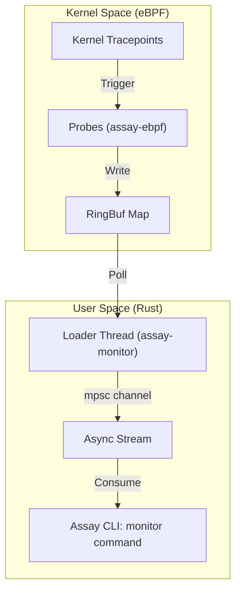

# Runtime Monitor Reference (v1.8)

**Status:** Production Ready (Linux), Stubs (macOS/Windows)

## 1. System Overview

Assay v1.8 introduces the **Runtime Monitor**, a subsystem designed to capture granular runtime events (File I/O, Network) from processes under test. This allows `assay` to verify not just the *output* of a program, but its *behavior* (side-effects).

The system uses **eBPF (Extended Berkeley Packet Filter)** for safe, high-performance kernel tracing on Linux.

## 2. Architecture

The architecture follows a producer-consumer model bridging Kernel Space and User Space.



**Notes:**
*   **Linux-only**: requires eBPF-capable kernel + elevated privileges (sudo recommended).
*   **Feature Gated**: `assay-ebpf` is gated behind the `ebpf` feature to prevent host linker errors; build it only via `cargo xtask build-ebpf` (which enables this feature).

### Key Components

| Component | Path | Responsibility |
|-----------|------|----------------|
| **assay-ebpf** | `crates/assay-ebpf` | Kernel probes written in `no_std` Rust. Hooks `sys_enter_openat` and `sys_enter_connect`. |
| **assay-monitor** | `crates/assay-monitor` | User-space library. Loads eBPF objects, attaches probes, and streams parsed events. |
| **assay-cli** | `crates/assay-cli` | Provides the `assay monitor` subcommand. Handles PID filtering and user output. |
| **assay-xtask** | `crates/assay-xtask` | Build automation. Compiles `assay-ebpf` using `nightly` Rust (native or Docker). |

## 3. Workflows

### A. Building (Hybrid Model)

Because eBPF requires a specific nightly toolchain and linker, we use a split build strategy:

1.  **Host Bins (`assay`)**: Built with standard `cargo build`.
    *   *Note*: `assay-ebpf` is explicitly excluded from standard workspace builds via feature gating.
    *   *Rule*: Host builds (`cargo build --workspace`) must **not** attempt to link the eBPF binary.
2.  **eBPF Artifact (`assay-ebpf.o`)**: Built via `cargo xtask build-ebpf`.
    *   **Native**: Uses local `rust-src` and `bpf-linker` (Primary CI path).
    *   **Docker (Optional)**: Can build in a container using `ghcr.io/aya-rs/aya`, but may require registry access/auth. CI uses the native build path for determinism.

### B. Running (Linux Only)

The monitor requires elevated privileges (`CAP_BPF`, `CAP_PERFMON`).
*Note: Some distros still require `CAP_SYS_ADMIN` for certain attach modes; use `sudo` if in doubt.*

```bash
# 1. Build eBPF (one-time)
cargo xtask build-ebpf --release

# 2. Run Monitor
sudo assay monitor --pid <TARGET_PID> --duration 10s
```

On **macOS**, the `monitor` command exists but will exit with code `40` (Not Supported).

## 4. Technical Deep Dive

### eBPF Probes (`assay-ebpf`)
*   **Safety**: Uses a "Read-First" pattern. Data is read into a local stack buffer *before* reserving a RingBuf slot.
    *   **Invariant**: never return/? after `RingBuf::reserve()` unless you `submit()` or `discard()` the reservation. This prevents "unreleased reference" verifier errors.
*   **Stack Optimization**: Uses direct pointer writes (`core::ptr::write`) to fill the RingBuf, avoiding large stack allocations that violate the 512-byte eBPF stack limit.
*   **No-Std**: Uses `core::ptr::copy_nonoverlapping` to avoid implicit mutable references (`dangerous_implicit_autorefs` lint).

### Event Streaming (`assay-monitor`)
*   **Protocol**: Events are defined in `assay-common` as `#[repr(C)]` POD structs.
*   **Parsing**: Uses `MaybeUninit` + `memcpy` for zero-overhead, safe parsing of raw bytes from the ring buffer.
*   **Threading**: A dedicated OS thread polls the RingBuf to avoid blocking the async runtime or conflicting with Aya's internals.

### CI/CD Pipeline

The `ebpf_smoke` job in CI ensures stability by isolating the nightly/eBPF build steps:

```bash
# Workflow steps for reliable eBPF builds:
rustup toolchain install nightly
rustup component add rust-src --toolchain nightly
cargo install bpf-linker --locked
cargo xtask build-ebpf --release
sudo ./target/debug/assay monitor --pid $$ --duration 5s --ebpf target/assay-ebpf.o --print
```

## 5. Maintenance & Troubleshooting

### Common Issues

1.  **"Target not found" / Linker Errors on Host**
    *   *Cause*: Trying to build `assay-ebpf` with standard generic `cargo build`.
    *   *Fix*: The binary is gated behind `required-features = ["ebpf"]`. Do not enable this feature on host builds.

2.  **"Verifier Error: unreleased reference"**
    *   *Cause*: Returning early (e.g. `?` operator) while holding a `ringbuf.reserve()` slot.
    *   *Fix*: Always read data to stack *before* calling `reserve()`.

3.  **"BPF stack limit exceeded"**
    *   *Cause*: Creating large structs (e.g. `MonitorEvent` ~260 bytes) on the stack.
    *   *Fix*: Write directly to the ring buffer pointer.
