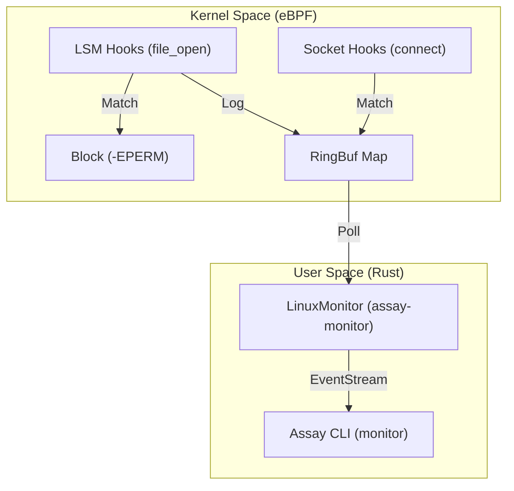

# Runtime Monitor Reference

**Status**: Production Ready (Linux / BPF LSM)

Assay's Runtime Monitor provides kernel-level enforcement for MCP security policies. Unlike traditional tracepoints which are detect-only and vulnerable to TOCTOU (Time-of-Check Time-of-Use) attacks, Assay uses **BPF LSM** to block unauthorized operations *before* they occur.

## 1. Architecture

The monitor bridges kernel space and user space using a producer-consumer model over a high-performance BPF Ring Buffer.



### Key Components

- **`assay-ebpf`**: Native BPF programs. Implements prefix/exact path matching and CIDR-based network blocking.
- **`assay-monitor`**: Orchestrates BPF lifecycle. Implements **RAII Link Persistence** to ensure programs remain attached.
- **`assay-xtask`**: Unified build automation. Supports building eBPF via a dedicated Docker toolchain.

## 2. Technical Capabilities

### LSM File Prevention
Assay hooks the `file_open` LSM gate. It allows or denies access based on:
- **SOTA Inode Resolution**: Resolves paths to `(dev, ino)` pairs securely using `open(O_PATH | O_NOFOLLOW)` to prevent TOCTOU/symlink attacks.
- **Exact Path Matches**: High-performance hash-based lookup for files like `/etc/shadow`.
- **Cgroup Scoping**: Automatically monitors only the processes within the target MCP sandbox.

### Network Egress Control
Uses Cgroup `connect4` and `connect6` hooks to enforce:
- **Port Blocklists**: Block SSH, Telnet, or internal databases.
- **CIDR Allowlists**: Restrict outbound traffic to known safe endpoints (e.g., API gateways).

## 3. Developer Workflow

### Environment Setup
eBPF development requires a specific toolchain (LLVM, nightly Rust, bpf-linker). Assay automates this via Docker:

```bash
# 1. Build the builder image (one-time)
cargo xtask build-image

# 2. Compile eBPF bytecode
cargo xtask build-ebpf --docker
```

### Verification
Local verification is best done via **Lima VM** on macOS or directly on **Linux**:

```bash
# Full E2E verification (LSM block check)
./scripts/verify_lsm_docker.sh
```

## 4. Production Deployment

The monitor requires `CAP_BPF` and `CAP_PERFMON` (or `sudo`).

```bash
# Run monitor with a specific policy
sudo assay monitor --ebpf ./target/assay-ebpf.o --policy policy.yaml
```

> [!IMPORTANT]
> Ensure your kernel is booted with `lsm=...,bpf` in the command line parameters to enable BPF LSM support.
