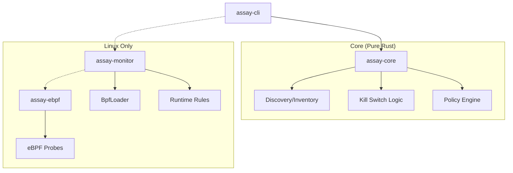

# Assay v1.8 Runtime Features — Implementation Guide

**Status:** Ready to implement
**Scope:** Discovery (P0) + Kill Switch (P0) + eBPF Monitor (P1/Experimental)

---

## 1. Strategic Context & Architecture

This addendum extends Assay from "pre-deployment linter" to "full-lifecycle security platform".

### Core Design Principles
1.  **Dependency Direction**: `assay-core` remains pure. `assay-monitor` encapsulates Linux-specific runtime logic. `assay-cli` orchestrates them.
2.  **OS Support Strategy**:
    *   **Discovery**: Cross-platform (Linux/macOS/Windows).
    *   **Kill Switch**: Unix-first (Linux/macOS) for v1.8. Windows support planned for v1.9.
    *   **eBPF Monitor**: Linux-only (requires kernel 5.8+, CAP_BPF).
3.  **Policy Compatibility**: All new runtime features integrate into Policy v2.0 schema as optional extensions.

### Component Diagram


---

## 2. Repository Layout

```text
assay/
├── Cargo.toml                          # Workspace root
├── crates/
│   ├── assay-core/                     # PURE LIBRARY
│   │   ├── src/
│   │   │   ├── discovery/              # P0: Config & Process scanning
│   │   │   └── kill_switch/            # P0: Signal logic (Unix)
│   │
│   ├── assay-monitor/                  # NEW: P1 (Linux Only)
│   │   ├── Cargo.toml
│   │   └── src/                        # User-space eBPF loader & event loop
│   │
│   ├── assay-ebpf/                     # NEW: P1 (Kernel space)
│   │   ├── Cargo.toml                  # no_std, aya-bpf
│   │   └── src/                        # eBPF C-like Rust code
│   │
│   ├── assay-xtask/                    # NEW: Build automation
│   │   ├── Cargo.toml
│   │   └── src/                        # Builds eBPF artifacts
│   │
│   └── assay-cli/
│       └── src/commands/               # Ties it all together
```

---

## 3. Cargo Configuration & Dependencies

### `crates/assay-core/Cargo.toml`
*Does not depend on monitor. Keeps the core lightweight.*

```toml
[features]
default = ["discovery", "kill-switch"]
discovery = ["sysinfo", "dirs"]
kill-switch = []

[dependencies]
sysinfo = { version = "0.30", optional = true }
dirs = { version = "5", optional = true }

# Unix-specifics for Kill Switch P0
[target.'cfg(unix)'.dependencies]
nix = { version = "0.27", features = ["signal", "process"] }

# Linux-specifics for process inspection
[target.'cfg(target_os = "linux")'.dependencies]
procfs = "0.16"
```

### `crates/assay-cli/Cargo.toml`
*Orchestrator. Opts-in to monitor on Linux.*

```toml
[features]
default = []
runtime-monitor = ["assay-monitor"]

[dependencies]
assay-core = { path = "../assay-core" }
assay-monitor = { path = "../assay-monitor", optional = true }
```

### `crates/assay-xtask/Cargo.toml`
*Critical for reliable eBPF builds.*

```toml
[package]
name = "assay-xtask"
version = "0.1.0"
edition = "2021"

[dependencies]
anyhow = "1"
clap = { version = "4", features = ["derive"] }
```

---

## 4. Policy v2.0 Integration

New features are added as **optional top-level blocks**. They do NOT interfere with v1/v2 tool schema validation.

### Example: `policies/production-hardened.yaml`

```yaml
version: "2.0"

metadata:
  name: hardened-policy

# --- Standard v2.0 Tool Policies ---
tools:
  allow: ["read_file", "list_directory"]

schemas:
  read_file:
    type: object
    properties:
      path:
        type: string
        pattern: "^/data/.*"
    required: ["path"]
    additionalProperties: false

# --- v1.8 Extensions ---

# Feature 3: Discovery
discovery:
  enabled: true
  methods: ["config_files", "processes"]
  on_findings:
    unmanaged_server: warn  # warn | fail
    no_auth: warn

# Feature 5: Kill Switch
kill_switch:
  enabled: true
  mode: graceful            # graceful | immediate
  grace_period_ms: 3000
  kill_children: true
  capture_state: true       # Dump env/fds on kill
  output_dir: ".assay/incidents"
  # Automatic triggers
  triggers:
    - on_rule: "sensitive-file-access"
      mode: immediate

# Feature 4: Runtime Monitor (P1 Extension)
runtime_monitor:
  enabled: false           # Default to false for safety
  provider: ebpf
  rules:
    - id: sensitive-file-access
      type: file_open
      match:
        path_globs:
          - "/etc/shadow"
          - "**/.ssh/*"
          - "**/.env"
      severity: critical
      action: trigger_kill
```

---

## 5. CLI & Exit Codes

### Command Surface
```bash
# Discovery
assay discover --local --format table
assay discover --local --fail-on unmanaged_server --format json > inventory.json

# Kill Switch
assay kill --pid 12345 --capture-state
assay kill --server-id claude-filesystem --mode graceful

# Monitor (Linux Only)
assay monitor --policy policy.yaml --daemon
```

### Exit Code Standards
Consistent severity mapping across all commands (`scan`, `verify`, `discover`).

| Code | Usage | Description |
|------|-------|-------------|
| 0 | Success | No issues or findings below threshold |
| 1 | Error | Runtime/IO/Config error |
| 2 | Config | Policy validation failed |
| 3 | Critical | Critical findings (security violations) |
| 4 | High | High severity findings |
| 5 | Medium | Medium severity findings |
| 10 | Unmanaged | Discovery: Found unmanaged servers |
| 11 | No Auth | Discovery: Found servers without auth |
| 30 | Kill Fail | Failed to terminate process |
| 40 | Monitor | eBPF attach/load failure |

---

## 6. Implementation Details

### 6.1 eBPF Build Infrastructure (xtask)
We use `xtask` to ensure eBPF programs are compiled with the correct target (`bpfel-unknown-none` or `bpfeb-unknown-none`) without polluting the main build.

**Usage:**
```bash
# Build eBPF artifacts
cargo xtask build-ebpf

# Build full project with monitor
cargo build --release --features runtime-monitor
```

### 6.2 Kill Switch (OS Specifics)
*   **Unix (Linux/macOS)**: Use `nix::sys::signal` (SIGTERM/SIGKILL).
    *   *Child Killing*: Best-effort via `pgrep -P <pid>` or process groups if managed by Assay.
*   **Windows**:
    *   v1.8: Not supported (Exit with error "Windows support coming in v1.9").
    *   v1.9 Plan: `WinAPI` (`TerminateProcess`) via `windows-rs`.

### 6.3 SARIF Output Updates
Ensure `uriBaseId` consistency to avoid broken links in GitHub.

**Discovery Finding Example:**
```json
{
  "ruleId": "discovery/unmanaged-server",
  "level": "warning",
  "message": { "text": "Unmanaged MCP server discovered" },
  "locations": [{
    "physicalLocation": {
      "artifactLocation": {
        "uri": "mcp://claude-desktop/filesystem",
        "uriBaseId": "DISCOVERY_ROOT"
      }
    }
  }],
  "properties": {
    "server_cmd": "npx -y @modelcontextprotocol/server-filesystem"
  }
}
```

---

## 7. Testing Strategy

### Unit Tests
*   **Config Parsers**: Test against fixture JSONs (Claude/Cursor configs).
*   **Process Enum**: Mock `sysinfo` data structures.

### Integration Tests
*   **Discovery**: Create a temp directory structure mimicking `$HOME/.config` and verify `assay discover` finds mock servers.
*   **Kill Switch (Cross-platform correctness)**:
    ```rust
    #[test]
    fn test_kill_lifecycle() {
        // Platform-agnostic sleep
        #[cfg(unix)]
        let mut child = Command::new("sleep").arg("60").spawn().unwrap();
        #[cfg(windows)]
        let mut child = Command::new("powershell").args(["-c", "Start-Sleep 60"]).spawn().unwrap();

        let pid = child.id();

        // Test Kill
        // ... invoke internal killer logic ...

        // Assert dead
        // ...
    }
    ```

### CI Considerations
*   **eBPF**: CI runners typically lack `CAP_BPF`. Tests should be skipped gracefully (`#[ignore]`) or check capabilities before running.
*   **Windows CI**: Ensure `kill-switch` feature doesn't break build on Windows (use `cfg` gates).

---

## 8. Implementation Checklist

### Phase 1: Infrastructure & Discovery (Wk 1-2)
- [x] Set up `xtask` for eBPF (even if empty initially).
- [x] Implement `assay-core/discovery/` modules (Config parsers).
- [x] Implement `sysinfo` based process scanning.
- [x] Create `assay discover` CLI command.

### Phase 2: Kill Switch (Wk 2-3)
- [x] Implement `assay-core/kill_switch/` (Unix signals).
- [x] Implement state capture (env, open files - best effort).
- [x] Create `assay kill` CLI command.

### Phase 3: Runtime Monitor (Wk 3-4)
- [ ] Implement `assay-ebpf` probes (openat, connect).
- [ ] Implement `assay-monitor` userspace loader.
- [ ] Feature gate integration in `assay-cli`.

### Phase 4: Integration
- [ ] Update Policy v2.0 parser to accept new blocks.
- [ ] Unified E2E tests.
